#### Sveučilište Jurja Dobrile u Puli Zagrebačka 30, 52100 Pula, Hrvatska

# BP1 Projekt - E-commerce trgovinu za prodaju čokolade 

## Tim-1

### 1. godina prijediplomskog sveučilišnog studija informatike

- **Luka Juroš** (JMBAG: )
- **Teo Kupčinovac** (JMBAG: )
- **Luka Wrana** (JMBAG: )
- **Andrej Pucović** (JMBAG: 0246066534)
- **Danijel Margić** (JMBAG: 0275053078)

&nbsp;

## 1. Uvod (Luka Juroš)
Lorem ipsum dolor sit amet, consectetur adipiscing elit, sed do eiusmod tempor incididunt ut labore et dolore magna aliqua. Ut enim ad minim veniam, quis nostrud exercitation ullamco laboris nisi ut aliquip ex ea commodo consequat. Duis aute irure dolor in reprehenderit in voluptate velit esse cillum dolore eu fugiat nulla pariatur. Excepteur sint occaecat cupidatat non proident, sunt in culpa qui officia deserunt mollit anim id est laborum.
  
&nbsp;

## 2. Opis projekta (Luka Juroš)
- Podjela projekta (napravi sarzaj)
- Što je naša tema i objasniti koncept projekta
- Za što se ova baza koristi i kakofuncionira
- Features baze

&nbsp;

## 3. Konceptualini dizajn (Luka Juroš)

#### 3.1 Definiranje poslovnog procesa (ER + EER Dijagram)

- objasniti strukturu
- zašto se koriste ER i EER? Što su? Kako funcioniraju? Kako se rade? 

&nbsp;

### 3.2 Entity Relationship (ER) dijagram

opis - Lorem ipsum dolor sit amet, consectetur adipiscing elit, sed do eiusmod tempor incididunt ut labore et dolore magna aliqua. Ut enim ad minim veniam, quis nostrud exercitation ullamco laboris nisi ut aliquip ex ea commodo consequat. Duis aute irure dolor in reprehenderit in voluptate velit esse cillum dolore eu fugiat nulla pariatur. Excepteur sint occaecat cupidatat non proident, sunt in culpa qui officia deserunt mollit anim id est laborum.

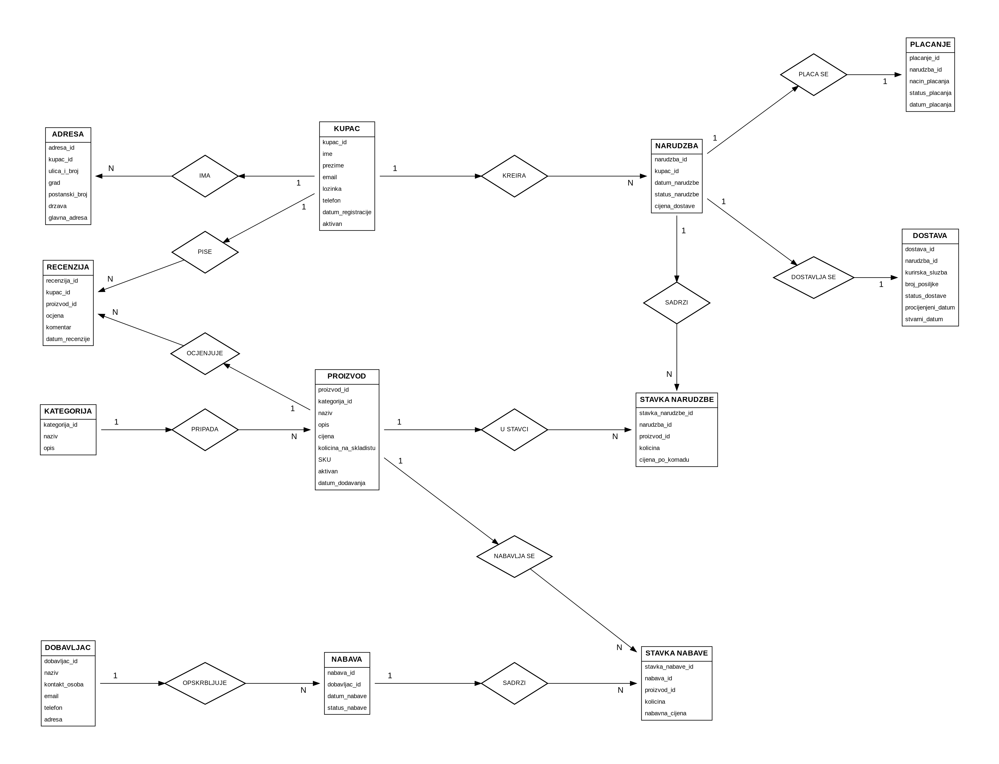

### 3.3 Enhanced Entity–Relationship (EER) dijagram (MySQL Workbench)

opis -Lorem ipsum dolor sit amet, consectetur adipiscing elit, sed do eiusmod tempor incididunt ut labore et dolore magna aliqua. Ut enim ad minim veniam, quis nostrud exercitation ullamco laboris nisi ut aliquip ex ea commodo consequat. Duis aute irure dolor in reprehenderit in voluptate velit esse cillum dolore eu fugiat nulla pariatur. Excepteur sint occaecat cupidatat non proident, sunt in culpa qui officia deserunt mollit anim id est laborum.

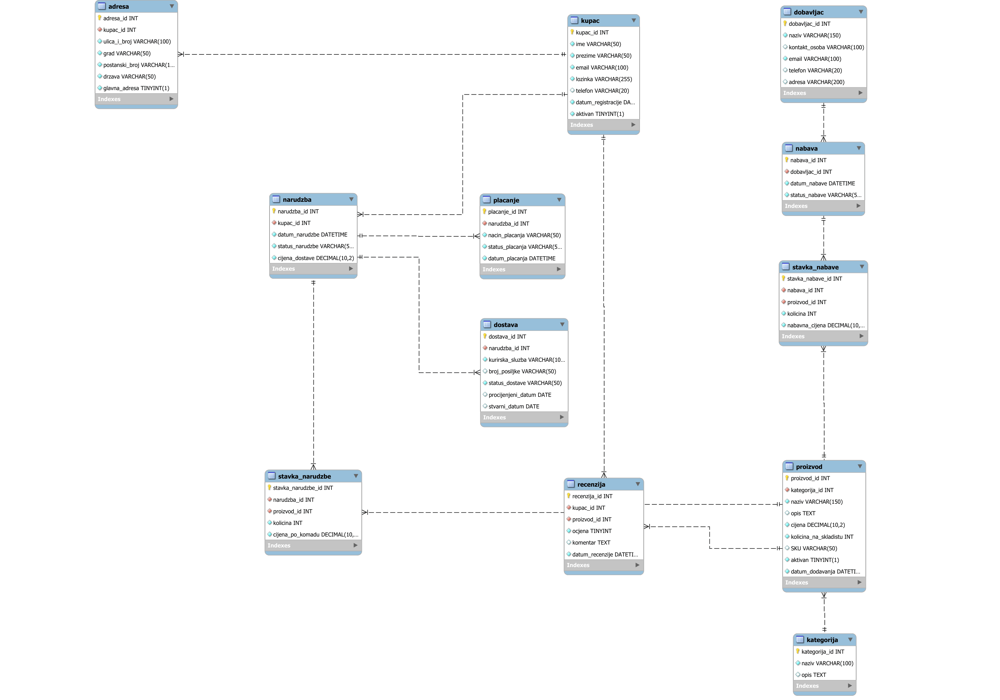

&nbsp;

## 4. Relacije (Teo Kupčinovac)

 opis

 - objasniti kako se stvaraju relacije u MySQL 
  
&nbsp;

### 4.1 Relacija *kupac*

Prati osnovne podatke o kupcima u sustavu. Relacija **kupac** se sastoji od sljedećih atributa:

- **kupac_id** – podatak tipa `INT`, koji je primarni ključ unutar relacije. Automatski se povećava (`AUTO_INCREMENT`), što znači da svaki novi kupac dobiva jedinstveni identifikator.

- **ime** – podatak tipa `VARCHAR` ograničen na 50 znakova. Ograničen je s `NOT NULL`, što znači da vrijednost mora biti unesena.

- **prezime** – podatak tipa `VARCHAR` ograničen na 50 znakova. Također ima ograničenje `NOT NULL`.

- **email** – podatak tipa `VARCHAR` ograničen na 100 znakova. Ima ograničenja `NOT NULL` i `UNIQUE`, što znači da svaki kupac mora imati email i da ne mogu postojati dva kupca s istom email adresom.

- **lozinka** – podatak tipa `VARCHAR` ograničen na 255 znakova. Ograničen je s `NOT NULL` (vrijednost je obavezna; tipično se sprema hash lozinke, ne sama lozinka).

- **telefon** – podatak tipa `VARCHAR` ograničen na 20 znakova. Nema `NOT NULL` ograničenje, što znači da je unos opcionalan.

- **datum_registracije** – podatak tipa `DATE`. Predstavlja datum registracije kupca i također je opcionalan (može biti `NULL` ako nije zadano).

- **aktivan** – podatak tipa `BOOLEAN`. Ima zadanu vrijednost (`DEFAULT TRUE`), što znači da će novi kupac automatski biti označen kao aktivan ako se ne navede drugačije.

Ograničenje `NOT NULL` označava da atribut mora imati vrijednost, dok `UNIQUE` osigurava jedinstvenost podataka unutar tog atributa.

```sql
CREATE TABLE kupac (
    kupac_id INT AUTO_INCREMENT PRIMARY KEY,
    ime VARCHAR(50) NOT NULL,
    prezime VARCHAR(50) NOT NULL,
    email VARCHAR(100) NOT NULL UNIQUE,
    lozinka VARCHAR(255) NOT NULL,
    telefon VARCHAR(20),
    datum_registracije DATE,
    aktivan BOOLEAN DEFAULT TRUE
);

```

&nbsp;

## 5. Popuna podacima (Luka Wrana)

opis -Lorem ipsum dolor sit amet, consectetur adipiscing elit, sed do eiusmod tempor incididunt ut labore et dolore magna aliqua. Ut enim ad minim veniam, quis nostrud exercitation ullamco laboris nisi ut aliquip ex ea commodo consequat. Duis aute irure dolor in reprehenderit in voluptate velit esse cillum dolore eu fugiat nulla pariatur. Excepteur sint occaecat cupidatat non proident, sunt in culpa qui officia deserunt mollit anim id est laborum.

&nbsp;

### 5.1 Popuna relacije *kategorija*


Popuna podataka u relaciji **kategorija** vrši se unosom više zapisa pomoću SQL naredbe `INSERT INTO`. U ovom primjeru unosi se početni skup kategorija proizvoda.

- **kategorija_id** se unosi ručno i predstavlja jedinstveni identifikator svake kategorije. Vrijednosti moraju biti jedinstvene.

- **naziv** predstavlja naziv kategorije te mora biti jedinstven i smislen kako bi jasno opisivao grupu proizvoda.

- **opis** daje dodatno objašnjenje kategorije i služi za detaljniji opis sadržaja unutar svake kategorije.

U prikazanom primjeru uneseno je 6 kategorija:

- **Tamna čokolada** – kategorija proizvoda s visokim udjelom kakaa  
- **Mliječna čokolada** – kremaste čokolade s dodatkom mlijeka  
- **Bijela čokolada** – slatke čokolade bez kakaa  
- **Praline** – ručno izrađeni proizvodi punjeni kremama i likerima  
- **Posebne ponude** – sezonski i ograničeni proizvodi  
- **Čokoladne figure** – dekorativni proizvodi od čokolade

```sql
INSERT INTO kategorija (kategorija_id, naziv, opis) VALUES
(1, 'Tamna čokolada', 'Premium tamne čokolade visokog udjela kakaa'),
(2, 'Mliječna čokolada', 'Kremaste mliječne čokolade s raznim okusima'),
(3, 'Bijela čokolada', 'Slatke bijele čokolade i kombinacije'),
(4, 'Praline', 'Ručno rađene praline punjene kremama i likerima'),
(5, 'Posebne ponude', 'Sezonske i limitirane kolekcije'),
(6, 'Čokoladne figure', 'Dekorativne figure od čokolade');
```

&nbsp;

### 5.2 Popuna relacije *dobavljac*

Popuna podataka u relaciji **dobavljac** vrši se unosom više zapisa pomoću SQL naredbe `INSERT INTO`. Ova relacija sadrži informacije o dobavljačima čokolade i sirovina.

- **dobavljac_id** se unosi ručno i predstavlja jedinstveni identifikator svakog dobavljača.

- **naziv** predstavlja ime tvrtke dobavljača.

- **kontakt_osoba** označava osobu za kontakt unutar tvrtke.

- **email** i **telefon** služe za komunikaciju s dobavljačem.

- **adresa** predstavlja lokaciju dobavljača.

U prikazanom primjeru unesena su 3 dobavljača iz različitih država.

```sql
INSERT INTO dobavljac (dobavljac_id, naziv, kontakt_osoba, email, telefon, adresa) VALUES
(1, 'Cocoa Imports Europe', 'Marko Jurić', 'info@cocoa-eu.com', '01 555 111', 'Zagreb, Hrvatska'),
(2, 'Belgian Chocolate Supply', 'Anna De Vries', 'sales@belgianchoco.be', '+32 555 222', 'Brussels, Belgium'),
(3, 'Organic Cacao Farm', 'Luis Hernandez', 'contact@organiccacao.com', '+57 300 111', 'Medellin, Colombia');
```

&nbsp;

### 5.3 Popuna relacije *kupac*

Popuna podataka u relaciji **kupac** vrši se unosom više zapisa pomoću SQL naredbe `INSERT INTO`. Ova relacija sadrži osnovne informacije o kupcima.

- **kupac_id** se unosi ručno i predstavlja jedinstveni identifikator svakog kupca.

- **ime** i **prezime** predstavljaju osobne podatke kupca.

- **email** mora biti jedinstven jer se koristi za prijavu u sustav.

- **lozinka** predstavlja korisničku lozinku.

- **telefon** služi za kontakt s kupcem.

U prikazanom primjeru uneseno je 10 kupaca:

```sql
INSERT INTO kupac (kupac_id, ime, prezime, email, lozinka, telefon) VALUES
(1, 'Luka', 'Kovač', 'luka@gmail.com', 'pass1', '0911111111'),
(2, 'Mia', 'Horvat', 'mia@gmail.com', 'pass2', '0911111112'),
(3, 'Ivan', 'Barić', 'ivan@gmail.com', 'pass3', '0911111113'),
(4, 'Ana', 'Novak', 'ana@gmail.com', 'pass4', '0911111114'),
(5, 'Petra', 'Marić', 'petra@gmail.com', 'pass5', '0911111115'),
(6, 'Marko', 'Šimić', 'marko@gmail.com', 'pass6', '0911111116'),
(7, 'Dario', 'Vuković', 'dario@gmail.com', 'pass7', '0911111117'),
(8, 'Nina', 'Kralj', 'nina@gmail.com', 'pass8', '0911111118'),
(9, 'Josip', 'Babić', 'josip@gmail.com', 'pass9', '0911111119'),
(10,'Sara', 'Lukic', 'sara@gmail.com', 'pass10', '0911111120');
```

&nbsp;

### 5.4 Popuna relacije *adresa*

```sql
INSERT INTO adresa (kupac_id, ulica, grad, postanski_broj, glavna_adresa) VALUES
(1,'Ilica 1','Zagreb','10000',1),
(1,'Gajeva 10','Zagreb','10000',0),
(2,'Korzo 5','Rijeka','51000',1),
(2,'Laginjina 2','Rijeka','51000',0),
(3,'Strossmayerova 3','Osijek','31000',1),
(3,'Vukovarska 9','Osijek','31000',0),
(4,'Poljička 7','Split','21000',1),
(4,'Riva 1','Split','21000',0),
(5,'Dubrava 12','Zagreb','10000',1),
(6,'Varaždinska 8','Varaždin','42000',1),
(7,'Čakovečka 15','Čakovec','40000',1),
(8,'Zagrebačka 22','Karlovac','47000',1),
(9,'Trg bana 4','Zagreb','10000',1),
(10,'Petrinjska 6','Zagreb','10000',1);

```

&nbsp;

### 5.5 Popuna relacije *proizvod*

```sql

```

&nbsp;

### 5.6 Procedura za automatsko generiranje narudzba

```sql
DELIMITER $$

CREATE PROCEDURE generate_orders()
BEGIN
    DECLARE i INT DEFAULT 1;
    DECLARE random_customer INT;
    DECLARE random_address INT;
    DECLARE order_id INT;

    WHILE i <= 60 DO

        SET random_customer = FLOOR(1 + RAND() * 10);
        
        SELECT adresa_id
        INTO random_address
        FROM adresa
        WHERE kupac_id = random_customer
        ORDER BY RAND()
        LIMIT 1;

        INSERT INTO narudzba (
            kupac_id,
            adresa_id,
            datum_narudzbe,
            status,
            ukupan_iznos
        )
        VALUES (
            random_customer,
            random_address,
            DATE_SUB(NOW(), INTERVAL FLOOR(RAND()*60) DAY),
            'Završena',
            0
        );

        SET order_id = LAST_INSERT_ID();

        INSERT INTO stavka_narudzbe (
            narudzba_id,
            proizvod_id,
            kolicina,
            cijena_po_komadu,
            ukupna_cijena
        )
        VALUES
        (order_id, FLOOR(1 + RAND()*18), 1, 3.5, 3.5),
        (order_id, FLOOR(1 + RAND()*18), 2, 4.0, 8.0),
        (order_id, FLOOR(1 + RAND()*18), 1, 5.5, 5.5);

        SET i = i + 1;
    END WHILE;

END $$

DELIMITER ;

CALL generate_orders();

UPDATE narudzba n
JOIN (
    SELECT narudzba_id, SUM(ukupna_cijena) AS total
    FROM stavka_narudzbe
    GROUP BY narudzba_id
) s ON s.narudzba_id = n.narudzba_id
SET n.ukupan_iznos = s.total;
```

&nbsp;

### 5.7 Popuna relacije *placanje*

```sql
INSERT INTO placanje (narudzba_id, nacin_placanja, iznos, status_placanja, datum_placanja)
SELECT 
    narudzba_id,
    ELT(FLOOR(1 + RAND()*3), 'Kartica', 'Pouzećem', 'PayPal'),
    ukupan_iznos,
    'Plaćeno',
    datum_narudzbe + INTERVAL FLOOR(RAND()*2) DAY
FROM narudzba;
```

&nbsp;

### 5.9 Popuna relacije *dostava*

```sql
INSERT INTO dostava (narudzba_id, kurirska_sluzba, broj_posiljke, status_dostave, procijenjeni_datum, stvarni_datum)
SELECT
    narudzba_id,
    ELT(FLOOR(1 + RAND()*3), 'DHL', 'GLS', 'HP'),
    CONCAT('HR', FLOOR(100000 + RAND()*900000)),
    'Dostavljeno',
    DATE(datum_narudzbe + INTERVAL 3 DAY),
    DATE(datum_narudzbe + INTERVAL 2 + FLOOR(RAND()*2) DAY)
FROM narudzba;
```

&nbsp;

### 5.11 Popuna relacije *stavka_nabave*

```sql
INSERT INTO stavka_nabave (nabava_id, proizvod_id, kolicina, nabavna_cijena)
VALUES
(1, 1, 100, 2.0),
(1, 2, 80, 2.2),
(2, 6, 120, 1.8),
(2, 7, 90, 2.1),
(3, 10, 70, 2.5),
(3, 12, 60, 2.8);
```

&nbsp;


### 5.11 Popuna relacije *recenzija*

```sql
INSERT INTO recenzija (kupac_id, proizvod_id, ocjena, komentar)
VALUES
(1,1,5,'Odlična čokolada!'),
(2,2,4,'Jako dobra, ali malo preslatka'),
(3,3,5,'Savršena kombinacija okusa'),
(4,4,4,'Fina i kremasta'),
(5,5,5,'Top proizvod!'),
(6,6,3,'Ok, ali očekivao sam više'),
(7,7,5,'Super okus naranče'),
(8,8,4,'Dobra, ali ljuta'),
(9,9,5,'Najbolja bijela čokolada'),
(10,10,4,'Vrlo ukusna'),
(1,6,5,'Tamna mi je favorit'),
(2,7,5,'Savršena aroma'),
(3,8,4,'Zanimljiva kombinacija'),
(4,9,5,'Odlična tekstura'),
(5,10,4,'Fino i lagano'),
(6,11,5,'Jagoda top'),
(7,12,5,'Pistacija odlična'),
(8,13,4,'Rum punjenje super'),
(9,14,5,'Lješnjak fantastičan'),
(10,15,5,'Espresso pun pogodak');

```
&nbsp;

## 6. Upiti (Andrej Pucović i Danijel Margić)

SQL upiti *(eng. queries)* predstavljaju naredbe kojima se dohvaćaju, filtriraju, grupiraju i prikazuju podaci iz baze podataka. Najčešće se zadaju pomoću naredbe `SELECT`, kojom se određuje koji atributi i podaci će biti prikazani iz jedne ili više tablica. Upiti mogu uključivati različite operacije poput filtriranja podataka pomoću `WHERE`, sortiranja pomoću `ORDER BY`, grupiranja pomoću `GROUP BY` te povezivanja više tablica korištenjem JOIN operacija. Također omogućavaju izvođenje računskih operacija nad podacima, poput zbrajanja, oduzimanja, množenja i dijeljenja vrijednosti atributa. SQL je deklarativni jezik, što znači da korisnik definira koje podatke želi dohvatiti, dok način i proceduru dohvaćanja podataka određuje sam DBMS *(DataBase Management System)*, odnosno sustav za upravljanje bazom podataka. Za razliku od relacijske algebre, gdje se mora definirati redoslijed operacija za dobivanje rezultata, kod SQL-a korisnik navodi samo željeni rezultat, dok je za izvršavanje upita zaslužan DBMS, konkretno u našem slučaju MySQL. Upiti omogućavaju jednostavan i učinkovit dohvat relevantnih informacija iz baze podataka.

Općenita sintaksa za kreiranje SQL upita je:

```sql
SELECT A1, A2, ...
FROM r1, r2, ...
WHERE P;
```

pri čemu `A1, A2` predstavljaju atribute (stupce), `r1, r2` relacije (tablice), a `P` predikat selekcije.

&nbsp;

### 6.1 Upit: Ukupan broj narudžbi i potrošnja po kupcu (Andrej Pucović)

Ovaj upit prikazuje ukupan broj narudžbi, ukupnu potrošnju i prosječnu vrijednost narudžbe za svakog kupca. Povezuju se relacije `kupac` i `narudzba`, a podaci se grupiraju prema kupcu korištenjem naredbe `GROUP BY`. Agregacijske funkcije `COUNT`, `SUM` i `AVG` koriste se za izračun broja narudžbi, ukupne potrošnje i prosječne vrijednosti narudžbe. Uvjet `HAVING` koristi se za prikaz samo kupaca koji imaju barem jednu narudžbu. Upit je koristan za analizu kupaca i prepoznavanje najaktivnijih kupaca trgovine.

```sql
SELECT 
    k.kupac_id,
    CONCAT(k.ime, ' ', k.prezime) AS kupac,
    k.email,
    COUNT(n.narudzba_id) AS broj_narudzbi,
    ROUND(SUM(n.ukupan_iznos), 2) AS ukupno_potroseno,
    ROUND(AVG(n.ukupan_iznos), 2) AS prosjecna_vrijednost_narudzbe
FROM kupac k
JOIN narudzba n ON k.kupac_id = n.kupac_id
GROUP BY k.kupac_id, k.ime, k.prezime, k.email
HAVING COUNT(n.narudzba_id) >= 1
ORDER BY ukupno_potroseno DESC;
```

### 6.2 Upit: Najprodavaniji proizvodi po količini i prihodu (Andrej Pucović)

Ovaj upit prikazuje proizvode koji su ostvarili najveću prodaju prema količini prodanih proizvoda i ukupnom prihodu. Povezuju se relacije `proizvod`, `kategorija` i `stavka_narudzbe`, a podaci se grupiraju prema proizvodu i kategoriji. Agregacijska funkcija `SUM` koristi se za izračun ukupno prodane količine i ukupnog prihoda proizvoda. Rezultati su sortirani prema količini prodaje i prihodu, dok se pomoću `LIMIT` prikazuje samo prvih pet proizvoda. Upit je koristan za analizu najuspješnijih proizvoda u trgovini.

```sql
SELECT 
    p.proizvod_id,
    p.naziv,
    k.naziv AS kategorija,
    SUM(sn.kolicina) AS ukupno_prodano,
    ROUND(SUM(sn.ukupna_cijena), 2) AS ukupni_prihod
FROM proizvod p
JOIN kategorija k ON p.kategorija_id = k.kategorija_id
JOIN stavka_narudzbe sn ON p.proizvod_id = sn.proizvod_id
GROUP BY p.proizvod_id, p.naziv, k.naziv
ORDER BY ukupno_prodano DESC, ukupni_prihod DESC
LIMIT 5;
```

### 6.3 Upit: Proizvodi koji nisu prodani (Andrej Pucović)

Ovaj upit prikazuje proizvode koji se ne pojavljuju ni u jednoj narudžbi kupaca. Koristi se `LEFT JOIN` između relacija `proizvod` i `stavka_narudzbe`, dok uvjet `IS NULL` služi za pronalazak proizvoda bez povezanih zapisa u stavkama narudžbe. Rezultati se sortiraju prema nazivu proizvoda. Upit je koristan za prepoznavanje proizvoda koji se ne prodaju te može pomoći pri analizi ponude i upravljanju skladištem.

```sql
SELECT 
    p.proizvod_id,
    p.naziv,
    p.cijena,
    p.kolicina_na_skladistu
FROM proizvod p
LEFT JOIN stavka_narudzbe sn ON p.proizvod_id = sn.proizvod_id
WHERE sn.proizvod_id IS NULL
ORDER BY p.naziv;
```

### 6.4 Upit: Kupci čija je potrošnja veća od prosjeka (Andrej Pucović)

Ovaj upit prikazuje kupce čija je ukupna potrošnja veća od prosječne potrošnje svih kupaca. U unutarnjem upitu računa se ukupna potrošnja po kupcu, a zatim se u vanjskom upitu prikazuju samo oni kupci čija je potrošnja veća od prosječne vrijednosti. Koriste se ugniježđeni podupiti, agregacijska funkcija `SUM`, funkcija `AVG` te grupiranje podataka po kupcu. Upit je koristan za prepoznavanje kupaca koji ostvaruju iznadprosječnu vrijednost kupovine.

```sql
SELECT *
FROM (
    SELECT 
        k.kupac_id,
        CONCAT(k.ime, ' ', k.prezime) AS kupac,
        ROUND(SUM(n.ukupan_iznos), 2) AS ukupna_potrosnja
    FROM kupac k
    JOIN narudzba n ON k.kupac_id = n.kupac_id
    GROUP BY k.kupac_id, k.ime, k.prezime
) x
WHERE x.ukupna_potrosnja > (
    SELECT AVG(potrosnja_po_kupcu)
    FROM (
        SELECT SUM(n2.ukupan_iznos) AS potrosnja_po_kupcu
        FROM narudzba n2
        GROUP BY n2.kupac_id
    ) y
)
ORDER BY x.ukupna_potrosnja DESC;
```

### 6.5 Upit: Mjesečni prihod trgovine (Andrej Pucović)

Ovaj upit prikazuje broj narudžbi, ukupni prihod i prosječnu vrijednost narudžbe po mjesecima. Podaci se dohvaćaju iz relacije `narudzba`, a funkcije `YEAR` i `MONTH` koriste se za grupiranje podataka prema godini i mjesecu narudžbe. Agregacijske funkcije `COUNT`, `SUM` i `AVG` omogućavaju analizu prodaje kroz određena vremenska razdoblja. Upit je koristan za praćenje poslovanja trgovine i analizu mjesečnih prihoda.

```sql
SELECT 
    YEAR(datum_narudzbe) AS godina,
    MONTH(datum_narudzbe) AS mjesec,
    COUNT(*) AS broj_narudzbi,
    ROUND(SUM(ukupan_iznos), 2) AS mjesecni_prihod,
    ROUND(AVG(ukupan_iznos), 2) AS prosjecna_narudzba
FROM narudzba
GROUP BY YEAR(datum_narudzbe), MONTH(datum_narudzbe)
ORDER BY godina, mjesec;
```

&nbsp;

### 6.6 Upit : Usporedba prodajne cijene i zadnje nabavne cijene po komadu (Danijel Margić)

```sql
SELECT 
    p.proizvod_id,
    p.naziv AS proizvod,
    p.cijena AS prodajna_cijena,
    ROUND(AVG(sn.nabavna_cijena), 2) AS prosjecna_nabavna_cijena,
    ROUND((p.cijena - AVG(sn.nabavna_cijena)), 2) AS profit_po_komadu,
    ROUND(((p.cijena - AVG(sn.nabavna_cijena)) / p.cijena) * 100, 2) AS marza_postotak
FROM proizvod p
INNER JOIN stavka_nabave sn ON p.proizvod_id = sn.proizvod_id
GROUP BY p.proizvod_id, p.naziv, p.cijena
ORDER BY marza_postotak DESC;
```
#### rezultat Upit a:


Ovaj upit služi za procjenu profitabilnosti proizvoda tako što uspoređuje njihovu prodajnu cijenu s prosječnom nabavnom cijenom. Podaci se preuzimaju iz tablice `proizvod`, a zatim se pomoću `INNER JOIN` spajaju sa zapisima iz tablice `stavka_nabave`, pri čemu se spajanje vrši preko relacije `p.proizvod_id = sn.proizvod_id`. Na taj način u analizu ulaze samo proizvodi koji imaju evidentirane nabave. Nad stupcem `sn.nabavna_cijena` primjenjuje se agregatna funkcija `AVG` kako bi se izračunala prosječna nabavna cijena za svaki proizvod. Nakon toga određuje se profit po komadu kao razlika između prodajne cijene iz tablice proizvod i izračunate prosječne nabavne cijene. Iz istih vrijednosti računa se i marža u postotku, koja pokazuje koliki dio prodajne cijene predstavlja zarada. Budući da se koriste agregatne funkcije, podaci se grupiraju prema identifikatoru, nazivu i prodajnoj cijeni proizvoda, što omogućuje da svaki proizvod bude prikazan kao jedan agregirani zapis. Rezultati se zatim sortiraju tako da se proizvodi s najvećom maržom nalaze na vrhu, čime upit omogućuje brzi uvid u najprofitabilnije artikle i potencijalne prilike za optimizaciju cijena ili nabavne strategije.

### 6.7 UPIT: Ukupna zarada, broj narudžbi i prosječna vrijednost košarice po kategorijama (Danijel Margić)

```sql
SELECT 
    k.naziv AS kategorija_naziv,
    COUNT(DISTINCT sn.narudzba_id) AS ukupno_narudzbi,
    SUM(sn.kolicina) AS prodano_komada,
    SUM(sn.ukupna_cijena) AS ukupni_prihod,
    ROUND(AVG(sn.ukupna_cijena), 2) AS prosjecna_vrijednost_stavke
FROM kategorija k
INNER JOIN proizvod p ON k.kategorija_id = p.kategorija_id
INNER JOIN stavka_narudzbe sn ON p.proizvod_id = sn.proizvod_id
GROUP BY k.kategorija_id, k.naziv
ORDER BY ukupni_prihod DESC;
```
#### Rezultat upita:
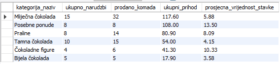

Ovaj upit služi za identifikaciju najprofitabilnijih segmenata asortimana kroz analizu prodajnih rezultata na razini kategorija proizvoda. Podaci se povezuju iz triju različitih relacija pomoću višestruke operacije `INNER JOIN`. Prvo se spajaju relacije `kategorija` i `proizvod` preko zajedničkog identifikatora kategorije, a zatim se rezultat povezuje s relacijom `stavka_narudzbe` preko surogatnog ključa proizvoda. Time se osigurava referencijski integritet i obuhvaćaju samo oni artikli koji su zapravo prodani. 

Nad atributom `sn.narudzba_id` primjenjuje se funkcija `COUNT(DISTINCT)` koja prebrojava unikatne n-torke narudžbi unutar multiskupa i eliminira duplikate nastale zbog više stavki u istoj košarici. Agregacijska funkcija `SUM` koristi se nad domenom atributa količine i ukupne cijene stavki kako bi izračunala ukupan volumen prodaje i ukupni ostvareni prihod. Istovremeno, funkcija `AVG` računa srednju vrijednost pojedinačnih stavki u narudžbi, zaokruženu funkcijom `ROUND` na dvije decimale. Svi prikupljeni transakcijski podaci grupiraju se (`GROUP BY`) prema nazivu i identifikatoru kategorije, što omogućuje sažeti prikaz performansi svake skupine proizvoda. Rezultati se sortiraju silazno prema ukupnom prihodu (`ORDER BY ... DESC`), uvid u to koje kategorije čokolada generiraju najveći promet na platformi.

### 6.8 UPIT: Kontrola kvalitete asortimana kroz najbolje ocijenjene proizvode (Danijel Margić)

```sql
SELECT 
    p.proizvod_id,
    p.naziv AS proizvod_naziv,
    p.cijena,
    ROUND(AVG(r.ocjena), 2) AS prosjecna_ocjena,
    COUNT(r.recenzija_id) AS broj_recenzija
FROM proizvod p
INNER JOIN recenzija r ON p.proizvod_id = r.proizvod_id
GROUP BY p.proizvod_id, p.naziv, p.cijena
HAVING broj_recenzija >= 2
ORDER BY prosjecna_ocjena DESC, broj_recenzija DESC;
```

#### Rezultat upita:
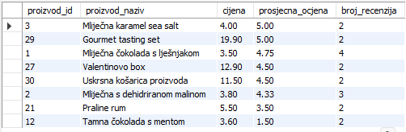

Ovaj upit služi za kontrolu kvalitete asortimana i izdvajanje artikala s najvišim povjerenjem kupaca, što omogućuje prepoznavanje "bestsellera". Podaci se preuzimaju iz referencirane relacije `proizvod` i povezuju pomoću operacije `INNER JOIN` s n-torkama iz referencirajuće relacije `recenzija`, pri čemu se spajanje vrši preko zajedničkog surogatnog ključa `p.proizvod_id = r.proizvod_id`. Na taj način u analizu ulaze samo oni artikli koji su dobili povratne informacije od klijenata. 

Nad domenom atributa `r.ocjena` primjenjuje se agregatna funkcija `AVG` kako bi se izračunala prosječna ocjena za svaki proizvod, zaokružena funkcijom `ROUND` na dvije decimale radi preciznosti. Istovremeno, funkcija `COUNT` prebrojava unikatne n-torke unutar atributa `r.recenzija_id` radi utvrđivanja ukupnog broja ocjena. Budući da se koriste agregatne funkcije nad multiskupovima, podaci se grupiraju (`GROUP BY`) prema identifikatoru, nazivu i cijeni proizvoda. Ključni dio upita je primjena klauzule `HAVING` koja vrši restrikciju skupina i propušta samo proizvode s barem dvije zaprimljene recenzije, čime se eliminiraju artikli s nerealno visokim ocjenama na temelju samo jednog glasa. Rezultati se sortiraju primarno prema prosječnoj ocjeni silazno (`DESC`), a sekundarno prema broju recenzija, pružajući jasan uvid u najkvalitetnije i najpopularnije proizvode na platformi.

### 6.9 UPIT: Upravljanje skladištem i identifikacija kritičnih zaliha popularnih artikala (Danijel Margić)

```sql
SELECT 
    p.proizvod_id,
    p.naziv,
    p.kolicina_na_skladistu,
    SUM(sn.kolicina) AS ukupno_prodano
FROM proizvod p
INNER JOIN stavka_narudzbe sn ON p.proizvod_id = sn.proizvod_id
WHERE p.kolicina_na_skladistu < (
    SELECT AVG(kolicina_na_skladistu) FROM proizvod WHERE aktivan = TRUE
)
GROUP BY p.proizvod_id, p.naziv, p.kolicina_na_skladistu
ORDER BY p.kolicina_na_skladistu ASC;
```

#### Rezultat upita:
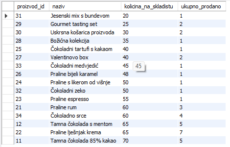

Ovaj upit služi za upravljanje skladištem i pravovremenu identifikaciju artikala koji su traženi na tržištu, ali su im zalihe kritično niske u usporedbi s prosjekom trgovine. Podaci se polazno povlače iz referencirane relacije `proizvod` i povezuju preko operacije `INNER JOIN` s n-torkama iz referencirajuće relacije `stavka_narudzbe` pomoću surogatnog ključa `p.proizvod_id = sn.proizvod_id`. Time se osigurava da se u analizu uključe isključivo proizvodi koji imaju ostvarenu prodaju. 

Ključni dio upita nalazi se u klauzuli `WHERE` koja vrši restrikciju na razini n-torki pomoću ugniježđenog skalarnog podupita. Taj podupit izračunava srednju vrijednost domene atributa `kolicina_na_skladistu` za sve aktivne artikle pomoću funkcije `AVG`. Glavni upit potom kroz operaciju selekcije propušta samo one proizvode čija je pojedinačna zaliha strogo manja od tog izračunatog prosjeka. Agregacijska funkcija `SUM` zbraja količine unutar multiskupa atributa `sn.kolicina` kako bi prikazala ukupan broj prodanih komada. Podaci se grupiraju (`GROUP BY`) prema identifikatoru, nazivu i stanju zaliha proizvoda, što omogućuje čisti pregled po svakom artiklu. Rezultati se sortiraju uzlazno (`ASC`) prema količini na skladištu, postavljajući najugroženije proizvode s kritičnim zalihama na sam vrh liste kako bi voditelj nabave odmah znao što treba ponovno naručiti od dobavljača.

### 6.10 UPIT: Analiza prometa asortimana (Danijel Margić)

```sql
SELECT 
    p.proizvod_id,
    p.SKU,
    p.naziv AS proizvod_naziv,
    COALESCE(SUM(sn.kolicina), 0) AS ukupno_prodanih_komada,
    COALESCE(SUM(sn.ukupna_cijena), 0) AS ukupni_ostvareni_prihod
FROM proizvod p
LEFT JOIN stavka_narudzbe sn ON p.proizvod_id = sn.proizvod_id
GROUP BY p.proizvod_id, p.SKU, p.naziv
ORDER BY ukupno_prodanih_komada ASC;
```

#### Rezultat upita:
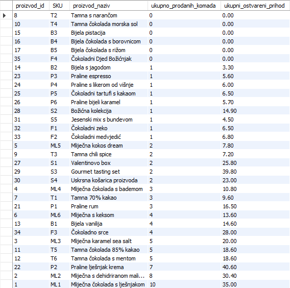

Ovaj upit služi za  analizu prometa asortimana s ciljem identifikacije proizvoda koji slabije rotiraju ili se uopće ne prodaju, kako bi se donijele odluke o popustima ili povlačenju robe. Za razliku od standardnog spajanja, ovaj upit polazi od relacije `proizvod` i povezuje se s n-torkama iz relacije `stavka_narudzbe` pomoću operacije lijevog vanjskog spajanja (**`LEFT JOIN`**). Svrha ove operacije je očuvanje svih n-torki iz lijeve relacije (`proizvod`), čak i ako za njih ne postoji niti jedan zapis o prodaji u desnoj relaciji. Za takve neprodane artikle, sustav privremeno inicijalizira vrijednosti kao `null`.

U fazi projekcije nad multiskupovima, funkcija `SUM` zbraja količine i ukupne prihode. Ključni element je primjena funkcije `COALESCE`, koja provodi generaliziranu projekciju i automatski zamjenjuje nastale `null` vrijednosti s konstantom `0` za sve proizvode bez realiziranog prometa. Podaci se grupiraju (`GROUP BY`) prema identifikatoru, unikatnom prirodnom ključu `SKU` i nazivu artikla. Rezultati se sortiraju uzlazno (`ORDER BY ... ASC`) prema broju prodanih komada. Na taj način, upit na samom vrhu tablice  prikazuje čokolade koje nitko nije kupio.

&nbsp;


## 7. Pogledi (Luka Wrana, Andrej Pucović, Danijel Margić)

Pogledi *(eng. views)* u SQL-u predstavljaju virtualne tablice koje su stvorene na temelju rezultata nekog `SELECT` upita. Pogled ne pohranjuje podatke zasebno, već prikazuje podatke koji se dohvaćaju iz jedne ili više tablica baze podataka. Stvaraju se pomoću naredbe `CREATE VIEW`, pri čemu se definira upit koji će pogled predstavljati. Pogledi se često koriste za pojednostavljenje složenih upita koji uključuju JOIN operacije, agregacije i filtriranje podataka. Pogledi se mogu promatrati kao spremljeni SELECT upiti koji omogućavaju ponovno korištenje često korištenih i složenih upita bez potrebe njihovog ponovnog pisanja. Također omogućavaju ograničavanje pristupa podacima jer se korisnicima mogu prikazati samo određeni stupci tablice, bez prikazivanja osjetljivih podataka (npr. lozinke, OIB, email adrese, broj računa i osobni podaci korisnika). Nakon stvaranja, pogled se može koristiti u `SELECT` naredbama kao obična tablica.

Općenita sintaksa za kreiranje SQL pogleda je:

```sql
CREATE VIEW view_name AS
SELECT A1, A2, ...
FROM r1, r2, ...
WHERE P;
```

pri čemu `view_name` predstavlja naziv pogleda, `A1, A2` atribute koji će biti prikazani, `r1, r2` relacije (tablice), a `P` predikat selekcije.

&nbsp;

### 7.1 Pogled: Proizvodi po ukupnom prihodu (Luka Wrana)

Lorem ipsum dolor sit amet, consectetur adipiscing elit, sed do eiusmod tempor incididunt ut labore et dolore magna aliqua. Ut enim ad minim veniam, quis nostrud exercitation ullamco laboris nisi ut aliquip ex ea commodo consequat. Duis aute irure dolor in reprehenderit in voluptate velit esse cillum dolore eu fugiat nulla pariatur. Excepteur sint occaecat cupidatat non proident, sunt in culpa qui officia deserunt mollit anim id est laborum.

```sql
CREATE OR REPLACE VIEW prihod_po_proizvodu AS
SELECT 
    p.proizvod_id,
    p.naziv,
    SUM(sn.kolicina * sn.cijena_po_komadu) AS ukupni_prihod
FROM proizvod p
JOIN stavka_narudzbe sn ON p.proizvod_id = sn.proizvod_id
JOIN narudzba n ON n.narudzba_id = sn.narudzba_id
WHERE n.datum_narudzbe >= DATE_SUB(NOW(), INTERVAL 1 MONTH)
GROUP BY p.proizvod_id, p.naziv;

SELECT *
FROM prihod_po_proizvodu
ORDER BY ukupni_prihod DESC;
```

&nbsp;

...
...
...

### 7.5 Pogled: Aktivni kupci s osnovnim podacima (Andrej Pucović)

Ovaj pogled prikazuje osnovne informacije o aktivnim kupcima unutar sustava. Podaci se dohvaćaju iz relacije `kupac`, pri čemu se pomoću uvjeta `WHERE` prikazuju samo kupci koji su označeni kao aktivni. Pogled ne prikazuje lozinku kupca, čime se ograničava prikaz osjetljivih podataka.

```sql
CREATE VIEW AP_Pogled_aktivni_kupci AS
SELECT 
    kupac_id,
    ime,
    prezime,
    email,
    telefon,
    datum_registracije
FROM kupac
WHERE aktivan = TRUE;
```

### 7.6 Pogled: Proizvodi i njihove kategorije (Andrej Pucović)

Ovaj pogled prikazuje proizvode zajedno s pripadajućim kategorijama. Koristi se `RIGHT JOIN` kako bi se prikazale i kategorije koje trenutno možda nemaju nijedan proizvod. Na taj način pogled nije ograničen samo na postojeće proizvode, nego daje širi pregled kategorija i povezanih proizvoda.

```sql
CREATE VIEW AP_Pogled_proizvodi_kategorije AS
SELECT 
    p.proizvod_id,
    p.naziv AS proizvod,
    k.naziv AS kategorija,
    p.cijena,
    p.kolicina_na_skladistu,
    p.SKU
FROM proizvod p
RIGHT JOIN kategorija k ON p.kategorija_id = k.kategorija_id;
```

### 7.7 Pogled: Detalji narudžbi (Andrej Pucović)

Ovaj pogled prikazuje informacije o narudžbama, kupcima i adresama dostave. Povezuju se relacije `narudzba`, `kupac` i `adresa`, čime se dobiva pregled važnih podataka vezanih uz narudžbu. Pogled ne prikazuje osjetljive podatke poput lozinke kupca.

```sql
CREATE VIEW AP_Pogled_detalji_narudzbi AS
SELECT 
    n.narudzba_id,
    CONCAT(k.ime, ' ', k.prezime) AS kupac,
    n.datum_narudzbe,
    n.status,
    n.ukupan_iznos,
    a.grad,
    a.ulica
FROM narudzba n
JOIN kupac k ON n.kupac_id = k.kupac_id
JOIN adresa a ON n.adresa_id = a.adresa_id;
```

### 7.8 Pogled: Stavke narudžbi (Andrej Pucović)

Ovaj pogled prikazuje stavke narudžbi zajedno s nazivom proizvoda. Koristi se `JOIN` s dodatnim uvjetom usporedbe, odnosno theta join uvjetom, gdje se prikazuju samo stavke čija je ukupna cijena veća od cijene po komadu. Time se izdvajaju stavke kod kojih je naručena količina veća od jednog komada.

```sql
CREATE VIEW AP_Pogled_stavke_narudzbe AS
SELECT 
    sn.stavka_id,
    sn.narudzba_id,
    p.naziv AS proizvod,
    sn.kolicina,
    sn.cijena_po_komadu,
    sn.ukupna_cijena
FROM stavka_narudzbe sn
JOIN proizvod p 
    ON sn.proizvod_id = p.proizvod_id
    AND sn.ukupna_cijena > sn.cijena_po_komadu;
```

### 7.9 Pogled: Plaćanja narudžbi (Andrej Pucović)

Ovaj pogled prikazuje plaćanja zajedno s osnovnim podacima o narudžbi i kupcu. Povezuju se relacije `placanje`, `narudzba` i `kupac`, čime se dobiva korisniji pregled od samog prikaza relacije `placanje`. Pogled je koristan za praćenje načina plaćanja, statusa plaćanja i kupca koji je vezan uz narudžbu.

```sql
CREATE VIEW AP_Pogled_placanja_narudzbi AS
SELECT 
    p.placanje_id,
    p.narudzba_id,
    CONCAT(k.ime, ' ', k.prezime) AS kupac,
    p.nacin_placanja,
    p.iznos,
    p.status_placanja,
    p.datum_placanja,
    n.status AS status_narudzbe
FROM placanje p
JOIN narudzba n ON p.narudzba_id = n.narudzba_id
JOIN kupac k ON n.kupac_id = k.kupac_id;
```

&nbsp;

### 7.10 Pogled: Prikaz ukupne potrošnje i aktivnosti po kupcima (Danijel Margić)

```sql
CREATE OR REPLACE VIEW v_pregled_potrosnje_kupaca AS
SELECT 
    k.kupac_id,
    CONCAT(k.ime, ' ', k.prezime) AS kupac_ime_prezime,
    k.email,
    COUNT(n.narudzba_id) AS ukupno_narudzbi,
    COALESCE(SUM(n.ukupan_iznos), 0) AS ukupno_potroseno
FROM kupac k
LEFT JOIN narudzba n ON k.kupac_id = n.kupac_id
GROUP BY k.kupac_id, k.ime, k.prezime, k.email;
```

```sql
-- Pozivanje pogleda uz sortiranje po ukupnoj potrošnji silazno
SELECT * FROM v_pregled_potrosnje_kupaca 
ORDER BY ukupno_potroseno DESC;
```
#### Rezultat pogleda:
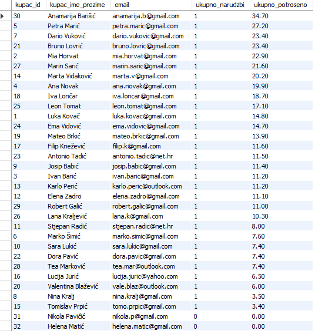

Ovaj pogled sluzi da se brzo vidi potrošačke navike i vjernost kupaca bez stalnog pisanja složenih upita. Podaci se povlače iz bazne relacije `kupac` i povezuju s n-torkama iz transakcijske relacije `narudzba`. U upitu se koristi operacija lijevog vanjskog spajanja (**`LEFT JOIN`**), čime se osigurava da u rezultirajuću izvedenu relaciju uđu svi registrirani kupci, uključujući i one pasivne koji još nemaju niti jednu realiziranu transakciju. Za takve korisnike sustav privremeno inicijalizira vrijednosti kao `null`.

U sklopu generalizirane projekcije primjenjuje se funkcija `CONCAT` koja spaja tekstualne atribute imena i prezimena u jedno polje. Nad multiskupom atributa `n.narudzba_id` izvršava se agregatna funkcija `COUNT` radi dobivanja ukupnog broja kupnji. Istovremeno, funkcija `SUM` zbraja iznose unutar domene atributa `n.ukupan_iznos`. Ključni element unutar projekcije je funkcija `COALESCE` koja presreće `null` vrijednosti nastale kod pasivnih kupaca i automatski ih pretvara u konstantu `0`. Svi transakcijski pokazatelji grupiraju se (`GROUP BY`) prema surogatnom ključu kupca, njegovom e-mailu i punom imenu. Pozivanjem ovog pogleda uz završnu naredbu `ORDER BY ... DESC`, sustav prikazuje kupce sortirane tako da se oni koji su najviše potrošili nalaze na samom vrhu liste.

### 7.11 Pogled: Pregled aktivnosti i troškova opskrbnog lanca (Danijel Margić)

```sql
CREATE OR REPLACE VIEW v_analiza_dobavljaca_opskrba AS
SELECT 
    d.dobavljac_id,
    d.naziv AS dobavljac_naziv,
    d.kontakt_osoba,
    COUNT(n.nabava_id) AS broj_realiziranih_nabava,
    COALESCE(SUM(n.ukupan_iznos), 0) AS ukupno_isplaceno_dobavljacu
FROM nabava n
RIGHT JOIN dobavljac d ON n.dobavljac_id = d.dobavljac_id
GROUP BY d.dobavljac_id, d.naziv, d.kontakt_osoba;

-- Pozivanje pogleda uz sortiranje po ukupnim troškovima nabave silazno
SELECT * FROM v_analiza_dobavljaca_opskrba 
ORDER BY ukupno_isplaceno_dobavljacu DESC;
```

#### Rezultat pogleda:
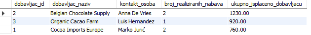

Ovaj pogled pomaže kako bi se brzo provjerilo koliko često surađujemo s kojim dobavljačem i koliko smo im novca ukupno isplatili. Podaci se povezuju iz transakcijske relacije `nabava` i bazne relacije `dobavljac` pomoću operacije desnog vanjskog spajanja (**`RIGHT JOIN`**). Svrha ove operacije je da u konačnom pogledu sačuvamo apsolutno sve dobavljače iz baze podataka, čak i ako od nekoga još nismo napravili niti jednu narudžbu, pri čemu će sustav njihove prazne transakcijske podatke privremeno označiti kao `null`.

U fazi projekcije, funkcija `COUNT` prebrojava unikatne n-torke realiziranih nabava iz popisa transakcija. Agregacijska funkcija `SUM` zbraja sve izdatke unutar domene atributa `n.ukupan_iznos`. Kako se kod novih ili neaktivnih dobavljača u pogledu ne bi prikazivala prazna polja, funkcija `COALESCE` uspješno presreće nastale `null` vrijednosti i pretvara ih u jasnu konstantu `0`. Svi podaci se logički strukturiraju i grupiraju (`GROUP BY`) prema surogatnom ključu i nazivu dobavljača. Pozivanjem ovog pogleda uz završnu naredbu `ORDER BY ... DESC`, pogled na samom vrhu prikazuje partnere s kojima ostvarujemo najveći financijski promet, dok se na dnu nalze dobavljači s nula realiziranih narudžbi.

### 7.12 Pogled: Prikaz volumena prodaje (Danijel Margić)

```sql
CREATE OR REPLACE VIEW v_analiza_popularnosti_proizvoda AS
SELECT 
    p.proizvod_id,
    p.naziv AS proizvod_naziv,
    COALESCE(SUM(sn.kolicina), 0) AS ukupno_prodanih_komada,
    COALESCE(SUM(sn.ukupna_cijena), 0) AS ukupni_ostvareni_prihod
FROM proizvod p
LEFT JOIN stavka_narudzbe sn ON p.proizvod_id = sn.proizvod_id
GROUP BY p.proizvod_id, p.naziv;

-- Pozivanje pogleda uz sortiranje po prodanim komadima silazno
SELECT * FROM v_analiza_popularnosti_proizvoda 
ORDER BY ukupno_prodanih_komada DESC;
```

#### Rezultat pogleda:
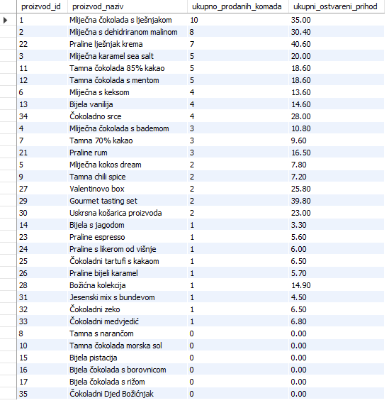

Ovaj pogledom se identificiraju najprodavaniji proizvodi u trgovini. Podaci se povlače iz bazne relacije `proizvod` i povezuju s n-torkama iz transakcijske relacije `stavka_narudzbe` pomoću operacije lijevog vanjskog spajanja (**`LEFT JOIN`**). Korištenje ovog spajanja jamči da će u konačnom rezulatu ostati sačuvani svi proizvodi iz kataloga, pa čak i oni novi artikli koji još nemaju niti jednu realiziranu prodaju, pri čemu će sustav njihove prazne podatke privremeno označiti kao `null`.

U fazi projekcije, agregacijska funkcija `SUM` koristi se nad domenom atributa `sn.kolicina` i `sn.ukupna_cijena` kako bi izračunala ukupan volumen prodaje i ukupni ostvareni prihod za svaku pojedinu čokoladu. Kako se kod neprodanih artikala u tablici ne bi prikazivala prazna polja, funkcija `COALESCE` uspješno presreće nastale `null` vrijednosti i pretvara ih u jasnu konstantu `0`. Svi transakcijski podaci grupiraju se (`GROUP BY`) prema surogatnom ključu i nazivu proizvoda. Pozivanjem ovog pogleda uz završnu naredbu `ORDER BY ... DESC`, sustav na samom vrhu tablice prikazuje najpopularnije artikle s najvećim prometom, pružajući uvid u uspješnost prodaje pojednog artikla.

### 7.13 Pogled 4: Konsolidirani prikaz javnih recenzija i ocjena (Danijel Margić)

```sql
CREATE OR REPLACE VIEW v_javne_recenzije_proizvoda AS
SELECT 
    r.recenzija_id,
    p.naziv AS proizvod_naziv,
    CONCAT(k.ime, ' ', k.prezime) AS kupac_autor,
    r.ocjena,
    r.komentar,
    r.datum_recenzije
FROM recenzija r
INNER JOIN proizvod p ON r.proizvod_id = p.proizvod_id
INNER JOIN kupac k ON r.kupac_id = k.kupac_id;

-- Pozivanje pogleda uz sortiranje po ocjenama uzlazno
SELECT * FROM v_javne_recenzije_proizvoda 
ORDER BY ocjena ASC;
```

#### Rezultat pogleda:
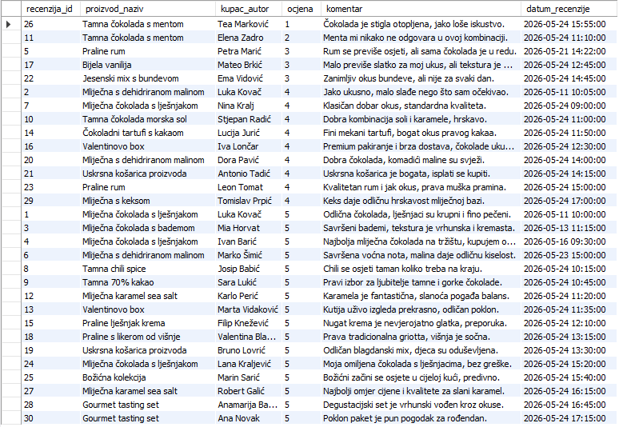

Ovaj pogled da se na jednom mjestu brzo pregleda sve povratne informacije kupaca. Podaci se povezuju iz triju različitih relacija pomoću višestruke operacije `INNER JOIN`. Spajaju se n-torke iz relacije `recenzija` s relacijama `proizvod` i `kupac` preko pripadajućih primarnih i stranih ključeva, čime se jamči očuvanje referencijskog integriteta i točno povezuje tekstualni komentar s artiklom i autorom.

U sklopu generalizirane projekcije primjenjuje se funkcija `CONCAT` koja spaja tekstualne atribute imena i prezimena u jedinstveni izvedeni atribut `kupac_autor`. Pogled izravno propušta atribute surogatnog ključa recenzije, ocjene, komentara i datuma. Pozivanjem ovog pogleda uz završnu naredbu `ORDER BY ocjena ASC`, sustav na samom vrhu tablice prikazuje najslabije ocijenjene proizvode. To omogućuje trenutačnu identifikaciju kritičnih prigovora kupaca (poput otopljene čokolade ili neodgovarajućih okusa) i brzu reakciju radi poboljšanja usluge.

### 7.14 Pogled 5: Operativni manifest za kurirske službe (Danijel Margić)

```sql
CREATE OR REPLACE VIEW v_logistika_dostave_detalji AS
SELECT 
    d.dostava_id,
    d.narudzba_id,
    CONCAT(k.ime, ' ', k.prezime) AS primatelj,
    CONCAT(a.ulica, ', ', a.postanski_broj, ' ', a.grad) AS adresa_dostave,
    d.kurirska_sluzba,
    d.broj_posiljke,
    d.status_dostave
FROM dostava d
INNER JOIN narudzba n ON d.narudzba_id = n.narudzba_id
INNER JOIN kupac k ON n.kupac_id = k.kupac_id
INNER JOIN adresa a ON n.adresa_id = a.adresa_id;

-- Pozivanje pogleda uz filtriranje samo onih dostava koje su u tijeku
SELECT * FROM v_logistika_dostave_detalji 
WHERE status_dostave IN ('U tranzitu', 'Otpremljeno');
```

#### Rezultat pogleda:
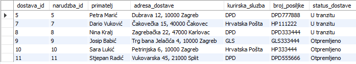

Ovaj pogled pomaže pakirnoj službi i kuririma da na jednom mjestu vide sve podatke za isporuku paketa. Podaci se konsolidiraju iz cetiri različite relacije pomoću višestruke operacije `INNER JOIN`. Spajaju se n-torke iz relacija `dostava`, `narudzba`, `kupac` i `adresa` preko njihovih odgovarajućih primarnih i stranih ključeva. Time se strogo poštuje referencijski integritet i povezuje logistički broj pošiljke s točnim imenom i lokacijom kupca.

Unutar operacije generalizirane projekcije dvaput se koristi funkcija `CONCAT` za spajanje znakovnih nizova. Prva spaja atribute imena i prezimena u izvedeni atribut `primatelj`, dok druga spaja ulica, poštanski broj i grad u jedinstveni izvedeni atribut `adresa_dostave`. Pogled izravno prikazuje i atribute surogatnog ključa dostave, kurirske službe te statusa isporuke. Pozivanjem ovog pogleda uz završnu naredbu `WHERE`, logistički tim može jednim klikom filtrirati samo aktivne pakete koji su trenutno na putu prema kupcima.

&nbsp;

###  8.1 Okidač: trg_stavka_narudzbe_kontrola (Objedinjena kontrola stavki narudžbe) (Danijel Margić)

```sql
DELIMITER $$

CREATE TRIGGER trg_stavka_narudzbe_kontrola
BEFORE INSERT ON stavka_narudzbe
FOR EACH ROW
BEGIN
    DECLARE dostupno_na_skladistu INT;
    
    -- 1. Dohvaćanje trenutnog stanja na skladištu za proizvod
    SELECT kolicina_na_skladistu INTO dostupno_na_skladistu
    FROM proizvod
    WHERE proizvod_id = NEW.proizvod_id;
    
    -- 2. Provjera ima li dovoljno robe na skladištu
    IF NEW.kolicina > dostupno_na_skladistu THEN
        SIGNAL SQLSTATE '45000'
        SET MESSAGE_TEXT = 'Greška: Nema dovoljno proizvoda na skladištu za izvršavanje narudžbe!';
    END IF;
    
    -- 3. Automatski izračun ukupne cijene stavke
    SET NEW.ukupna_cijena = NEW.kolicina * NEW.cijena_po_komadu;
END$$
DELIMITER ;
```

#### Pokretanje okidača (Uspješan unos):
```sql
-- Unosimo stavku bez kolone 'ukupna_cijena' jer je triger sam računa
INSERT INTO stavka_narudzbe (narudzba_id, proizvod_id, kolicina, cijena_po_komadu) 
VALUES (1, 1, 2, 3.50);

-- Provjera automatskog izračuna ukupne cijene (7.00)
SELECT * FROM stavka_narudzbe WHERE narudzba_id = 1 AND proizvod_id = 1;
```
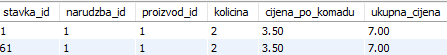

#### Demonstracija greške (Zabrana unosa):
```sql
-- Pokušaj narudžbe prevelike količine (500 komada)
INSERT INTO stavka_narudzbe (narudzba_id, proizvod_id, kolicina, cijena_po_komadu) 
VALUES (1, 1, 500, 3.50);
```
Ovaj okidač služi za automatsko očuvanje integriteta skladišta i sprječavanje ljudskih pogrešaka prilikom kreiranja narudžbi. Pokreće se nad relacijom `stavka_narudzbe` prije nego što se nova n-torka trajno zapiše u bazu podataka (**`BEFORE INSERT`**). Njegova prva uloga je da pomoću lokalne varijable dohvati trenutnu vrijednost iz domene zaliha u relaciji `proizvod`. Ako predikat utvrdi da kupac pokušava naručiti količinu koja je veća od dostupne, okidač pomoću naredbe `SIGNAL SQLSTATE '45000'` fizički prekida transakciju i izbacuje jasnu poruku o grešci, čime se sprječava prodaja nepostojećih čokolada. Ako na skladištu ima dovoljno robe, okidač uspješno prolazi provjeru te kroz operaciju generalizirane projekcije samostalno računa i popunjava atribut `ukupna_cijena` množenjem količine i cijene po komadu, eliminirajući potrebu da vanjska aplikacija obavlja taj izračun.

### 8.2 Okidač: trg_azuriraj_zalihe_nakon_prodaje (Automatsko ažuriranje zaliha nakon kupnje) (Danijel Margić)

```sql
DELIMITER $$

CREATE TRIGGER trg_azuriraj_zalihe_nakon_prodaje
AFTER INSERT ON stavka_narudzbe
FOR EACH ROW
BEGIN
    UPDATE proizvod 
    SET kolicina_na_skladistu = kolicina_na_skladistu - NEW.kolicina
    WHERE proizvod_id = NEW.proizvod_id;
END$$

DELIMITER ;
```

#### Pokretanje i provjera rada okidača:
```sql
-- 1. Provjera stanja zaliha prije nego što kupac obavi kupnju
SELECT kolicina_na_skladistu FROM proizvod WHERE proizvod_id = 3;
```
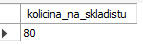

```sql
-- 2. Pokretanje okidača: Kupac kroz stavku narudžbe kupuje 5 komada proizvoda broj 3
INSERT INTO stavka_narudzbe (narudzba_id, proizvod_id, kolicina, cijena_po_komadu) 
VALUES (2, 3, 5, 4.00);

-- 3. Provjera stanja nakon unosa n-torke: Količina na skladištu je automatski smanjena za 5 komada
SELECT kolicina_na_skladistu FROM proizvod WHERE proizvod_id = 3;
```
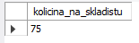

Ovaj okidač služi za automatizirano usklađivanje fizičkog stanja skladišta s realiziranom prodajom u stvarnom vremenu. Pokreće se nad relacijom `stavka_narudzbe` neposredno nakon što se nova n-torka uspješno zapiše u bazu podataka (**`AFTER INSERT`**). Njegova operativna svrha je automatsko očuvanje integriteta zaliha i sprječavanje problema prekoračenja prodaje. 

Kada kupac potvrdi kupnju i podaci prođu početne provjere, ovaj okidač presreće novu n-torku te pomoću ključne riječi `NEW` uzima vrijednost iz domene njezinog atributa `kolicina`. Potom u istom transakcijskom bloku izvršava DML naredbu `UPDATE` nad referenciranom relacijom `proizvod`. Triger pronalazi odgovarajući artikl prema surogatnom ključu `proizvod_id` i aritmetičkom operacijom oduzimanja smanjuje njegov atribut `kolicina_na_skladistu`. Zahvaljujući ovom okidaču, podaci o dostupnosti čokolada na webshopu uvijek su sto posto točni i ažurni bez ikakve potrebe za ručnim intervencijama operatera.


...
...
...
...


