#### Sveučilište Jurja Dobrile u Puli Zagrebačka 30, 52100 Pula, Hrvatska

# BP1 Projekt - E-commerce trgovinu za prodaju čokolade 

## Tim-1

### 1. godina prijediplomskog sveučilišnog studija informatike

- **Luka Juroš** (JMBAG: 0016108283)
- **Teo Kupčinovac** (JMBAG: 1311029868)
- **Luka Wrana** (JMBAG: 0303128892)
- **Andrej Pucković** (JMBAG: 0246066534)
- **Danijel Margić** (JMBAG: 0275053078)

video prezentacija: 

github repozitorij: https://github.com/HeadMathematician/baze-projekt


&nbsp;

## 1. Uvod

U sklopu kolegija Baze podataka I zadatak projektnog rada bio je osmisliti, dizajnirati i implementirati relacijsku bazu podataka koja modelira stvarni poslovni proces koristeći znanja obrađena tijekom semestra. Projekt je obuhvaćao analizu problema, modeliranje podataka pomoću ER i EER dijagrama, implementaciju baze podataka u MySQL sustavu te izradu SQL upita i pogleda.
  

&nbsp;


## 2. Opis poslovnog procesa

Tema našeg projekta je sustav za upravljanje e-commerce trgovinom za prodaju čokolada. Projekt je podijeljen u nekoliko glavnih faza razvoja baze podataka:

- **Konceptualni dizajn baze podataka** – analiza poslovnog procesa te izrada ER i EER dijagrama pomoću Lucidchart-a i MySQL Workbench-a.
  
- **Implementacija relacija i tablica** – stvaranje relacija u MySQL sustavu korištenjem SQL skripti i naredbi CREATE TABLE uz definiranje primarnih i stranih ključeva.
  
- **Unos i generiranje podataka** – popunjavanje baze smislenim testnim podacima koji simuliraju stvarno poslovanje webshop sustava za prodaju čokolada.
  
- **Izrada SQL upita i pogleda** – razvoj složenih SQL upita i VIEW pogleda za dohvat i analizu podataka iz baze.

Projekt je razvijan korištenjem više alata i tehnologija. Draw.io i MySQL Workbench su korišteni za modeliranje ER dijagrama i EER dijagrama, MySQL Workbench za implementaciju baze, GitHub za verzioniranje i dijeljenje koda, a Discord za komunikaciju unutar tima. ChatGPT korišten je kao pomoć pri generiranju dijela testnih podataka.


&nbsp;


## 3. Konceptualini dizajn (Luka Juroš)


Sustav modelira cjelokupan poslovni proces e-trgovine — od registracije kupaca, kataloga proizvoda i naručivanja, preko plaćanja i dostave, do nabave robe od dobavljača i recenziranja proizvoda. Baza podataka sastoji se od 12 povezanih relacija koje pokrivaju tri glavna segmenta poslovanja: prodaju (kupci, narudžbe), logistiku (dostava, plaćanje) i opskrbu (dobavljači, nabava).


&nbsp;


### 3.1 Opis entiteta i atributa


### KUPAC
Pohranjuje podatke o registriranim korisnicima e-trgovine. Svaki kupac ima jedinstvenu email adresu koja služi kao identifikator za prijavu. Lozinka se pohranjuje u hashiranom obliku. Atribut `aktivan` omogućuje deaktivaciju korisničkog računa bez brisanja podataka, čime se čuva povijest narudžbi.

| Atribut | Tip | Ograničenja | Opis |
|---------|-----|-------------|------|
| kupac_id | `INT` | `PK`, `AUTO_INCREMENT` | Jedinstveni identifikator kupca |
| ime | `VARCHAR(50)` | `NOT NULL` | Ime kupca |
| prezime | `VARCHAR(50)` | `NOT NULL` | Prezime kupca |
| email | `VARCHAR(100)` | `NOT NULL`, `UNIQUE` | Email adresa za prijavu |
| lozinka | `VARCHAR(255)` | `NOT NULL` | Hashirana lozinka |
| telefon | `VARCHAR(20)` | `NULL` | Kontakt telefon (opcionalan) |
| datum_registracije | `DATE` | `NOT NULL`, `DEFAULT` | Datum kreiranja računa |
| aktivan | `BOOLEAN` | `NOT NULL`, `DEFAULT TRUE` | Je li račun aktivan |

&nbsp;

### ADRESA
Pohranjuje adrese kupaca. Kupac može imati više adresa (npr. kućna adresa i poslovna adresa) te odabrati jednu kao glavnu adresu za dostavu.

| Atribut | Tip | Ograničenja | Opis |
|---------|-----|-------------|------|
| adresa_id | `INT` | `PK`, `AUTO_INCREMENT` | Jedinstveni identifikator adrese |
| kupac_id | `INT` | `FK`, `NOT NULL` | Referenca na kupca |
| ulica_i_broj | `VARCHAR(100)` | `NOT NULL` | Naziv ulice i kućni broj |
| grad | `VARCHAR(50)` | `NOT NULL` | Naziv grada |
| postanski_broj | `VARCHAR(10)` | `NOT NULL` | Poštanski broj |
| drzava | `VARCHAR(50)` | `NOT NULL`, `DEFAULT 'Hrvatska'` | Država |
| glavna_adresa | `BOOLEAN` | `NOT NULL`, `DEFAULT FALSE` | Je li ovo glavna adresa kupca |

&nbsp;

### KATEGORIJA
Pohranjuje kategorije proizvoda (npr. Elektronika, Odjeća, Sport). Služi za organizaciju kataloga proizvoda kako bi kupci lakše pronašli željene artikle.

| Atribut | Tip | Ograničenja | Opis |
|---------|-----|-------------|------|
| kategorija_id | `INT` | `PK`, `AUTO_INCREMENT` | Jedinstveni identifikator kategorije |
| naziv | `VARCHAR(100)` | `NOT NULL` | Naziv kategorije |
| opis | `TEXT` | `NULL` | Opcionalni opis kategorije |

&nbsp;

### PROIZVOD
Pohranjuje artikle u ponudi e-trgovine. Svaki proizvod pripada jednoj kategoriji, ima jedinstveni SKU kod za praćenje inventara, trenutnu prodajnu cijenu i količinu na skladištu. Atribut `aktivan` omogućuje skrivanje proizvoda iz ponude bez brisanja.

| Atribut | Tip | Ograničenja | Opis |
|---------|-----|-------------|------|
| proizvod_id | `INT` | `PK`, `AUTO_INCREMENT` | Jedinstveni identifikator proizvoda |
| kategorija_id | `INT` | `FK`,`NOT NULL` | Referenca na kategoriju |
| naziv | `VARCHAR(150)` | `NOT NULL` | Naziv proizvoda |
| opis | `TEXT` | `NULL` | Detaljni opis proizvoda |
| cijena | `DECIMAL(10,2)` | `NOT NULL`, `CHECK > 0 `| Trenutna prodajna cijena |
| kolicina_na_skladistu | `INT` | `NOT NULL`, `DEFAULT 0`, `CHECK >= 0` | Raspoloživa količina |
| SKU | `VARCHAR(50)` | `UNIQUE` | Jedinstveni kod za inventar |
| aktivan | `BOOLEAN` | `NOT NULL`, `DEFAULT TRUE` | Je li proizvod vidljiv u ponudi |
| datum_dodavanja | `DATETIME` | `NOT NULL`, `DEFAULT` | Datum dodavanja u katalog |

&nbsp;

### NARUDZBA
Pohranjuje narudžbe kupaca. Svaka narudžba pripada jednom kupcu. Ima status koji prati tijek obrade (od "na_cekanju" do "dostavljena" ili "otkazana") i zasebnu cijenu dostave.

| Atribut | Tip | Ograničenja | Opis |
|---------|-----|-------------|------|
| narudzba_id | `INT` | `PK`, `AUTO_INCREMENT` | Jedinstveni identifikator narudžbe |
| kupac_id | `INT` | `FK`,`NOT NULL` | Referenca na kupca koji je naručio |
| datum_narudzbe | `DATETIME` | `NOT NULL`, `DEFAULT` | Datum i vrijeme kreiranja narudžbe |
| status_narudzbe | `VARCHAR(50)` | `NOT NULL`, `DEFAULT 'na_cekanju'` | Trenutni status obrade |
| cijena_dostave | `DECIMAL(10,2)` | `NOT NULL`, `DEFAULT 0.00` | Trošak dostave |

&nbsp;

### STAVKA_NARUDZBE
Pohranjuje pojedinačne stavke unutar narudžbe — koji proizvod je naručen, u kojoj količini i po kojoj cijeni. Ova tablica razrješava višeznačnu (M:N) vezu između narudžbe i proizvoda. Atribut `cijena_po_komadu` bilježi cijenu proizvoda u trenutku kupnje.

| Atribut | Tip | Ograničenja | Opis |
|---------|-----|-------------|------|
| stavka_narudzbe_id | `INT` | `PK`, `AUTO_INCREMENT` | Jedinstveni identifikator stavke |
| narudzba_id | `INT` | `FK`, `NOT NULL` | Referenca na narudžbu |
| proizvod_id | `INT` | `FK`, `NOT NULL` | Referenca na proizvod |
| kolicina | `INT` | `NOT NULL`, `CHECK > 0` | Naručena količina |
| cijena_po_komadu | `DECIMAL(10,2)` | `NOT NULL` | Cijena u trenutku kupnje |

Dodatno ograničenje: UNIQUE (narudzba_id, proizvod_id) — isti proizvod ne može biti dvaput u istoj narudžbi.

&nbsp;

### PLACANJE
Pohranjuje podatke o plaćanju svake narudžbe. Svaka narudžba ima točno jedno plaćanje (1:1 veza osigurana UNIQUE ograničenjem na narudzba_id).

| Atribut | Tip | Ograničenja | Opis |
|---------|-----|-------------|------|
| placanje_id | `INT` | `PK`, `AUTO_INCREMENT` | Jedinstveni identifikator plaćanja |
| narudzba_id | `INT` | `FK`, `NOT NULL`, `UNIQUE` | Referenca na narudžbu (1:1) |
| nacin_placanja | `VARCHAR(50)` | `NOT NULL` | Način plaćanja (kartica, pouzeće...) |
| status_placanja | `VARCHAR(50)` | `NOT NULL`, `DEFAULT 'u_obradi'` | Status transakcije |
| datum_placanja | `DATETIME` | `NOT NULL`, `DEFAULT` | Datum izvršenja plaćanja |

&nbsp;

### DOSTAVA
Pohranjuje podatke o dostavi svake narudžbe. Svaka narudžba ima točno jednu dostavu (1:1 veza osigurana UNIQUE ograničenjem na narudzba_id). Prati kurirsku službu, broj pošiljke te procijenjeni i stvarni datum dostave.

| Atribut | Tip | Ograničenja | Opis |
|---------|-----|-------------|------|
| dostava_id | `INT` | `PK`, `AUTO_INCREMENT` | Jedinstveni identifikator dostave |
| narudzba_id | `INT` | `FK`, `NOT NULL`, `UNIQUE` | Referenca na narudžbu (1:1) |
| kurirska_sluzba | `VARCHAR(100)` | `NOT NULL` | Naziv kurirske službe |
| broj_posiljke | `VARCHAR(50)` | `NULL` | Broj za praćenje pošiljke |
| status_dostave |` VARCHAR(50)` | `NOT NULL`, `DEFAULT 'priprema'` | Trenutni status dostave |
| procijenjeni_datum | `DATE` | `NULL` | Procijenjeni datum dostave |
| stvarni_datum | `DATE` | `NULL` | Stvarni datum dostave |

&nbsp;

### DOBAVLJAC
Pohranjuje podatke o dobavljačima od kojih e-trgovina nabavlja robu. Svaki dobavljač ima kontakt osobu za komunikaciju i jedinstvenu email adresu.

| Atribut | Tip | Ograničenja | Opis |
|---------|-----|-------------|------|
| dobavljac_id | `INT` | `PK`, `AUTO_INCREMENT` | Jedinstveni identifikator dobavljača |
| naziv | `VARCHAR(150)` | `NOT NULL` | Naziv tvrtke dobavljača |
| kontakt_osoba | `VARCHAR(100)` | `NULL` | Ime kontakt osobe |
| email | `VARCHAR(100)` | `NOT NULL`, `UNIQUE` | Email dobavljača |
| telefon | `VARCHAR(20)` | `NULL` | Kontakt telefon |
| adresa | `VARCHAR(200)` | `NULL` | Adresa dobavljača |

&nbsp;

### NABAVA
Pohranjuje nabavne narudžbe prema dobavljačima. Kad e-trgovini ponestane robe, kreira nabavnu narudžbu prema dobavljaču. Prati se status nabave od narudžbe do zaprimanja robe na skladište.

| Atribut | Tip | Ograničenja | Opis |
|---------|-----|-------------|------|
| nabava_id | `INT` | `PK`, `AUTO_INCREMENT` | Jedinstveni identifikator nabave |
| dobavljac_id | `INT` | `FK`, `NOT NULL` | Referenca na dobavljača |
| datum_nabave | `DATETIME` | `NOT NULL`, `DEFAULT` | Datum kreiranja nabavne narudžbe |
| status_nabave | `VARCHAR(50)` | `NOT NULL`, `DEFAULT 'narudzeno'` | Status nabavne narudžbe |

&nbsp;

### STAVKA_NABAVE
Pohranjuje pojedinačne stavke unutar nabavne narudžbe — koji proizvod se nabavlja, u kojoj količini i po kojoj nabavnoj cijeni. Razrješava M:N vezu između nabave i proizvoda.

| Atribut | Tip | Ograničenja | Opis |
|---------|-----|-------------|------|
| stavka_nabave_id | `INT` | `PK`, `AUTO_INCREMENT` | Jedinstveni identifikator stavke |
| nabava_id | `INT` | `FK`, `NOT NULL` | Referenca na nabavu |
| proizvod_id | `INT` | `FK`, `NOT NULL` | Referenca na proizvod |
| kolicina | `INT` | `NOT NULL`, `CHECK > 0` | Naručena količina |
| nabavna_cijena | `DECIMAL(10,2)` | `NOT NULL`, `CHECK > 0` | Cijena po komadu od dobavljača |

Dodatno ograničenje: UNIQUE (nabava_id, proizvod_id) — isti proizvod ne može biti dvaput u istoj nabavi.

&nbsp;

### RECENZIJA
Pohranjuje ocjene i komentare kupaca na kupljene proizvode. Razrješava M:N vezu između kupca i proizvoda. Ocjena je ograničena na raspon 1-5.

| Atribut | Tip | Ograničenja | Opis |
|---------|-----|-------------|------|
| recenzija_id | `INT` | `PK`, `AUTO_INCREMENT` | Jedinstveni identifikator recenzije |
| kupac_id | `INT` | `FK`, `NOT NULL` | Referenca na kupca koji piše recenziju |
| proizvod_id | `INT` | `FK`, `NOT NULL` | Referenca na ocijenjeni proizvod |
| ocjena | `TINYINT` | `NOT NULL`, `CHECK 1-5` | Ocjena od 1 do 5 |
| komentar | `TEXT` | `NULL` | Tekstualni komentar (opcionalan) |
| datum_recenzije | `DATETIME` | `NOT NULL`, `DEFAULT` | Datum pisanja recenzije |

Dodatno ograničenje: UNIQUE (kupac_id, proizvod_id) — jedan kupac može dati samo jednu recenziju po proizvodu.

---

&nbsp;

### 3.2 Opis veza između entiteta

| # | Veza | Entiteti | Kardinalnost |
|---|------|----------|-------------|
| 1 | IMA | `KUPAC` → `ADRESA` | 1:N |
| 2 | KREIRA | `KUPAC` → `NARUDZBA` | 1:N |
| 3 | PISE | `KUPAC` → `RECENZIJA` | 1:N |
| 4 | PRIPADA | `KATEGORIJA` → `PROIZVOD` | 1:N |
| 5 | OCJENJUJE | `PROIZVOD` → `RECENZIJA` | 1:N |
| 6 | SADRZI | `NARUDZBA` → `STAVKA_NARUDZBE` | 1:N |
| 7 | U STAVCI | `PROIZVOD` → `STAVKA_NARUDZBE` | 1:N |
| 8 | PLACA SE | `NARUDZBA` → `PLACANJE` | 1:1 |
| 9 | DOSTAVLJA SE | `NARUDZBA` → `DOSTAVA` | 1:1 |
| 10 | OPSKRBLJUJE | `DOBAVLJAC` → `NABAVA` | 1:N |
| 11 | SADRZI | `NABAVA` → `STAVKA_NABAVE` | 1:N |
| 12 | NABAVLJA SE | `PROIZVOD` → `STAVKA_NABAVE` | 1:N |

### Detaljan opis veza

- `IMA (KUPAC 1:N ADRESA)` — Jedan kupac može imati više adresa, dok se svaka adresa odnosi na točno jednog kupca.

- `KREIRA (KUPAC 1:N NARUDZBA)` — Jedan kupac može kreirati više narudžbi tijekom vremena, dok se svaka narudžba odnosi na točno jednog kupca koji ju je kreirao.

- `PISE (KUPAC 1:N RECENZIJA)` — Jedan kupac može napisati više recenzija za različite proizvode, dok svaku recenziju piše točno jedan kupac.

- `PRIPADA (KATEGORIJA 1:N PROIZVOD)` — Jedna kategorija može sadržavati više proizvoda, dok svaki proizvod pripada točno jednoj kategoriji.

- `OCJENJUJE (PROIZVOD 1:N RECENZIJA)` — Jedan proizvod može imati više recenzija od različitih kupaca, dok se svaka recenzija odnosi na točno jedan proizvod.

- `SADRZI (NARUDZBA 1:N STAVKA_NARUDZBE)` — Jedna narudžba može sadržavati više stavki, dok se svaka stavka odnosi na točno jednu narudžbu.

- `U STAVCI (PROIZVOD 1:N STAVKA_NARUDZBE)` — Jedan proizvod može se pojaviti u stavkama više različitih narudžbi, dok se svaka stavka odnosi na točno jedan proizvod.

- `PLACA SE (NARUDZBA 1:1 PLACANJE)` — Svaka narudžba ima točno jedno plaćanje i svako plaćanje se odnosi na točno jednu narudžbu.

- `DOSTAVLJA SE (NARUDZBA 1:1 DOSTAVA)` — Svaka narudžba ima točno jednu dostavu i svaka dostava se odnosi na točno jednu narudžbu.

- `OPSKRBLJUJE (DOBAVLJAC 1:N NABAVA)` — Jedan dobavljač može primiti više nabavnih narudžbi, dok se svaka nabavna narudžba odnosi na točno jednog dobavljača.

- `SADRZI (NABAVA 1:N STAVKA_NABAVE)` — Jedna nabavna narudžba može sadržavati više stavki, dok se svaka stavka odnosi na točno jednu nabavu.

- `NABAVLJA SE (PROIZVOD 1:N STAVKA_NABAVE)` — Jedan proizvod može se nabavljati kroz više različitih nabavnih narudžbi, dok se svaka stavka nabave odnosi na točno jedan proizvod.


&nbsp;


### 3.3 Pregled kardinalnosti

#### Veze 1:1 (jedan naprema jedan)
- NARUDZBA ↔ PLACANJE — osigurano s UNIQUE(narudzba_id)
- NARUDZBA ↔ DOSTAVA — osigurano s UNIQUE(narudzba_id)

#### Veze 1:N (jedan naprema više)
- `KUPAC` → `ADRESA`
- `KUPAC` → `NARUDZBA`
- `KUPAC` → `RECENZIJA`
- `KATEGORIJA` → `PROIZVOD`
- `PROIZVOD` → `RECENZIJA`
- `NARUDZBA` → `STAVKA_NARUDZBE`
- `PROIZVOD` → `STAVKA_NARUDZBE`
- `DOBAVLJAC` → `NABAVA`
- `NABAVA` → `STAVKA_NABAVE`
- `PROIZVOD` → `STAVKA_NABAVE`

#### Razriješene veze M:N (više naprema više)
- `NARUDZBA` ↔ `PROIZVOD` — razriješeno preko `STAVKA_NARUDZBE`
- `NABAVA` ↔ `PROIZVOD` — razriješeno preko `STAVKA_NABAVE`
- `KUPAC` ↔ `PROIZVOD` — razriješeno preko `RECENZIJA`

---

&nbsp;

### 3.4 Pregled poslovnih pravila i ograničenja

| Tablica | FK referenca | ON DELETE | ON UPDATE |
|---------|-------------|-----------|-----------|
| adresa | → kupac | `CASCADE` | `CASCADE` |
| proizvod | → kategorija | `RESTRICT` | `CASCADE` |
| narudzba | → kupac | `RESTRICT` | `CASCADE` |
| stavka_narudzbe | → narudzba | `CASCADE` | `CASCADE` |
| stavka_narudzbe | → proizvod | `RESTRICT` | `CASCADE` |
| placanje | → narudzba | `RESTRICT` | `CASCADE` |
| dostava | → narudzba | `RESTRICT` | `CASCADE` |
| nabava | → dobavljac | `RESTRICT` | `CASCADE` |
| stavka_nabave | → nabava | `CASCADE` | `CASCADE` |
| stavka_nabave | → proizvod | `RESTRICT` | `CASCADE` |
| recenzija | → kupac | `RESTRICT` | `CASCADE` |
| recenzija | → proizvod | `CASCADE` | `CASCADE` |

### Ostala ograničenja
- `UNIQUE` na email u tablicama kupac i dobavljac
- `UNIQUE` na SKU u tablici proizvod
- `UNIQUE` na narudzba_id u tablicama placanje i dostava (osigurava 1:1)
- `UNIQUE` na (narudzba_id, proizvod_id) u stavka_narudzbe
- `UNIQUE` na (nabava_id, proizvod_id) u stavka_nabave
- `UNIQUE` na (kupac_id, proizvod_id) u recenzija
- `CHECK` cijena > 0, kolicina > 0, ocjena između 1 i 5

---


&nbsp;


## 4. Relacije (Teo Kupčinovac)

Nakon izrade konceptualnog i logičkog modela baze podataka slijedi implementacija relacija u MySQL sustavu. Relacije predstavljaju tablice u kojima se pohranjuju podaci o određenim entitetima poslovnog procesa. Svaka relacija sastoji se od atributa definiranih odgovarajućim tipovima podataka i ograničenjima. Prilikom izrade relacija korišten je SQL jezik i naredba `CREATE TABLE`. Svaka tablica definira vlastite atribute, primarne ključeve (`PRIMARY KEY`) i strane ključeve (`FOREIGN KEY`) koji omogućuju povezivanje podataka između različitih relacija. Primarni ključ služi za jedinstvenu identifikaciju svakog zapisa unutar tablice, dok strani ključ omogućuje povezivanje tablica i održavanje referencijalnog integriteta podataka. Osim toga, korištena su i dodatna ograničenja poput:

- `NOT NULL` – atribut mora sadržavati vrijednost
- `UNIQUE` – vrijednosti atributa moraju biti jedinstvene
- `DEFAULT` – definira zadanu vrijednost atributa
- `CHECK` – ograničava dozvoljene vrijednosti atributa
- `AUTO_INCREMENT` – automatski povećava vrijednost primarnog ključa
- `ON DELETE CASCADE` – automatski briše povezane zapise


&nbsp;


### 4.1 Relacija kupac

Prati osnovne podatke o kupcima u sustavu. Relacija **kupac** se sastoji od sljedećih atributa:

- **kupac_id** – podatak tipa `INT`, koji je primarni ključ unutar relacije. Automatski se povećava (`AUTO_INCREMENT`), što znači da svaki novi kupac dobiva jedinstveni identifikator.

- **ime** – podatak tipa `VARCHAR` ograničen na 50 znakova. Ograničen je s `NOT NULL`, što znači da vrijednost mora biti unesena.

- **prezime** – podatak tipa `VARCHAR` ograničen na 50 znakova. Također ima ograničenje `NOT NULL`.

- **email** – podatak tipa `VARCHAR` ograničen na 100 znakova. Ima ograničenja `NOT NULL` i `UNIQUE`, što znači da svaki kupac mora imati email i da ne mogu postojati dva kupca s istom email adresom.

- **lozinka** – podatak tipa `VARCHAR` ograničen na 255 znakova. Ograničen je s `NOT NULL` (vrijednost je obavezna, najbolja praksa je da se sprema hash lozinke, ne sama lozinka).

- **telefon** – podatak tipa `VARCHAR` ograničen na 20 znakova. Nema `NOT NULL` ograničenje, što znači da je unos opcionalan.

- **datum_registracije** – podatak tipa `DATE` s ograničenjem `NOT NULL` i zadanom vrijednošću `DEFAULT (CURRENT_DATE)`. Automatski se popunjava s datumom kreiranja korisničkog računa.

- **aktivan** – podatak tipa `BOOLEAN` s ograničenjem `NOT NULL`. Ima zadanu vrijednost (`DEFAULT TRUE`), što znači da će novi kupac automatski biti označen kao aktivan ako se ne navede drugačije.

Ograničenje `NOT NULL` označava da atribut mora imati vrijednost, dok `UNIQUE` osigurava jedinstvenost podataka unutar tog atributa.

```sql
CREATE TABLE kupac (
    kupac_id INT AUTO_INCREMENT PRIMARY KEY,
    ime VARCHAR(50) NOT NULL,
    prezime VARCHAR(50) NOT NULL,
    email VARCHAR(100) NOT NULL UNIQUE,
    lozinka VARCHAR(255) NOT NULL,
    telefon VARCHAR(20),
    datum_registracije DATE NOT NULL DEFAULT (CURRENT_DATE),
    aktivan BOOLEAN NOT NULL DEFAULT TRUE
);
```


&nbsp;


### 4.2 Relacija adresa

Kupac može imati više adresa za dostavu, primjerice kućnu i poslovnu. Primarni ključ je **adresa_id** koji se automatski povećava. **kupac_id** je strani ključ prema tablici _kupac_, s `ON DELETE CASCADE ON UPDATE CASCADE`, dakle brisanjem ili izmjenom kupca automatski se mijenjaju i sve njegove adrese. **ulica_i_broj**, **grad** i **postanski_broj** su obavezni atributi tipa `VARCHAR`. Zanimljivo je da **postanski_broj** nije `INT` nego `VARCHAR`, zato jer neki poštanski brojevi počinju nulom. **drzava** ima ograničenje `NOT NULL` i zadanu vrijednost `'Hrvatska'` pa ju nije potrebno ručno unositi. **glavna_adresa** je `BOOLEAN NOT NULL` koji označava je li ta adresa primarna za dostavu, s podrazumijevanom vrijednošću `FALSE`.

```sql
CREATE TABLE adresa (
    adresa_id INT AUTO_INCREMENT PRIMARY KEY,
    kupac_id INT NOT NULL,
    ulica_i_broj VARCHAR(100) NOT NULL,
    grad VARCHAR(50) NOT NULL,
    postanski_broj VARCHAR(10) NOT NULL,
    drzava VARCHAR(50) NOT NULL DEFAULT 'Hrvatska',
    glavna_adresa BOOLEAN NOT NULL DEFAULT FALSE,
    FOREIGN KEY (kupac_id) REFERENCES kupac(kupac_id) ON DELETE CASCADE ON UPDATE CASCADE
);
```


&nbsp;


### 4.3 Relacija dobavljac

Pohranjuje kontaktne podatke tvrtki od kojih nabavljamo sirovine i gotove proizvode. **dobavljac_id** je primarni ključ s `AUTO_INCREMENT`. **naziv** je obavezan, dok su **kontakt_osoba**, **telefon** i **adresa** opcionalni jer ne mora svaka tvrtka imati specificiranog kontakta. **email** je obavezan i jedinstven (`NOT NULL` i `UNIQUE`). Ne mogu postojati dva dobavljača s istom email adresom.

```sql
CREATE TABLE dobavljac (
    dobavljac_id INT AUTO_INCREMENT PRIMARY KEY,
    naziv VARCHAR(150) NOT NULL,
    kontakt_osoba VARCHAR(100),
    email VARCHAR(100) NOT NULL UNIQUE,
    telefon VARCHAR(20),
    adresa VARCHAR(200)
);
```


&nbsp;


### 4.4 Relacija kategorija

Grupira proizvode u logične cjeline kako bi pretraživanje u webshop-u bilo jednostavnije. **kategorija_id** je primarni ključ s `AUTO_INCREMENT`. **naziv** je obavezan atribut tipa `VARCHAR`, dok je **opis** opcionalan tekst koji dodatno opisuje sadržaj kategorije.

```sql
CREATE TABLE kategorija (
    kategorija_id INT AUTO_INCREMENT PRIMARY KEY,
    naziv VARCHAR(100) NOT NULL,
    opis TEXT
);
```


&nbsp;


### 4.5 Relacija proizvod

Srž cijelog kataloga, svaki artikl koji prodajemo ima ovdje svoj zapis. **kategorija_id** je strani ključ s `ON DELETE RESTRICT ON UPDATE CASCADE` koji ga smješta u odgovarajuću kategoriju. **cijena** je tipa `DECIMAL(10,2)` umjesto `FLOAT` jer se radi o novcu, a ograničenje `CHECK (cijena > 0)` osigurava da cijena ne može biti nula ni negativna, tj. nenegativna je. **kolicina_na_skladistu** je `NOT NULL DEFAULT 0` s `CHECK (kolicina_na_skladistu >= 0)` koji sprječava negativno stanje zalihe. **SKU** (Stock Keeping Unit) je interna šifra proizvoda koja mora biti jedinstvena (`UNIQUE`). **aktivan** je `BOOLEAN NOT NULL` koji omogućuje tkzv. meko brisanje, kad povučemo proizvod iz prodaje, ne brišemo ga iz baze nego ga samo označimo kao neaktivnog, čime čuvamo povijest. **datum_dodavanja** je `NOT NULL` i automatski se popunjava s `CURRENT_TIMESTAMP` pri unosu.

```sql
CREATE TABLE proizvod (
    proizvod_id INT AUTO_INCREMENT PRIMARY KEY,
    kategorija_id INT NOT NULL,
    naziv VARCHAR(150) NOT NULL,
    opis TEXT,
    cijena DECIMAL(10,2) NOT NULL CHECK (cijena > 0),
    kolicina_na_skladistu INT NOT NULL DEFAULT 0 CHECK (kolicina_na_skladistu >= 0),
    SKU VARCHAR(50) UNIQUE,
    aktivan BOOLEAN NOT NULL DEFAULT TRUE,
    datum_dodavanja DATETIME NOT NULL DEFAULT CURRENT_TIMESTAMP,
    FOREIGN KEY (kategorija_id) REFERENCES kategorija(kategorija_id) ON DELETE RESTRICT ON UPDATE CASCADE
);
```


&nbsp;


### 4.6 Relacija narudzba

Bilježi svaku kupovinu u webshop-u. Sadrži strani ključ prema tablici **kupac** s `ON DELETE CASCADE`, dakle brisanjem kupca brišu se i sve njegove narudžbe. **datum_narudzbe** je `NOT NULL DEFAULT CURRENT_TIMESTAMP` i automatski bilježi trenutak kreiranja narudžbe. **status_narudzbe** prati fazu obrade s podrazumijevanom vrijednošću `'na_cekanju'`. **cijena_dostave** je `DECIMAL(10,2) NOT NULL DEFAULT 0.00` i bilježi trošak dostave koji može biti nula za besplatnu dostavu.

```sql
CREATE TABLE narudzba (
    narudzba_id INT AUTO_INCREMENT PRIMARY KEY,
    kupac_id INT NOT NULL,
    datum_narudzbe DATETIME NOT NULL DEFAULT CURRENT_TIMESTAMP,
    status_narudzbe VARCHAR(50) NOT NULL DEFAULT 'na_cekanju',
    cijena_dostave DECIMAL(10,2) NOT NULL DEFAULT 0.00,
    FOREIGN KEY (kupac_id) REFERENCES kupac(kupac_id) ON DELETE CASCADE
);
```


&nbsp;


### 4.7 Relacija stavka_narudzbe

Budući da jedna narudžba može sadržavati više različitih proizvoda, svaki redak u košarici postaje zasebna stavka. Primarni ključ je **stavka_narudzbe_id**. **narudzba_id** i **proizvod_id** su strani ključevi koji je vežu uz narudžbu i konkretni proizvod. **kolicina** je obavezna s `CHECK (kolicina > 0)`. **cijena_po_komadu** sprema se u trenutku narudžbe s `CHECK (cijena_po_komadu > 0)`, a ne uzima se direktno iz tablice _proizvod_ namjerno, jer bi naknadna promjena cijene utjecala i na stare narudžbe. Složeno ograničenje `UNIQUE (narudzba_id, proizvod_id)` sprječava da se isti proizvod doda dva puta u istu narudžbu. FK za narudžbu ima `ON DELETE CASCADE`, a FK za proizvod ima `ON DELETE RESTRICT`.

```sql
CREATE TABLE stavka_narudzbe (
    stavka_narudzbe_id INT AUTO_INCREMENT PRIMARY KEY,
    narudzba_id INT NOT NULL,
    proizvod_id INT NOT NULL,
    kolicina INT NOT NULL CHECK (kolicina > 0),
    cijena_po_komadu DECIMAL(10,2) NOT NULL CHECK (cijena_po_komadu > 0),

    UNIQUE (narudzba_id, proizvod_id),

    FOREIGN KEY (narudzba_id) REFERENCES narudzba(narudzba_id) ON DELETE CASCADE ON UPDATE CASCADE,
    FOREIGN KEY (proizvod_id) REFERENCES proizvod(proizvod_id) ON DELETE RESTRICT ON UPDATE CASCADE
);
```


&nbsp;


### 4.8 Relacija placanje

Bilježi detalje transakcije za svaku narudžbu. **narudzba_id** je strani ključ s `NOT NULL UNIQUE`, čime se osigurava veza 1:1 između plaćanja i narudžbe, svaka narudžba ima točno jedno plaćanje. **nacin_placanja** je `NOT NULL` i opisuje kako je kupac platio (npr. "Kartica", "PayPal", "Pouzećem"). **status_placanja** je `NOT NULL DEFAULT 'u_obradi'` i prati je li plaćanje uspješno. **datum_placanja** je `NOT NULL DEFAULT CURRENT_TIMESTAMP` i automatski bilježi trenutak transakcije. FK ima `ON DELETE RESTRICT` koji sprječava brisanje narudžbe dok postoji plaćanje.

```sql
CREATE TABLE placanje (
    placanje_id INT AUTO_INCREMENT PRIMARY KEY,
    narudzba_id INT NOT NULL UNIQUE,
    nacin_placanja VARCHAR(50) NOT NULL,
    status_placanja VARCHAR(50) NOT NULL DEFAULT 'u_obradi',
    datum_placanja DATETIME NOT NULL DEFAULT CURRENT_TIMESTAMP,
    FOREIGN KEY (narudzba_id) REFERENCES narudzba(narudzba_id) ON DELETE RESTRICT ON UPDATE CASCADE
);
```


&nbsp;


### 4.9 Relacija dostava

Nakon što je narudžba plaćena, paket se predaje kurirskoj službi. **narudzba_id** je `NOT NULL UNIQUE`, čime se osigurava veza 1:1 između dostave i narudžbe. **kurirska_sluzba** je `NOT NULL`. **broj_posiljke** (tracking broj) je opcionalan. **status_dostave** je `NOT NULL DEFAULT 'priprema'` i prati fazu isporuke. **procijenjeni_datum** i **stvarni_datum** su oba tipa `DATE`, uspoređivanjem tih dvaju polja možemo pratiti kasni li kurirska služba. FK ima `ON DELETE RESTRICT ON UPDATE CASCADE`.

```sql
CREATE TABLE dostava (
    dostava_id INT AUTO_INCREMENT PRIMARY KEY,
    narudzba_id INT NOT NULL UNIQUE,
    kurirska_sluzba VARCHAR(100) NOT NULL,
    broj_posiljke VARCHAR(50),
    status_dostave VARCHAR(50) NOT NULL DEFAULT 'priprema',
    procijenjeni_datum DATE,
    stvarni_datum DATE,
    FOREIGN KEY (narudzba_id) REFERENCES narudzba(narudzba_id) ON DELETE RESTRICT ON UPDATE CASCADE
);
```


&nbsp;


### 4.10 Relacija nabava

Dok prethodne tablice prate prodaju prema kupcima, ova tablica pokriva drugu stranu, tj. kupovinu robe od dobavljača. **dobavljac_id** je strani ključ `NOT NULL` koji pokazuje od koga je roba naručena. **datum_nabave** je `NOT NULL DEFAULT CURRENT_TIMESTAMP` i automatski bilježi trenutak narudžbe. **status_nabave** je `NOT NULL DEFAULT 'na_cekanju'` i prati tijek nabave. FK ima `ON DELETE RESTRICT ON UPDATE CASCADE` što sprječava brisanje dobavljača dok postoje aktivne nabave.

```sql
CREATE TABLE nabava (
    nabava_id INT AUTO_INCREMENT PRIMARY KEY,
    dobavljac_id INT NOT NULL,
    datum_nabave DATETIME NOT NULL DEFAULT CURRENT_TIMESTAMP,
    status_nabave VARCHAR(50) NOT NULL DEFAULT 'na_cekanju',
    FOREIGN KEY (dobavljac_id) REFERENCES dobavljac(dobavljac_id) ON DELETE RESTRICT ON UPDATE CASCADE
);
```


&nbsp;


### 4.11 Relacija stavka_nabave

Analogno stavkama narudžbe, ova tablica detaljizira što je točno nabavljeno u sklopu jedne nabave. **nabava_id** je strani ključ s `ON DELETE CASCADE ON UPDATE CASCADE`, tj. brisanjem nabave automatski se brišu i sve njene stavke. **proizvod_id** ima `ON DELETE RESTRICT` koji sprječava brisanje proizvoda dok je u nabavi. **kolicina** označava koliko komada je nabavljeno, a **nabavna_cijena** je cijena po komadu od dobavljača s `CHECK (nabavna_cijena > 0)`, koja se razlikuje od prodajne cijene. Složeno ograničenje `UNIQUE (nabava_id, proizvod_id)` sprječava dupliciranje istog proizvoda unutar jedne nabave.

```sql
CREATE TABLE stavka_nabave (
    stavka_nabave_id INT AUTO_INCREMENT PRIMARY KEY,
    nabava_id INT NOT NULL,
    proizvod_id INT NOT NULL,
    kolicina INT NOT NULL,
    nabavna_cijena DECIMAL(10,2) NOT NULL CHECK (nabavna_cijena > 0),

    UNIQUE (nabava_id, proizvod_id),

    FOREIGN KEY (nabava_id) REFERENCES nabava(nabava_id) ON DELETE CASCADE ON UPDATE CASCADE,
    FOREIGN KEY (proizvod_id) REFERENCES proizvod(proizvod_id) ON DELETE RESTRICT ON UPDATE CASCADE
);
```


&nbsp;


### 4.12 Relacija recenzija

Kupci mogu ocjenjivati proizvode koje su kupili. **kupac_id** je strani ključ s `ON DELETE RESTRICT`, dakle kupac se ne može obrisati dok ima recenzije. **proizvod_id** je strani ključ s `ON DELETE CASCADE`, dakle brisanjem proizvoda brišu se i sve njegove recenzije. **ocjena** je `TINYINT NOT NULL` s ograničenjem `CHECK (ocjena BETWEEN 1 AND 5)`, dakle baza ne prihvaća vrijednosti izvan tog raspona. **komentar** je opcionalan tekst, a **datum_recenzije** je `NOT NULL` i automatski se popunjava. Složeno ograničenje `UNIQUE (kupac_id, proizvod_id)` sprječava da isti kupac ostavi više od jedne recenzije za isti proizvod.

```sql
CREATE TABLE recenzija (
    recenzija_id INT AUTO_INCREMENT PRIMARY KEY,
    kupac_id INT NOT NULL,
    proizvod_id INT NOT NULL,
    ocjena TINYINT NOT NULL CHECK (ocjena BETWEEN 1 AND 5),
    komentar TEXT,
    datum_recenzije DATETIME NOT NULL DEFAULT CURRENT_TIMESTAMP,

    UNIQUE (kupac_id, proizvod_id),

    FOREIGN KEY (kupac_id) REFERENCES kupac(kupac_id) ON DELETE RESTRICT ON UPDATE CASCADE,
    FOREIGN KEY (proizvod_id) REFERENCES proizvod(proizvod_id) ON DELETE CASCADE ON UPDATE CASCADE
);
```


&nbsp;


## 5. Popuna podacima (Luka Wrana)

Glavni zadatak ovog dijela projekta bio je popuniti bazu podataka smislenim i kvalitetnim podacima koji realistično simuliraju e-commerce trgovinu za prodaju čokolade. Važno je stvoriti kvalitetne podatke koji će biti korisni za izvođenje upita i izradu pogleda, jer je svrha podataka njihova analiza i donošenje zaključaka na temelju dobivenih rezultata.

Kada vlasnik trgovine analizira podatke o proizvodima i narudžbama, može pokušati utvrditi koji su proizvodi popularni, a koji nisu, te na temelju toga donositi poslovne odluke. Na temelju podataka, mogao bi povećati cijenu proizvoda za koje postoji velika potražnja ili prestati prodavati proizvode koji ostvaruju slabe rezultate.

Podaci mogu biti nasumično generirani jer je ponašanje kupaca prirodno nasumičan no, podaci moraju svakako ostati smisleni i konzistentni kako bi analiza bila pouzdana te kako bi se na temelju nje mogli donositi pravilni zaključci i poslovne odluke.

Za popunu podataka korištene su SQL naredbe poput:

- `INSERT INTO` — umetanje novih redaka u tablicu
- `VALUES` — definiranje konkretnih vrijednosti koje se umeću
- `SELECT` — dohvaćanje podataka iz drugih tablica
- `INSERT INTO ... SELECT` — umetanje podataka dobivenih iz drugog upita
- `RAND()` — generiranje slučajnih vrijednosti
- `NOW()` — dohvaćanje trenutnog datuma i vremena
- `DATE()` i `INTERVAL` — rad s datumima
- `CONCAT()` — spajanje tekstualnih vrijednosti
- `ELT()` — odabir jedne vrijednosti iz liste na temelju indeksa

Podaci su djelomično uneseni ručno pomoću statičkih SQL naredbi, dok su određene relacije poput narudžbi generirane automatski pomoću pohranjenih procedura kako bi se stvorila veća količina testnih podataka.

&nbsp;


### 5.1 Popuna relacije kategorija


```sql
INSERT INTO kategorija (kategorija_id, naziv, opis) VALUES
(1, 'Tamna čokolada', 'Premium tamne čokolade visokog udjela kakaa'),
(2, 'Mliječna čokolada', 'Kremaste mliječne čokolade s raznim okusima'),
(3, 'Bijela čokolada', 'Slatke bijele čokolade i kombinacije'),
(4, 'Praline', 'Ručno rađene praline punjene kremama i likerima'),
(5, 'Posebne ponude', 'Sezonske i limitirane kolekcije'),
(6, 'Čokoladne figure', 'Dekorativne figure od čokolade');
```

Popuna podataka u relaciji **kategorija** vrši se unosom više zapisa pomoću SQL naredbe `INSERT INTO`. U ovom primjeru unosi se početni skup kategorija proizvoda.

- **kategorija_id**- jedinstveni identifikator svake kategorije
  
- **naziv** - naziv kategorije

- **opis** - daje dodatno objašnjenje kategorije i služi za detaljniji opis sadržaja


&nbsp;


### 5.2 Popuna relacije dobavljac

```sql
INSERT INTO dobavljac (dobavljac_id, naziv, kontakt_osoba, email, telefon, adresa) VALUES
(1, 'Cocoa Imports Europe', 'Marko Jurić', 'info@cocoa-eu.com', '01 555 111', 'Zagreb, Hrvatska'),
(2, 'Belgian Chocolate Supply', 'Anna De Vries', 'sales@belgianchoco.be', '+32 555 222', 'Brussels, Belgium'),
(3, 'Organic Cacao Farm', 'Luis Hernandez', 'contact@organiccacao.com', '+57 300 111', 'Medellin, Colombia');
```

Popuna podataka u relaciji **dobavljac** vrši se unosom više zapisa pomoću SQL naredbe `INSERT INTO`. Ova relacija sadrži informacije o dobavljačima čokolade i sirovina.

- **dobavljac_id** - jedinstveni identifikator svakog dobavljača

- **naziv** - tvrtke dobavljača.

- **kontakt_osoba** - osoba za kontakt unutar tvrtke

- **email** i **telefon** - služe za komunikaciju s dobavljačem, moraju biti jedinstveni

- **adresa** - predstavlja lokaciju dobavljača


&nbsp;

### 5.3 Popuna relacije kupac

```sql
INSERT INTO kupac (kupac_id, ime, prezime, email, lozinka, telefon, datum_registracije, aktivan) VALUES
(1, 'Luka', 'Kovač', 'luka.kovac@gmail.com', 'hash_pass_1', '0911111111', '2026-01-10', 1),
(2, 'Mia', 'Horvat', 'mia.horvat@gmail.com', 'hash_pass_2', '0911111112', '2026-01-12', 1),
(3, 'Ivan', 'Barić', 'ivan.baric@gmail.com', 'hash_pass_3', '0911111113', '2026-01-15', 1),
(4, 'Ana', 'Novak', 'ana.novak@gmail.com', 'hash_pass_4', '0911111114', '2026-01-20', 1),
(5, 'Petra', 'Marić', 'petra.maric@gmail.com', 'hash_pass_5', '0911111115', '2026-01-22', 1),
(6, 'Marko', 'Šimić', 'marko.simic@gmail.com', 'hash_pass_6', '0911111116', '2026-01-25', 0),
(7, 'Dario', 'Vuković', 'dario.vukovic@gmail.com', 'hash_pass_7', '0911111117', '2026-01-28', 1),
(8, 'Nina', 'Kralj', 'nina.kralj@gmail.com', 'hash_pass_8', '0911111118', '2026-02-01', 1),
(9, 'Josip', 'Babić', 'josip.babic@gmail.com', 'hash_pass_9', '0911111119', '2026-02-03', 1),
(10, 'Sara', 'Lukić', 'sara.lukic@gmail.com', 'hash_pass_10', '0911111120', '2026-02-05', 1),
(11, 'Stjepan', 'Radić', 'stjepan.radic@net.hr', 'hash_pass_11', '0952223344', '2026-02-10', 1),
(12, 'Elena', 'Zadro', 'elena.zadro@gmail.com', 'hash_pass_12', '0987776655', '2026-02-12', 0),
(13, 'Karlo', 'Perić', 'karlo.peric@outlook.com', 'hash_pass_13', '0923334455', '2026-02-14', 1),
(14, 'Marta', 'Vidaković', 'marta.v@gmail.com', 'hash_pass_14', '0914445566', '2026-02-18', 1),
(15, 'Tomislav', 'Prpić', 'tomo.prpic@gmail.com', 'hash_pass_15', '0998889900', '2026-02-20', 0),
(16, 'Lucija', 'Jurić', 'lucija.juric@yahoo.com', 'hash_pass_16', '0951112233', '2026-02-22', 1),
(17, 'Filip', 'Knežević', 'filip.k@gmail.com', 'hash_pass_17', '0915556677', '2026-02-25', 0),
(18, 'Iva', 'Lončar', 'iva.loncar@gmail.com', 'hash_pass_18', '0981114455', '2026-02-27', 1),
(19, 'Mateo', 'Brkić', 'mateo.brkic@gmail.com', 'hash_pass_19', '0928887766', '2026-03-01', 0),
(20, 'Valentina', 'Blažević', 'vale.blaz@outlook.com', 'hash_pass_20', '0993332211', '2026-03-04', 1),
(21, 'Bruno', 'Lovrić', 'bruno.lovric@gmail.com', 'hash_pass_21', '0917778899', '2026-03-06', 1),
(22, 'Dora', 'Pavić', 'dora.pavic@gmail.com', 'hash_pass_22', '0956667788', '2026-03-10', 1),
(23, 'Antonio', 'Tadić', 'antonio.tadic@net.hr', 'hash_pass_23', '0984445522', '2026-03-12', 1),
(24, 'Ema', 'Vidović', 'ema.vidovic@gmail.com', 'hash_pass_24', '0921119988', '2026-03-15', 1),
(25, 'Leon', 'Tomat', 'leon.tomat@gmail.com', 'hash_pass_25', '0913335544', '2026-03-18', 1),
(26, 'Lana', 'Kraljević', 'lana.k@gmail.com', 'hash_pass_26', '0994441122', '2026-03-20', 1),
(27, 'Marin', 'Sarić', 'marin.saric@gmail.com', 'hash_pass_27', '0959998877', '2026-03-22', 1),
(28, 'Tea', 'Marković', 'tea.mar@outlook.com', 'hash_pass_28', '0912228833', '2026-03-25', 1),
(29, 'Robert', 'Galić', 'robert.galic@gmail.com', 'hash_pass_29', '0981112299', '2026-03-28', 0),
(30, 'Anamarija', 'Barišić', 'anamarija.b@gmail.com', 'hash_pass_30', '0926665544', '2026-04-01', 1),
(31, 'Nikola', 'Pavičić', 'nikola.p@gmail.com', 'hash_pass_31', '0914447788', '2026-04-03', 1),
(32, 'Helena', 'Matić', 'helena.matic@gmail.com', 'hash_pass_32', '0953339900', '2026-04-05', 1);
```

Popuna podataka u relaciji **kupac** vrši se unosom više zapisa pomoću SQL naredbe `INSERT INTO`. Ova relacija sadrži osnovne informacije o kupcima.

- **kupac_id** - predstavlja jedinstveni identifikator svakog kupca

- **ime** i **prezime** - predstavljaju osobne podatke kupca

- **email** - email adresa kupca, mora biti jedinstven jer se koristi za prijavu u sustav

- **lozinka** - predstavlja korisničku lozinku, mora biti jedinstven jer se koristi za prijavu u sustav 

- **telefon** - služi za kontakt s kupcem, mora biti jedinstven
  
- **datum_registracije** - predstavlja datum registracije kupca u sustavu

- **aktivan** - predstavlja informaciju o tome da li je kupac aktivan ili ne


&nbsp;


### 5.4 Popuna relacije adresa

```sql
INSERT INTO adresa (adresa_id, kupac_id, ulica_i_broj, grad, postanski_broj, drzava, glavna_adresa) VALUES
(1, 1, 'Ilica 1', 'Zagreb', '10000', 'Hrvatska', 1),
(2, 2, 'Korzo 5', 'Rijeka', '51000', 'Hrvatska', 1),
(3, 3, 'Strossmayerova 3', 'Osijek', '31000', 'Hrvatska', 1),
(4, 4, 'Poljička 7', 'Split', '21000', 'Hrvatska', 1),
(5, 5, 'Dubrava 12', 'Zagreb', '10000', 'Hrvatska', 1),
(6, 6, 'Varaždinska 8', 'Varaždin', '42000', 'Hrvatska', 1),
(7, 7, 'Čakovečka 15', 'Čakovec', '40000', 'Hrvatska', 1),
(8, 8, 'Zagrebačka 22', 'Karlovac', '47000', 'Hrvatska', 1),
(9, 9, 'Trg bana Jelačića 4', 'Zagreb', '10000', 'Hrvatska', 1),
(10, 10, 'Petrinjska 6', 'Zagreb', '10000', 'Hrvatska', 1),
(11, 11, 'Vukovarska 45', 'Split', '21000', 'Hrvatska', 1),
(12, 12, 'Matije Gupca 12', 'Zadar', '23000', 'Hrvatska', 1),
(13, 13, 'Riječka 88', 'Opatija', '51410', 'Hrvatska', 1),
(14, 14, 'Osječka 101', 'Đakovo', '31400', 'Hrvatska', 1),
(15, 15, 'Kralja Tomislava 2', 'Pula', '52100', 'Hrvatska', 1),
(16, 16, 'Gundulićeva 14', 'Zagreb', '10000', 'Hrvatska', 1),
(17, 17, 'Frankopanska 9', 'Karlovac', '47000', 'Hrvatska', 1),
(18, 18, 'Splitska 33', 'Šibenik', '22000', 'Hrvatska', 1),
(19, 19, 'Dubrovačka 5', 'Dubrovnik', '20000', 'Hrvatska', 1),
(20, 20, 'Svačićeva 18', 'Slavonski Brod', '35000', 'Hrvatska', 1),
(21, 21, 'Ante Starčevića 55', 'Vinkovci', '32100', 'Hrvatska', 1),
(22, 22, 'Zagrebačka 112', 'Varaždin', '42000', 'Hrvatska', 1),
(23, 23, 'Trg Slobode 3', 'Poreč', '52440', 'Hrvatska', 1),
(24, 24, 'Križanićeva 7', 'Zagreb', '10000', 'Hrvatska', 1),
(25, 25, 'Stanka Vraza 22', 'Samobor', '10430', 'Hrvatska', 1),
(26, 26, 'Matice Hrvatske 4', 'Bjelovar', '43000', 'Hrvatska', 1),
(27, 27, 'Kumičićeva 19', 'Rijeka', '51000', 'Hrvatska', 1),
(28, 28, 'Ilirska 2', 'Osijek', '31000', 'Hrvatska', 1),
(29, 29, 'Velebitska 67', 'Split', '21000', 'Hrvatska', 1),
(30, 30, 'Maksimirska 90', 'Zagreb', '10000', 'Hrvatska', 1),
(31, 31, 'Nazorova 14', 'Koprivnica', '48000', 'Hrvatska', 1),
(32, 32, 'Držićeva 8', 'Sisak', '44000', 'Hrvatska', 1),
(33, 1, 'Savska cesta 55', 'Zagreb', '10000', 'Hrvatska', 0),
(34, 5, 'Cvjetna 9', 'Velika Gorica', '10410', 'Hrvatska', 0),
(35, 12, 'Splitska 44', 'Makarska', '21300', 'Hrvatska', 0);
```

Popuna podataka u relaciji **adresa** vrši se unosom više zapisa pomoću SQL naredbe `INSERT INTO`. Ova relacija sadrži adrese kupaca koje se koriste za dostavu narudžbi.

Svaka adresa povezana je s određenim kupcem pomoću stranog ključa `kupac_id`, čime se ostvaruje relacija između tablica `kupac` i `adresa`.

Atributi u relaciji imaju sljedeću ulogu:

- **adresa_id** - jedinstveni identifikator adrese

- **kupac_id** - označava kojem kupcu pripada adresa
 
- **ulica_i_broj** - naziv ulice i kućni broj
 
- **grad** - grad stanovanja kupca
 
- **postanski_broj** - poštanski broj grada

- **drzava** - država stanovanja kupca
 
- **glavna_adresa** - označava je li adresa glavna adresa kupca (`1`) ili dodatna adresa (`0`)

U prikazanom primjeru neki kupci imaju više adresa, što omogućuje realističniji prikaz stvarnog sustava internetske trgovine gdje korisnici mogu imati različite adrese za dostavu.

&nbsp;

### 5.5 Popuna relacije proizvod

```sql
INSERT INTO proizvod (kategorija_id, naziv, opis, cijena, kolicina_na_skladistu, SKU) VALUES
(2,'Mliječna čokolada s lješnjakom','Kremasta mliječna s prženim lješnjacima',3.50,100,'ML1'),
(2,'Mliječna s dehidriranom malinom','Voćna nota maline u mliječnoj čokoladi',3.80,90,'ML2'),
(2,'Mliječna karamel sea salt','Slatko-slana kombinacija karamele i soli',4.00,80,'ML3'),
(2,'Mliječna čokolada s bademom','Hrskavi bademi u mliječnoj bazi',3.60,110,'ML4'),
(2,'Mliječna kokos dream','Egzotični kokos u mliječnoj čokoladi',3.90,95,'ML5'),

(1,'Tamna 70% kakao','Intenzivna gorka čokolada',3.20,120,'T1'),
(1,'Tamna s narančom','Citrusna aroma naranče',3.40,100,'T2'),
(1,'Tamna chili spice','Ljuta čokolada s chili paprikom',3.60,85,'T3'),
(1,'Tamna mint fusion','Svježa menta i tamna čokolada',3.70,75,'T4'),
(1,'Tamna espresso intense','Bogata aroma espresso kave',3.90,65,'T5'),

(3,'Bijela vanilija','Kremasta vanilija čokolada',3.10,110,'B1'),
(3,'Bijela s jagodom','Voćna jagoda u bijeloj čokoladi',3.30,95,'B2'),
(3,'Bijela pistacija','Premium pistacija blend',3.80,70,'B3'),
(3,'Bijela limun cheesecake','Kombinacija limuna i keksa',3.60,85,'B4'),
(3,'Bijela cookies cream','Keksići u kremastoj bijeloj čokoladi',3.70,80,'B5'),

(4,'Praline rum','Punjenje s rum kremom',5.50,60,'P1'),
(4,'Praline lješnjak krema','Bogata lješnjak krema',5.80,65,'P2'),
(4,'Praline espresso','Kava + čokolada kombinacija',5.60,55,'P3'),
(4,'Praline pistacija','Punjene pistacija kremom',6.10,50,'P4'),
(4,'Praline caramel gold','Tekuća karamela u sredini',6.20,45,'P5'),

(5,'Valentinovo box','Mix premium čokolada',12.90,40,'S1'),
(5,'Božićna kolekcija','Sezonski paketić',14.90,35,'S2'),
(5,'Gourmet tasting set','Degustacijski paket',19.90,25,'S3'),
(5,'Uskrsna kolekcija','Tematski uskrsni paket',15.90,30,'S4'),
(5,'Luxury gold edition','Ekskluzivna premium kolekcija',24.90,15,'S5'),

(6,'Čokoladni zeko','Ručna figura zeca',6.50,50,'F1'),
(6,'Čokoladni medvjedić','Dekorativni medvjedić',6.80,45,'F2'),
(6,'Čokoladno srce','Romantična figura srca',7.00,60,'F3'),
(6,'Čokoladna ruža','Elegantna ruža od čokolade',7.50,40,'F4'),
(6,'Čokoladni dinosaurus','Zabavna figura za djecu',8.20,35,'F5');
```

Popuna podataka u relaciji **proizvod** vrši se pomoću više `INSERT INTO` naredbi. Ova relacija predstavlja glavnu tablicu proizvoda koji se prodaju unutar web trgovine. Svaki proizvod povezan je s određenom kategorijom pomoću atributa `kategorija_id`, čime se ostvaruje relacija između tablica `proizvod` i `kategorija`.

Atributi relacije imaju sljedeću svrhu:

- **kategorija_id** - određuje kojoj kategoriji proizvod pripada
  
- **naziv** - naziv proizvoda
  
- **opis** - dodatni opis proizvoda i njegovih karakteristika
  
- **cijena** - prodajna cijena proizvoda
  
- **kolicina_na_skladistu** - trenutno stanje proizvoda na skladištu
  
- **SKU** - jedinstvena oznaka proizvoda koja služi za identifikaciju proizvoda u skladištu i sustavu prodaje

Prilikom popune korišteni su realistični nazivi i opisi proizvoda kako bi podaci imali smisla u kontekstu trgovine za prodaju čokolade. Proizvodi su raspoređeni po kategorijama poput mliječnih, tamnih i bijelih čokolada, pralina, posebnih ponuda i dekorativnih figura. Na taj način omogućeno je kvalitetnije testiranje SQL upita, filtriranja proizvoda po kategorijama i izrade pogleda nad bazom podataka.


&nbsp;


### 5.6 Pohranjena procedura za automatsko generiranje narudzba

Pohranjene procedure su unaprijed definirani SQL programi koji se spremaju unutar baze podataka i mogu se pozivati po potrebi. One omogućuju automatizaciju složenijih operacija koje uključuju više SQL naredbi, petlje, uvjete i rad s varijablama. One su u MySQL-u ekvivalentne funckijama iz drugih programskih jezika poput Pythona, C++-a i JavaScripta.

Za razliku od običnog SQL upita koji izvršava samo jednu naredbu, procedura može sadržavati više naredbi koje se izvršavaju redom unutar jednog bloka.

U MySQL-u procedura se definira pomoću naredbe `CREATE PROCEDURE`, a pokreće se naredbom `CALL`.

Kod procedura se često koriste:

`DECLARE` - deklaracija varijabli

`SET` - postavljanje vrijednosti

`WHILE` - petlje

`IF` - uvjeti

`SELECT` ... `INTO` - spremanje rezultata upita u varijablu

`LAST_INSERT_ID()` - dohvaćanje ID-a zadnjeg unesenog retka.

&nbsp;

```sql
DELIMITER $$

CREATE PROCEDURE generiraj_narudzbe()
BEGIN
    DECLARE id_narudzbe INT;
    DECLARE i INT DEFAULT 1;
    DECLARE j INT DEFAULT 1;
    DECLARE random_kupac INT;
    DECLARE random_proizvod INT;
    DECLARE random_kolicina INT;

    WHILE i <= 60 DO

        SET random_kupac = FLOOR(1 + RAND() * 32);

        INSERT INTO narudzba (
            kupac_id,
            datum_narudzbe,
            status_narudzbe,
            cijena_dostave
        )
        VALUES (
            random_kupac,
            DATE_SUB(NOW(), INTERVAL FLOOR(RAND()*60) DAY),
            'Završena',
            ROUND(2 + (RAND() * 5), 2)
        );

        SET id_narudzbe = LAST_INSERT_ID();
        SET j = 1;

        WHILE j <= 3 DO

            SET random_proizvod = FLOOR(1 + RAND() * 30);
            SET random_kolicina = FLOOR(1 + RAND() * 3);

            INSERT IGNORE INTO stavka_narudzbe (
                narudzba_id,
                proizvod_id,
                kolicina,
                cijena_po_komadu
            )
            SELECT
                id_narudzbe,
                p.proizvod_id,
                random_kolicina,
                p.cijena
            FROM proizvod p
            WHERE p.proizvod_id = random_proizvod;

            SET j = j + 1;

        END WHILE;

        SET i = i + 1;
    END WHILE;

END $$

DELIMITER ;

CALL generiraj_narudzbe();
```

&nbsp;

Ova pohranjena procedura služi za automatsko generiranje testnih podataka u bazi podataka sustava za narudžbe. U ovoj implementaciji procedura generira ukupno 60 narudžbi, pri čemu svaka narudžba sadrži 3 stavke narudžbe. Na taj način se automatski popunjava veća količina realističnih testnih podataka bez potrebe za ručnim unosom.

Procedura redom:

- generira nasumične kupce
  
- dohvaća njihove pripadajuće adrese
  
- stvara nove narudžbe
  
- generira stavke narudžbi s nasumično odabranim proizvodima i količinama
  
- izračunava ukupan iznos svake narudžbe


```sql
DELIMITER $$

...

END $$

DELIMITER ;
```

&nbsp;

Delimiter je znak ili niz znakova koji označava kraj SQL naredbe. U MySQL-u se delimiter postavlja ili mijenja pomoću naredbe `DELIMITER`. Prije definiranja procedure potrebno je promijeniti standardni delimiter `;` u neki drugi simbol, primjerice `$$`, pomoću naredbe `DELIMITER $$`. Na kraju procedure naredba završava s `END $$`, nakon čega se delimiter vraća na standardni `;` pomoću naredbe `DELIMITER` ;.

Ovo je potrebno zato što MySQL standardno koristi `;` kao završetak SQL naredbe, što funkcionira kod jednostavnih upita koji sadrže samo jednu naredbu. Međutim, procedure sadrže više SQL naredbi koje također završavaju znakom `;`, pa je potrebno definirati drugačiji delimiter kako bi MySQL znao gdje procedura završava.


```sql
CREATE PROCEDURE generiraj_narudzbe()
BEGIN
```
 
Pomoću naredbe `CREATE PROCEDURE `definira se nova pohranjena procedura naziva `generiraj_narudzbe()`.

Naredba `BEGIN` označava početak procedure, a sve SQL naredbe koje pripadaju proceduri nalaze se između blokova `BEGIN` i `END`.


&nbsp;


```sql
DECLARE id_narudzbe INT;
DECLARE i INT DEFAULT 1;
DECLARE j INT DEFAULT 1;
DECLARE random_kupac INT;
DECLARE random_proizvod INT;
DECLARE random_kolicina INT;
```

Sljedeći korak u proceduri je deklaracija varijabli koje će se koristiti tijekom izvođenja procedure. Varijable se deklariraju pomoću naredbe `DECLARE`, a osnovna struktura deklaracije izgleda ovako:

`DECLARE ime_varijable tip_podatka [DEFAULT zadana_vrijednost];`

| Dio             | Opis                                   |
| --------------- | -------------------------------------- |
| `DECLARE`       | Ključna riječ za deklaraciju varijable |
| `ime_varijable` | Naziv varijable                        |
| `tip_podatka`   | Tip podatka koji varijabla sprema      |
| `DEFAULT`       | Opcionalna zadana vrijednost           |


&nbsp;


U ovoj proceduri koriste se sljedeće varijable:

- **id_narudzbe** sprema ID novokreirane narudžbe
  
- **i** i **j** - služe kao brojači petlji i imaju `DEFAULT` vrijednost 1 jer petlje kreću od prve iteracije

- **random_kupac** - sprema nasumično odabrani ID kupca

- **random_proizvod** - sprema nasumično odabrani ID proizvoda

- **random_kolicina** - sprema nasumično generiranu količinu proizvoda


&nbsp;


```sql
WHILE i <= 60 DO

...

END WHILE;
```

Ovim dijelom započinje glavna `WHILE` petlja koja izvršava sve naredbe između `WHILE` i END `WHILE`. Uvjet `i <= 60` određuje koliko će se puta petlja izvršiti. U ovom slučaju procedura generira ukupno 60 narudžbi. Ako bi se željelo generirati 100 narudžbi, uvjet bi bio `i <= 100`. Naredba `END WHILE` označava kraj iteracije, nakon čega MySQL ponovno provjerava uvjet. Petlja se izvršava sve dok je uvjet zadovoljen.

&nbsp;

```sql
SET random_kupac = FLOOR(1 + RAND() * 32);
```


Pomoću naredbe `SET` dodjeljuje se vrijednost varijabli `random_kupac`. Ova naredba generira nasumičan broj između 1 i 32 te ga sprema u varijablu `random_kupac`. Dobiveni broj predstavlja ID nasumično odabranog kupca iz tablice kupac. Za generiranje nasumičnog broja koriste se funkcije:

**RAND()** – generira slučajni decimalni broj između 0 i 1
**FLOOR()** – uklanja decimalni dio broja i vraća cijeli broj

Izraz `RAND() * 32` generira decimalni broj između 0 i 32 (npr. 8.47). Dodavanjem vrijednosti 1 raspon se pomiče na 1–33 (npr. 9.47), dok `FLOOR()` uklanja decimalni dio i vraća cijeli broj između 1 i 32 (npr. 9). 

Važno je napomenuti da ova procedura pretpostavlja da tablica `kupac` sadrži ID-eve u rasponu od 1 do 32. Kada bi u tablici postojali ID-evi izvan tog raspona, procedura bi jedino mogla dohvatiti prvih 32 kupaca.


&nbsp;


```sql
INSERT INTO narudzba (
    kupac_id,
    datum_narudzbe,
    status_narudzbe,
    cijena_dostave
)
VALUES (
    random_kupac,
    DATE_SUB(NOW(), INTERVAL FLOOR(RAND()*60) DAY),
    'Završena',
    ROUND(2 + (RAND() * 5), 2)
);
```

Nakon što je generirani kupac, moguće je umetnuti novu narudžbu u tablicu `narudzba`. Podaci se umeću pomoću naredbi `INSERT INTO` i `VALUES`. Za stupce `kupac_id` koristi se prethodno generirana vrijednost `random_kupac`, a vrijednost stupca `datum_narudzbe` generira se pomoću izraza `DATE_SUB(NOW(), INTERVAL FLOOR(RAND()*60) DAY)` koji generira datum koji je između 0 i 60 dana udaljen od trenutnog datuma.

&nbsp;

Objašnjenje izraza:

| Dio izraza | Funkcija | Objašnjenje |
|------------|----------|-------------|
| `NOW()` | Trenutni datum i vrijeme | Vraća sadašnji timestamp (npr. 2026-05-18 19:00:00) |
| `RAND()` | Slučajni broj | Generira decimalni broj između 0 i 1 |
| `RAND() * 60` | Skaliranje na raspon 0–60 | Pretvara slučajni broj u raspon dana (0–60) |
| `FLOOR(RAND()*60)` | Cijeli broj dana | Uklanja decimalni dio i daje cijeli broj (0–59) |
| `INTERVAL ... DAY` | Definicija vremenskog intervala | Pretvara broj u vremenski interval u danima |
| `DATE_SUB(NOW(), INTERVAL ... DAY)` | Oduzimanje datuma | Oduzima slučajan broj dana od trenutnog datuma |

&nbsp;

Vrijednost stupca `status` postavlja se na 'Završena' jer procedura simulira već izvršene narudžbe, a vrijednost za `cijena_dostave` se generira pomoću izraza `ROUND(2 + (RAND() * 5), 2)`. U ovom slučaju, `2 + (RAND() * 5)` generira broj između 2 i 7 i pomoću funkcije `ROUND()` se taj broj zaokružuje na dvije decimale.

&nbsp;

```sql
SET id_narudzbe = LAST_INSERT_ID();
SET j = 1;

WHILE j <= 3 DO

    SET random_proizvod = FLOOR(1 + RAND() * 30);
    SET random_kolicina = FLOOR(1 + RAND() * 3);

    INSERT IGNORE INTO stavka_narudzbe (
        narudzba_id,
        proizvod_id,
        kolicina,
        cijena_po_komadu
    )
    SELECT
        id_narudzbe,
        p.proizvod_id,
        random_kolicina,
        p.cijena
    FROM proizvod p
    WHERE p.proizvod_id = random_proizvod;

    SET j = j + 1;

END WHILE;
```

Nakon stvaranja narudžbe potrebno je generirati njezine stavke. ID posljednje umetnute narudžbe dohvaća se pomoću funkcije `LAST_INSERT_ID()` te se sprema u varijablu `id_narudzbe`. Unutarnjoj kontrolnoj varijabli `j` potrebno je ponovno dodijeliti početnu vrijednost 1, iako ona već ima definiranu `DEFAULT` vrijednost. Razlog je dinamika u ponašanju ugniježđenih petlji. Unutarnja WHILE petlja `WHILE j <= 3 DO` koja generira stavke narudžbe izvršava se tri puta i nakon završetka te petlje, vrijednost varijable `j` ostaje 3. U sljedećoj iteraciji vanjske petlje `WHILE i <= 60 DO`, vrijednost `j` se ne resetira automatski, pa uvjet `j <= 3` više nije zadovoljen i unutarnja petlja se ne izvršava. Zbog toga je nužno resetirati brojač `j` na početnu vrijednost 1 prije svake nove iteracije unutarnje petlje.

Tijekom svake iteracije unutarnje petlje `WHILE j <= 3 DO` generiraju se nasumični ID proizvoda i nasumična količina proizvoda. Varijabla `random_proizvod` dobiva vrijednost između 1 i 30, dok `random_kolicina` dobiva vrijednost između 1 i 3. Na taj način svaka narudžba dobiva tri stavke s različitim proizvodima i količinama.


&nbsp;
 
```sql
INSERT IGNORE INTO stavka_narudzbe (
    narudzba_id,
    proizvod_id,
    kolicina,
    cijena_po_komadu
)
SELECT
    id_narudzbe,
    p.proizvod_id,
    random_kolicina,
    p.cijena
FROM proizvod p
WHERE p.proizvod_id = random_proizvod;
```

Za razliku od prethodnih `INSERT` naredbi koje koriste `VALUES`, ovdje se koristi kombinacija `INSERT IGNORE INTO ... SELECT`. Takav pristup omogućuje dohvaćanje podataka direktno iz druge tablice i njihovo umetanje u novu tablicu unutar iste naredbe. `INSERT IGNORE INTO stavka_narudzbe` definira tablicu u koju će se umetnuti podaci, dok `SELECT` dio određuje koje će se vrijednosti umetnuti. Koirsti se `IGNORE` klauzula, kako se ne bi dohvatali podaci za proizvode koji su već dodani kao stvake narudžbe.

U `FROM proizvod p` dijelu dohvaćaju se podaci iz tablice proizvod, pri čemu je p alias (skraćeni naziv) za tablicu proizvod. Alias služi za kraće i preglednije pisanje naziva stupaca, pa umjesto `proizvod.cijena` možemo pisati `p.cijena`. Uvjet `WHERE p.proizvod_id = random_proizvod` osigurava da se iz tablice proizvod dohvati točno taj proizvod čiji ID je jednak nasumično generiranom ID-u spremljenom u varijabli `random_proizvod`.

Vrijednosti koje se umeću u tablicu `stavka_narudzbe` su:

| Vrijednost                   | Opis                                           |
| ---------------------------- | ---------------------------------------------- |
| `id_narudzbe`                | ID trenutno generirane narudžbe                |
| `p.proizvod_id`              | ID nasumično odabranog proizvoda               |
| `random_kolicina`            | Nasumično generirana količina proizvoda        |
| `p.cijena`                   | Stvarna cijena proizvoda iz tablice `proizvod` |


&nbsp;


Na kraju petlje koristi se `SET j = j + 1` što povećava brojač unutarnje petlje i omogućuje prelazak na generiranje sljedeće stavke narudžbe. Kada vrijednost `j` postane veća od 3, unutarnja `WHILE` petlja završava i procedura nastavlja s generiranjem sljedeće narudžbe.


&nbsp;


```sql
CALL generiraj_narudzbe();
```

Nakon što je procedura definirana i spremljena u bazu podataka, može se pokrenuti pomoću naredbe `CALL`. Naredba poziva pohranjenu proceduru `generiraj_narudzbe()` i izvršava sve SQL naredbe koje se nalaze unutar nje.


&nbsp;


### 5.7 Popuna relacije placanje

```sql
INSERT INTO placanje (narudzba_id, nacin_placanja, status_placanja, datum_placanja)
SELECT 
    narudzba_id,
    ELT(FLOOR(1 + RAND()*3), 'Kartica', 'Pouzećem', 'PayPal'),
    'placeno',
    datum_narudzbe + INTERVAL FLOOR(RAND()*2) DAY
FROM narudzba;
```

Popuna podataka u relaciji **placanje** vrši se pomoću naredbe `INSERT INTO ... SELECT`. Za razliku od prethodnih relacija gdje su vrijednosti unesene ručno, ovdje se podaci automatski generiraju na temelju postojećih podataka iz relacije `narudzba`. Svako plaćanje povezano je s jednom narudžbom pomoću atributa `narudzba_id`.

Atributi relacije imaju sljedeću svrhu:

- **narudzba_id** - označava kojoj narudžbi pripada plaćanj

- **nacin_placanja** - način kojim je kupac izvršio plaćanje

- **status_placanja** - status izvršenog plaćanja

- **datum_placanja** - datum kada je plaćanje izvršeno

Za generiranje nasumičnog načina plaćanja koristi se funkcija:

```sql
ELT(FLOOR(1 + RAND()*3), 'Kartica', 'Pouzećem', 'PayPal')
```

Funkcija `RAND()` generira slučajni broj, dok `ELT()` na temelju tog broja odabire jednu od ponuđenih vrijednosti. Datum plaćanja generira se dodavanjem 0–1 dana na datum narudžbe kako bi podaci realistično prikazivali proces online kupovine.


&nbsp;


### 5.8 Popuna relacije dostava

```sql
INSERT INTO dostava (narudzba_id, kurirska_sluzba, broj_posiljke, status_dostave, procijenjeni_datum, stvarni_datum)
SELECT
    narudzba_id,
    ELT(FLOOR(1 + RAND()*3), 'DHL', 'GLS', 'HP'),
    CONCAT('HR', FLOOR(100000 + RAND()*900000)),
    'dostavljeno',
    DATE(datum_narudzbe + INTERVAL 3 DAY),
    DATE(datum_narudzbe + INTERVAL 2 + FLOOR(RAND()*2) DAY)
FROM narudzba;
```

Popuna relacije **dostava** također koristi `INSERT INTO ... SELECT` pristup kojim se podaci generiraju na temelju postojećih narudžbi. Ova relacija sadrži informacije o dostavi svake narudžbe. Atributi relacije imaju sljedeću svrhu:

- **narudzba_id** - označava kojoj narudžbi pripada dostava

- **kurirska_sluzba** - naziv dostavne službe

- **broj_posiljke** - jedinstveni broj pošiljke

- **status_dostave** - trenutno stanje dostave

- **procijenjeni_datum** - očekivani datum dostave

- **stvarni_datum** - datum kada je pošiljka stvarno dostavljena

Kurirska služba bira se nasumično pomoću funkcije `ELT()`, dok se broj pošiljke generira pomoću `CONCAT()` funkcije koja spaja prefiks `"HR"` i slučajno generirani broj.  Procijenjeni datum dostave postavljen je tri dana nakon datuma narudžbe, dok stvarni datum dostave može odstupati za jedan dan kako bi podaci izgledali realističnije.


&nbsp;


### 5.9 Popuna relacije nabava

```sql
INSERT INTO nabava (nabava_id, dobavljac_id, datum_nabave, status_nabave) VALUES
(1, 1, '2026-04-01', 'Zaprimljeno'),
(2, 2, '2026-04-03', 'Zaprimljeno'),
(3, 3, '2026-04-05', 'Zaprimljeno'),
(4, 1, '2026-04-07', 'Zaprimljeno'),
(5, 2, '2026-04-10', 'Zaprimljeno'),
(6, 3, '2026-04-12', 'Zaprimljeno'),
(7, 1, '2026-04-15', 'Zaprimljeno'),
(8, 2, '2026-04-18', 'Zaprimljeno'),
(9, 3, '2026-04-20', 'Zaprimljeno'),
(10, 1, '2026-04-22', 'Zaprimljeno');
```

Relacija **nabava** sadrži podatke o nabavi proizvoda od dobavljača. Svaka nabava predstavlja jednu zaprimljenu pošiljku robe.

Atributi relacije imaju sljedeću svrhu:

- **nabava_id** - jedinstveni identifikator nabave

- **dobavljac_id** - označava od kojeg dobavljača dolazi nabava

- **datum_nabave** - datum kada je nabava izvršena

- **status_nabave** - stanje nabave


Datumi nabave generirani su pomoću `NOW()` funkcije i vremenskih intervala kako bi podaci predstavljali nabave izvršene u prošlosti.


&nbsp;


### 5.11 Popuna relacije stavka_nabave

```sql
INSERT INTO stavka_nabave (nabava_id, proizvod_id, kolicina, nabavna_cijena) VALUES
(1, 1, 100, 2.00),
(1, 2, 80, 2.50),
(1, 3, 60, 3.83),
(2, 6, 90, 2.00),
(2, 7, 70, 2.50),
(2, 8, 70, 2.10),
(3, 10, 110, 2.10),
(3, 11, 85, 2.40),
(3, 12, 75, 5.48),
(4, 14, 95, 2.50),
(4, 15, 65, 3.00),
(4, 16, 55, 8.50),
(5, 18, 100, 2.00),
(5, 19, 80, 2.20),
(5, 20, 80, 3.90),
(6, 22, 120, 2.20),
(6, 23, 90, 2.50),
(6, 24, 75, 6.17),
(7, 25, 110, 2.10),
(7, 26, 85, 2.60),
(7, 27, 70, 5.21),
(8, 28, 100, 2.50),
(8, 29, 80, 3.00),
(8, 30, 90, 3.78),
(9, 28, 90, 2.00),
(9, 29, 70, 2.50),
(9, 30, 90, 3.17),
(10, 1, 100, 2.50),
(10, 2, 80, 3.00),
(10, 3, 85, 6.00);
```

Relacija **stavka_nabave** predstavlja pojedinačne proizvode koji pripadaju određenoj nabavi. Ova relacija ostvaruje vezu između tablica `nabava` i `proizvod`.

Atributi relacije imaju sljedeću svrhu:

- **nabava_id** - označava kojoj nabavi pripada stavka

- **proizvod_id** - označava koji je proizvod nabavljen

- **kolicina** - količina nabavljenog proizvoda

- **nabavna_cijena** - cijena po kojoj je proizvod nabavljen

Podaci su uneseni ručno kako bi se simulirala stvarna nabava različitih proizvoda od različitih dobavljača.


&nbsp;


### 5.12 Popuna relacije recenzija

```sql
INSERT INTO recenzija (kupac_id, proizvod_id, ocjena, komentar, datum_recenzije) VALUES
(1, 1, 5, 'Odlična čokolada, lješnjaci su krupni i fino pečeni.', '2026-05-11 10:00:00'),
(1, 2, 4, 'Jako ukusno, malo slađe nego što sam očekivao.', '2026-05-11 10:05:00'),
(2, 4, 5, 'Savršeni bademi, tekstura je vrhunska i kremasta.', '2026-05-13 11:15:00'),
(3, 1, 5, 'Najbolja mliječna čokolada na tržištu, kupujem opet.', '2026-05-16 09:30:00'),
(5, 12, 3, 'Rum se previše osjeti, ali sama čokolada je u redu.', '2026-05-21 14:22:00'),
(6, 2, 5, 'Savršena voćna nota, malina daje odličnu kiselost.', '2026-05-23 15:00:00'),
(8, 1, 4, 'Klasičan dobar okus, standardna kvaliteta.', '2026-05-24 09:00:00'),
(9, 8, 5, 'Chili se osjeti taman koliko treba na kraju.', '2026-05-24 10:15:00'),
(10, 6, 5, 'Pravi izbor za ljubitelje tamne i gorke čokolade.', '2026-05-24 10:45:00'),
(11, 3, 4, 'Dobra kombinacija soli i karamele, hrskavo.', '2026-05-24 11:00:00'),
(12, 10, 2, 'Menta mi nikako ne odgovara u ovoj kombinaciji.', '2026-05-24 11:10:00'),
(13, 3, 5, 'Karamela je fantastična, slanoća pogađa balans.', '2026-05-24 11:20:00'),
(14, 15, 5, 'Kutija uživo izgleda prekrasno, odličan poklon.', '2026-05-24 11:35:00'),
(16, 14, 4, 'Fini mekani tartufi, bogat okus pravog kakaa.', '2026-05-24 11:50:00'),
(17, 13, 5, 'Nugat krema je nevjerojatno glatka, preporuka.', '2026-05-24 12:10:00'),
(18, 15, 4, 'Premium pakiranje i brza dostava, čokolade ukusne.', '2026-05-24 12:30:00'),
(19, 11, 3, 'Malo previše slatko za moj ukus, ali tekstura je OK.', '2026-05-24 12:45:00'),
(20, 18, 5, 'Prava tradicionalna griotta, višnja je sočna.', '2026-05-24 13:15:00'),
(21, 16, 5, 'Odličan blagdanski mix, djeca su oduševljena.', '2026-05-24 13:30:00'),
(22, 2, 4, 'Dobra čokolada, komadići maline su svježi.', '2026-05-24 14:00:00'),
(23, 16, 4, 'Uskrsna košarica je bogata, isplati se kupiti.', '2026-05-24 14:15:00'),
(24, 19, 3, 'Zanimljiv okus figure, ali nije za svaki dan.', '2026-05-24 14:45:00'),
(25, 12, 4, 'Kvalitetan rum i jak okus.', '2026-05-24 15:00:00'),
(26, 1, 5, 'Moja omiljena čokolada s lješnjacima, bez greške.', '2026-05-24 15:20:00'),
(27, 16, 5, 'Božićni začini se osjete u cijeloj kući, predivno.', '2026-05-24 15:40:00'),
(28, 10, 1, 'Čokolada je stigla otopljena, jako loše iskustvo.', '2026-05-24 15:55:00'),
(29, 3, 5, 'Najbolji omjer cijene i kvalitete za slani karamel.', '2026-05-24 16:15:00'),
(30, 17, 5, 'Degustacijski set je vrhunski vođen kroz okuse.', '2026-05-24 16:45:00'),
(15, 5, 4, 'Kokos daje odličnu teksturu mliječnoj bazi.', '2026-05-24 17:00:00'),
(4, 17, 5, 'Poklon paket je pun pogodak za rođendan.', '2026-05-24 17:15:00');
```

Relacija **recenzija** sadrži korisničke recenzije i ocjene proizvoda. Ova relacija omogućuje prikaz povratnih informacija kupaca i analizu zadovoljstva proizvodima. Svaka recenzija povezana je s jednim kupcem i jednim proizvodom pomoću stranih ključeva `kupac_id` i `proizvod_id`. Atributi relacije imaju sljedeću svrhu:

- **kupac_id** - označava autora recenzije

- **proizvod_id** - označava proizvod koji se recenzira

- **ocjena** - brojčana ocjena proizvoda

- **komentar** - tekstualni komentar kupca

- **datum_recenzije** - datum i vrijeme recenzije

Prilikom popune korištene su različite ocjene i komentari kako bi podaci djelovali realističnije i omogućili kvalitetnije testiranje agregacijskih SQL funkcija poput `AVG()`, `COUNT()` i filtriranja recenzija po proizvodima.


&nbsp;


## 6. Upiti

SQL upiti *(eng. queries)* predstavljaju naredbe kojima se dohvaćaju, filtriraju, grupiraju i prikazuju podaci iz baze podataka. Najčešće se zadaju pomoću naredbe `SELECT`, kojom se određuje koji atributi i podaci će biti prikazani iz jedne ili više tablica. Upiti mogu uključivati različite operacije poput filtriranja podataka pomoću `WHERE`, sortiranja pomoću `ORDER BY`, grupiranja pomoću `GROUP BY` te povezivanja više tablica korištenjem JOIN operacija. Također omogućavaju izvođenje računskih operacija nad podacima, poput zbrajanja, oduzimanja, množenja i dijeljenja vrijednosti atributa. SQL je deklarativni jezik, što znači da korisnik definira koje podatke želi dohvatiti, dok način i proceduru dohvaćanja podataka određuje sam DBMS *(DataBase Management System)*, odnosno sustav za upravljanje bazom podataka. Za razliku od relacijske algebre, gdje se mora definirati redoslijed operacija za dobivanje rezultata, kod SQL-a korisnik navodi samo željeni rezultat, dok je za izvršavanje upita zaslužan DBMS, konkretno u našem slučaju MySQL. Upiti omogućavaju jednostavan i učinkovit dohvat relevantnih informacija iz baze podataka.

Općenita sintaksa za kreiranje SQL upita je:

```sql
SELECT A1, A2, ...
FROM r1, r2, ...
WHERE P;
```

pri čemu `A1, A2` predstavljaju atribute (stupce), `r1, r2` relacije (tablice), a `P` predikat selekcije.

&nbsp;

### 6.1 Upit: Tamna čokolada na skladištu (Danijel Margić)

```sql
SELECT 
    p.proizvod_id AS Sifra_proizvoda,
    p.naziv AS Naziv_cokolade,
    p.cijena AS Cijena_u_eurima,
    p.kolicina_na_skladistu AS Stanje_zaliha,
    CASE 
        WHEN p.kolicina_na_skladistu > 40 THEN 'Sigurna zaliha'
        ELSE 'Niska zaliha'
    END AS Status_zaliha
FROM proizvod AS p
WHERE p.aktivan = TRUE 
  AND p.kategorija_id = 1
  AND p.kolicina_na_skladistu > 0
  AND (p.naziv LIKE '%tamna%' OR p.naziv LIKE '%dark%')
ORDER BY p.cijena DESC;
```

#### POSLOVNI PROBLEM

Voditelj prodaje primijetio je iznimno veliku potražnju za proizvodima od tamne čokolade 
te želi optimizirati ponudu za nadolazeću akcijsku prodaju. Za potrebe pripreme marketinške 
kampanje, voditelj treba precizan popis svih aktivnih proizvoda koji u svom nazivu sadrže 
riječ 'tamna' ili 'dark', ali isključivo onih koji pripadaju kategoriji s šifrom 1. 

Iz izvješća je potrebno u potpunosti izbaciti proizvode kojih više nema na skladištu. 
Kako bi izvješće bilo maksimalno čitljivo marketinškom timu, nazivi stupaca moraju biti 
ispisani jasnim tekstom (npr. 'Cijena_u_eurima'). Također, u izvješće treba uključiti i 
tekstualni stupac 'Status_zaliha' koji će artikle s količinom većom od 40 komada označiti 
kao 'Sigurna zaliha', dok će sve ostale artikle označiti kao 'Niska zaliha'. Rezultate je 
potrebno uredno sortirati od najskupljeg prema najjeftinijem proizvodu.

#### Opis upita:

- `FROM proizvod AS p` — dohvaća podatke iz baze iz relacije proizvoda i dodjeljuje joj kratki naziv `p` radi lakšeg pisanja koda.

- `AS Sifra_proizvoda / Naziv_cokolade...` — operacija projekcije kojom se izlaznim stupcima dodjeljuju nova zamjenska imena prilagođena korisniku.

- `CASE WHEN ... THEN ... ELSE END` — uvjetni izraz koji evaluira domenu količine na skladištu i dinamički dodjeljuje tekstualni status zalihama u novom stupcu.

- `p.aktivan = TRUE` — predikat selekcije koji filtrira i prikazuje isključivo proizvode koji su trenutno označeni kao aktivni u ponudi.

- `p.kategorija_id = 1` — dodatni uvjet restrikcije koji ograničava prikaz samo na proizvode koji pripadaju kategoriji tamnih čokolada.

- `p.kolicina_na_skladistu > 0` — osigurava da se u konačnom rezultatu ne prikazuju artikli koji fizički nisu dostupni za prodaju na skladištu.

- `LIKE '%tamna%' OR LIKE '%dark%'` — operator za usporedbu znakovnih nizova koji pretražuje i izdvaja čokolade koje u bilo kojem dijelu naziva sadrže traženi pojam.

- `ORDER BY p.cijena DESC` — sortira n-torke konačnog rezultirajućeg multiskupa silazno prema vrijednosti prodajne cijene artikla.


### Rezultat:
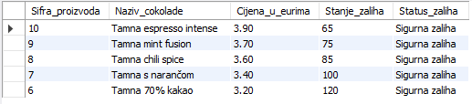

&nbsp;


### 6.2 Upit: Zarobljeni kapital po proizvodima (Danijel Margić)

```sql
SELECT 
    p.proizvod_id AS Sifra_proizvoda,
    p.naziv AS Naziv_cokolade,
    p.kolicina_na_skladistu AS Kolicina_zaliha,
    p.cijena AS Cijena_po_komadu,
    ROUND((p.kolicina_na_skladistu * p.cijena), 2) AS Vrijednost_zarobljenog_kapitala
FROM proizvod AS p
WHERE p.aktivan = TRUE
GROUP BY p.proizvod_id, p.naziv, p.kolicina_na_skladistu, p.cijena
HAVING Vrijednost_zarobljenog_kapitala > (
    SELECT AVG(izvedeno_stanje.vrijednost_artikla)
    FROM (
        SELECT (p2.kolicina_na_skladistu * p2.cijena) AS vrijednost_artikla
        FROM proizvod AS p2
        WHERE p2.aktivan = TRUE
    ) AS izvedeno_stanje
)
ORDER BY Vrijednost_zarobljenog_kapitala DESC;
```

### POSLOVNI PROBLEM

Voditelj nabave priprema strategiju obnove zaliha za proizvode koji se nalaze na 
skladištu, ali se suočava s problemom nelikvidnosti određenih artikala. Potrebno 
je identificirati proizvode čija je trenutna vrijednost zaliha na skladištu (umnožak 
količine na skladištu i jedinične cijene) strogo veća od prosječne vrijednosti zaliha 
svih aktivnih proizvoda u trgovini čokolade. 

Izvješće mora obuhvatiti šifru proizvoda, njegov naziv, trenutnu količinu na 
skladištu, cijenu te izračunatu ukupnu kapitalnu vrijednost zarobljenu u zalihama 
zaokruženu na dvije decimale. Rezultate je potrebno sortirati od najveće vrijednosti 
zaliha prema manjoj kako bi se odmah uočili artikli koji najviše opterećuju poslovanje.


### Opis upita:

- `FROM proizvod AS p` — određuje bazičnu relaciju proizvoda kao polazno mjesto za pretragu i 
  izračun, uz uvođenje kraćeg zamjenskog imena `p`.

- `WHERE p.aktivan = TRUE` — predikat selekcije na razini n-torki koji osigurava da u analizu uđu isključivo artikli koji su trenutno aktivni u katalogu.

- `GROUP BY p.proizvod_id ...` — operacija grupiranja podataka po ključnim atributima proizvoda kako bi se omogućila valjana evaluacija uvjeta unutar HAVING klauzule.

- `ROUND((p.kolicina_na_skladistu * p.cijena), 2)` — aritmetički izraz opće projekcije koji računa ukupnu novčanu vrijednost zaliha i zaokružuje iznos na dvije decimale.

- `HAVING Vrijednost_zarobljenog_kapitala > (...)` — filtrira grupirane redove i propušta samo 
  proizvode čija je izračunata vrijednost zaliha veća od skalarne vrijednosti iz podupita.

- `SELECT AVG(...) FROM (...) AS izvedeno_stanje` — ugniježđeni podupit koji najprije računa vrijednost zaliha za svaki pojedini artikl, a zatim nad tim multiskupom izvodi ukupni prosjek webshopa.

- `ORDER BY Vrijednost_zarobljenog_kapitala DESC` — sortira konačni rezultirajući multiskup silazno, postavljajući proizvode s najvećom financijskom vrijednošću zaliha na sam vrh tablice.

### Rezultat:
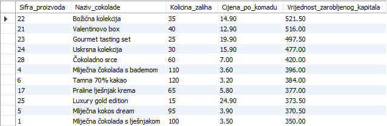


&nbsp;


### 6.3 Upit: Prodajne aktivnosti po danima (Danijel Margić)

```sql
SELECT 
    DAYNAME(n.datum_narudzbe) AS Dan_u_tjednu,
    COUNT(DISTINCT n.narudzba_id) AS Ukupan_broj_narudzbi,
    SUM(sn.kolicina) AS Ukupno_prodanih_komada,
    ROUND(AVG(sn.kolicina * sn.cijena_po_komadu), 2) AS Prosjecna_vrijednost_stavke_EUR
FROM narudzba AS n
INNER JOIN stavka_narudzbe AS sn ON n.narudzba_id = sn.narudzba_id
GROUP BY DAYNAME(n.datum_narudzbe), WEEKDAY(n.datum_narudzbe)
ORDER BY WEEKDAY(n.datum_narudzbe) ASC;
```

### POSLOVNI PROBLEM

Voditelj marketinga i logistike želi optimizirati vrijeme slanja tjednih newslettera i pripremiti skladište za dane s najvećim volumenom pakiranja. Za donošenje odluka potreban mu je točan pregled prodajnih aktivnosti raščlanjen po danima u tjednu (ponedjeljak, utorak, itd.). 

Napisati upit koji će analizirati povijest narudžbi te za svaki dan u tjednu izračunati ukupan broj predanih narudžbi, ukupan broj prodanih komada čokolade te prosječnu vrijednost košarice ostvarenu tog dana. Rezultate je potrebno sortirati kronološki od početka radnog tjedna.


### Opis upita:
- `DAYNAME(n.datum_narudzbe)` — ugrađena funkcija koja iz datuma transakcije izdvaja tekstualni naziv dana u tjednu na temelju kojeg se provodi menadžerska analiza.

- `INNER JOIN stavka_narudzbe AS sn ON n.narudzba_id = sn.narudzba_id` — relacijski povezuje zaglavlje transakcije s pojedinačnim stavkama količina i cijena u košarici.

- `COUNT(DISTINCT n.narudzba_id)` — agregacijska funkcija koja broji jedinstvene šifre narudžbi unutar svakog dana, sprječavajući umnožavanje broja narudžbi zbog višestrukih artikala na istom računu.

- `SUM(sn.kolicina)` — agregatna funkcija koja zbraja sve komade prodanih čokolada, dajući logistici uvid u fizičko opterećenje skladišta po danima.

- `ROUND(AVG(sn.kolicina * sn.cijena_po_komadu), 2)` — računa prosječnu financijsku vrijednost stavke zaokruženu na dvije decimale, otkrivajući u kojim danima kupci rade najveće košarice.

- `GROUP BY DAYNAME(...), WEEKDAY(...)` — grupira podatke prema nazivu dana, uz obvezno dodavanje funkcije `WEEKDAY` kako bi se rezultati mogli ispravno i kronološki sortirati od ponedjeljka do nedjelje.


### Rezultat:
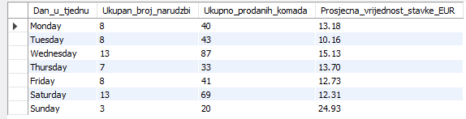


&nbsp;


### 6.4 Upit: Izvješće o prosječnoj cijeni dostave (Danijel Margić)

```sql
SELECT 
    d.status_dostave AS Status_isporuke,
    COUNT(d.dostava_id) AS Broj_evidentiranih_paketa,
    ROUND(AVG(n.cijena_dostave), 2) AS Prosjecna_cijena_dostave_EUR
FROM dostava AS d
JOIN narudzba AS n ON d.narudzba_id = n.narudzba_id
GROUP BY d.status_dostave
HAVING AVG(n.cijena_dostave) > (
    SELECT AVG(izvedena_statistika.prosjek_statusa)
    FROM (
        SELECT AVG(n2.cijena_dostave) AS prosjek_statusa
        FROM dostava AS d2
        JOIN narudzba AS n2 ON d2.narudzba_id = n2.narudzba_id
        GROUP BY d2.status_dostave
    ) AS izvedena_statistika
)
ORDER BY Prosjecna_cijena_dostave_EUR DESC;
```

### POSLOVNI PROBLEM

Voditelj logistike želi provesti detaljnu analizu troškova dostave kako bi identificirao statuse isporuke koji generiraju iznadprosječne troškove u odnosu na ostale statuse dostave unutar sustava e-trgovine.

Potrebno je za svaki status dostave izračunati ukupan broj evidentiranih paketa te prosječnu cijenu dostave. Nakon toga potrebno je usporediti dobivene prosjeke sa zajedničkim prosjekom svih prosječnih cijena dostave po statusima te izdvojiti samo one statuse čija je prosječna cijena dostave veća od tako izračunate referentne vrijednosti.

Izvješće mora sadržavati naziv statusa isporuke, broj evidentiranih paketa i prosječnu cijenu dostave zaokruženu na dvije decimale. Rezultate je potrebno sortirati silazno prema prosječnoj cijeni dostave kako bi se odmah prepoznali statusi koji predstavljaju najveće logističko opterećenje i potencijalno zahtijevaju dodatnu analizu ili optimizaciju procesa dostave.


### Opis upita:

- `FROM dostava AS d` — određuje relaciju dostava kao polazni skup podataka nad kojim se provodi analiza logističkih statusa i troškova isporuke.

- `JOIN narudzba AS n ON d.narudzba_id = n.narudzba_id` — povezuje relacije dostava i narudžba preko primarnog i stranog ključa kako bi se uz podatke o statusu dostave mogli koristiti i podaci o cijeni dostave evidentirani u narudžbi.

- `COUNT(d.dostava_id)` — agregatna funkcija koja prebrojava ukupan broj evidentiranih dostava (n-torki) unutar svakog pojedinog statusa isporuke.

- `ROUND(AVG(n.cijena_dostave), 2)` — izračunava aritmetičku sredinu cijene dostave za svaku grupu statusa te rezultat zaokružuje na dvije decimale radi preglednijeg prikaza izvješća.

- `GROUP BY d.status_dostave` — provodi grupiranje podataka prema vrijednosti atributa status_dostave te formira zasebne grupe nad kojima se izvršavaju agregatne funkcije.

- `HAVING AVG(n.cijena_dostave) > (...)` — filtrira već formirane grupe i zadržava samo one statuse dostave čija je prosječna cijena dostave veća od referentne vrijednosti dobivene podupitom.

- `SELECT AVG(izvedena_statistika.prosjek_statusa)` — vanjski dio podupita računa prosječnu vrijednost svih prethodno izračunatih prosjeka po statusima dostave.

- `FROM ( ... ) AS izvedena_statistika` — stvara izvedenu relaciju (privremenu tablicu) koja postoji samo tijekom izvršavanja upita te služi kao izvor podataka za daljnju agregaciju.

- `SELECT AVG(n2.cijena_dostave) AS prosjek_statusa` — za svaki status dostave izračunava pojedinačni prosjek cijene dostave koji će kasnije biti uključen u izračun ukupnog prosjeka statusnih prosjeka.

- `JOIN narudzba AS n2 ON d2.narudzba_id = n2.narudzba_id` — ponovno povezuje relacije dostava i narudžba unutar podupita kako bi se za svaki status mogli dohvatiti podaci o cijenama dostave.

- `GROUP BY d2.status_dostave` — grupira zapise prema statusu dostave te omogućuje izračun prosječne cijene dostave za svaki status zasebno.

- `ORDER BY Prosjecna_cijena_dostave_EUR DESC` — sortira konačni rezultirajući multiskup silaznim redoslijedom prema prosječnoj cijeni dostave kako bi statusi s najvećim logističkim troškovima bili prikazani na vrhu izvješća.


### Rezultat:
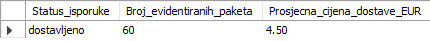


&nbsp;


### 6.5 Upit: Top 3 najveće narudžbe u zadnjih 6 mjeseci (Andrej Pucović)

```sql
SELECT 
    n.narudzba_id AS Sifra_narudzbe,
    n.datum_narudzbe AS Datum_kupnje,
    ROUND(SUM(sn.kolicina * sn.cijena_po_komadu), 2) AS Ukupna_vrijednost_narudzbe
FROM narudzba AS n
INNER JOIN stavka_narudzbe AS sn ON n.narudzba_id = sn.narudzba_id
WHERE n.datum_narudzbe >= NOW() - INTERVAL 6 MONTH
GROUP BY n.narudzba_id, n.datum_narudzbe
ORDER BY Ukupna_vrijednost_narudzbe DESC
LIMIT 3;
```

### POSLOVNI PROBLEM

Voditelj prodaje želi nagraditi kupce koji su napravili najveće pojedinačne kupnje 
u proteklih pola godine. Potrebno je izdvojiti točno 3 narudžbe s najvećim ukupnim 
iznosom predane u zadnjih 6 mjeseci u odnosu na trenutno vrijeme sustava. 

Izvješće mora prikazati šifru narudžbe, datum te izračunatu ukupnu vrijednost 
zaokruženu na dvije decimale, sortirano od najvećeg iznosa prema manjima.


### Opis upita:

- `FROM narudzba AS n` — određuje tablicu narudžbi kao polaznu relaciju pretrage i 
  dodjeljuje joj kratko ime `n` radi lakšeg pisanja koda.

- `INNER JOIN stavka_narudzbe AS sn` — spaja narudžbe s njihovim pripadajućim 
  stavkama preko zajedničke šifre narudžbe radi izračuna cijene.

- `WHERE n.datum_narudzbe >= NOW() - INTERVAL 6 MONTH` — vremenski predikat koji 
  izdvaja isključivo narudžbe predane u zadnjih pola godine.

- `NOW() - INTERVAL 6 MONTH` — dinamički računa točan vremenski trenutak od prije 
  6 mjeseci u odnosu na trenutno vrijeme sustava.

- `GROUP BY n.narudzba_id, n.datum_narudzbe` — grupira n-torke po narudžbama kako bi 
  se funkcija SUM izvršila zasebno za svaku pojedinu košaricu.

- `ROUND(SUM(sn.kolicina * sn.cijena_po_komadu), 2)` — množi količinu i cijenu 
  svake stavke, zbraja ih u ukupni iznos narudžbe i zaokružuje na dvije decimale.

- `ORDER BY Ukupna_vrijednost_narudzbe DESC` — sortira rezultirajući multiskup silazno 
  prema ukupnoj vrijednosti, postavljajući najskuplje narudžbe na vrh.

- `LIMIT 3` — ograničava konačni ispis na prva tri retka s vrha tablice, 
  formirajući top listu najvrjednijih kupnji.


### Rezultat:
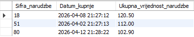


&nbsp;


### 6.6 Upit: Kupci s najvećim prosječnim ocjenama recenzija (Andrej Pucović)

```sql
SELECT 
    k.kupac_id AS Sifra_kupca,
    CONCAT(k.ime, ' ', k.prezime) AS Kupac,
    COUNT(r.recenzija_id) AS Broj_recenzija,
    ROUND(AVG(r.ocjena), 2) AS Prosjecna_ocjena
FROM recenzija AS r
RIGHT JOIN kupac AS k ON r.kupac_id = k.kupac_id
GROUP BY k.kupac_id, k.ime, k.prezime
ORDER BY Prosjecna_ocjena DESC;
```

### POSLOVNI PROBLEM

Voditelj prodaje provodi analizu recenzija kupaca kako bi utvrdio razinu interakcije 
korisnika s našim asortimanom. Potrebno je izvući popis apsolutno svih registriranih 
kupaca iz baze podataka, uključujući i one koji su pasivni te nikada nisu napisali 
niti jednu recenziju za neki proizvod. 

Za potrebe slanja marketinških upitnika o zadovoljstvu, u izvješće treba uključiti 
šifru kupca, njegovo ime i prezime spojeno u jedno polje, ukupan broj napisanih 
recenzija, te prosječnu ocjenu koju je taj kupac dodijelio. Rezultate je potrebno 
sortirati tako da kupci s najvišim prosječnim ocjenama budu na vrhu.


### Opis upita:

- `FROM recenzija AS r RIGHT JOIN kupac AS k` — desno vanjsko spajanje koje osigurava 
  očuvanje svih zapisa iz desne tablice (kupac), čak i ako nemaju upisane recenzije.

- `CONCAT(k.ime, ' ', k.prezime)` — funkcija opće projekcije koja spaja ime i 
  prezime kupca u jedno tekstualno polje s razmakom između njih.

- `COUNT(r.recenzija_id)` — funkcija agregacije koja prebrojava ukupni broj zaprimljenih 
  recenzija za svakog pojedinog kupca iz baze.

- `ROUND(AVG(r.ocjena), 2)` — računa prosječnu vrijednost svih ocjena za pojedinog kupca 
  i zaokružuje dobiveni rezultat na dvije decimale.

- `GROUP BY k.kupac_id ...` — grupiranje rezultata po ključnim atributima kupca kako bi 
  se agregatne funkcije izvršile odvojeno za svakog korisnika.

- `ORDER BY Prosjecna_ocjena DESC` — sortira konačni rezultirajući multiskup silazno prema 
  izračunatoj prosječnoj ocjeni.


### Rezultat:
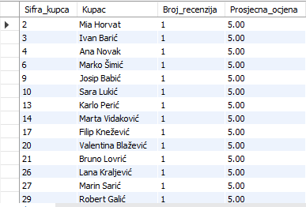


&nbsp;


### 6.7 Upit: Najviša i najniža cijena po kategorijama (Andrej Pucović)

```sql
SELECT 
    k.kategorija_id AS Sifra_kategorije,
    k.naziv AS Naziv_kategorije,
    MIN(p.cijena) AS Najniza_cijena_kategorije,
    MAX(p.cijena) AS Najvisa_cijena_kategorije
FROM kategorija AS k
LEFT JOIN proizvod AS p ON k.kategorija_id = p.kategorija_id
GROUP BY k.kategorija_id, k.naziv
ORDER BY Najvisa_cijena_kategorije DESC;
```

### POSLOVNI PROBLEM

Voditelj prodaje provodi dubinsku analizu asortimana unutar svih definiranih 
kategorija čokolade kako bi uočio ekstreme u cijenama, ali želi imati uvid i u 
stvarnu potražnju unutar tih cjelina. Potrebno je za svaku pojedinu kategoriju 
izvući njezinu šifru, njezin naziv, te najnižu i najvišu jediničnu cijenu 
proizvoda koji joj pripadaju. 

Kako bi analiza bila potpuna, u izvješće je nužno uključiti i nove ili sezonske 
kategorije u koje još nije dodan niti jedan proizvod (za njih će ekstremne cijene 
prirodno imati NULL vrijednost). Rezultate je potrebno sortirati tako da na vrhu 
budu kategorije koje imaju najskuplji pojedinačni proizvod u ponudi.

### Opis upita:

- `FROM kategorija AS k` — određuje tablicu kategorija kao polaznu relaciju pretrage 
  i dodjeljuje joj kratko ime `k` radi lakšeg pisanja koda.

- `LEFT JOIN proizvod AS p ON k.kategorija_id = p.kategorija_id` — lijevo vanjsko 
  spajanje koje čuva sve kategorije, čak i ako u katalogu ne postoji pripadajući proizvod.

- `MIN(p.cijena)` — agregatna funkcija koja pronalazi najnižu cijenu proizvoda unutar 
  svake pojedine grupe (kategorije).

- `MAX(p.cijena)` — agregatna funkcija koja pronalazi najvišu cijenu proizvoda unutar 
  svake pojedine grupe (kategorije).

- `GROUP BY k.kategorija_id, k.naziv` — grupiranje n-torki po šifri i nazivu kategorije 
  kako bi se funkcije MIN i MAX mogle izvršiti odvojeno za svaku skupinu.

- `ORDER BY Najvisa_cijena_kategorije DESC` — sortira konačne rezultate silazno 
  prema maksimalnoj cijeni, postavljajući kategorije s najskupljim artiklima na vrh.


### Rezultat:
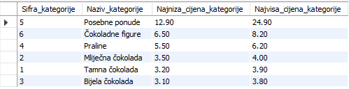


&nbsp;


### 6.8 Upit: Najviša i najniža cijena nabave po dobavljačima (Luka Juroš)

```sql
SELECT 
    d.dobavljac_id AS Sifra_dobavljaca,
    d.naziv AS Naziv_dobavljaca,
    COUNT(DISTINCT snab.proizvod_id) AS Broj_razlicitih_artikala,
    MIN(snab.nabavna_cijena) AS Minimalna_nabavna_cijena,
    MAX(snab.nabavna_cijena) AS Maksimalna_nabavna_cijena
FROM dobavljac AS d
LEFT JOIN nabava AS n ON d.dobavljac_id = n.dobavljac_id
LEFT JOIN stavka_nabave AS snab ON n.nabava_id = snab.nabava_id
GROUP BY d.dobavljac_id, d.naziv
ORDER BY Maksimalna_nabavna_cijena DESC, Broj_razlicitih_artikala DESC;
```

### POSLOVNI PROBLEM

Voditelj nabave provodi opsežnu analizu troškova nabave i asortimana po svim 
definiranim dobavljačima u bazi podataka kako bi optimizirao ugovore. Potrebno 
je za svakog pojedinog dobavljača utvrditi ukupan broj različitih proizvoda koje 
od njega nabavljamo, te najnižu i najvišu nabavnu cijenu po komadu koju smo mu 
platili kroz stavke nabave. 

Kako bi se dobio potpun uvid, u izvješće je nužno uključiti i nove dobavljače s 
kojima smo tek potpisali ugovor, ali od njih još nismo fizički zaprimili niti 
jednu nabavu (za njih će broj artikala iznositi 0, a ekstremne cijene će imati 
oznaku `NULL`). Izvješće mora sadržavati šifru dobavljača, naziv tvrtke, ukupan 
broj različitih artikala te minimalnu i maksimalnu ugovorenu cijenu. Rezultate 
je potrebno sortirati tako da dobavljači s najvišom ugovorenom nabavnom cijenom 
budu na samom vrhu, a ako su cijene jednake, prednost imaju oni s više artikala.

### Opis upita:

- `FROM dobavljac AS d` — određuje bazičnu relaciju dobavljača kao početnu točku za 
  izgradnju izvješća i dodjeljuje joj kratko ime `d`.

- `LEFT JOIN nabava AS n ... LEFT JOIN stavka_nabave` — uzastopna vanjska lijeva 
  spajanja koja čuvaju sve dobavljače, čak i ako nemaju vezane transakcije nabave.

- `COUNT(DISTINCT snab.proizvod_id)` — funkcija agregacije koja prebrojava samo 
  jedinstvene šifre proizvoda, eliminirajući ponavljanja istog artikla u nabavama.

- `MIN(snab.nabavna_cijena)` — agregatna funkcija koja pronalazi najnižu ugovorenu 
  vrijednost nabave po komadu za pojedinog poslovnog partnera.

- `MAX(snab.nabavna_cijena)` — agregatna funkcija koja pronalazi najvišu plaćenu 
  cenu artikla unutar formiranih skupina nabave.

- `GROUP BY d.dobavljac_id, d.naziv` — grupiranje rezultata po ključnim atributima 
  dobavljača kako bi se sve funkcije agregacije izvršile zasebno za svaku tvrtku.

- `ORDER BY Maksimalna_nabavna_cijena DESC ... `— sortira rezultirajući multiskup 
  primarno silazno po najvećoj cijeni, a sekundarno silazno po broju artikala.


### Rezultat:
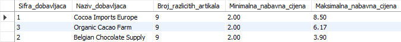


&nbsp;


### 6.9 Upit: Analiza košarice po premium proizvodima (Andrej Pucović)

```sql
SELECT 
    p.proizvod_id AS Sifra_proizvoda,
    p.naziv AS Naziv_premium_cokolade,
    COUNT(sn.narudzba_id) AS Broj_pojavljivanja_u_narudzbama,
    SUM(sn.kolicina) AS Ukupna_prodana_kolicina_komadi,
    ROUND(AVG(sn.kolicina), 1) AS Prosjecna_kolicina_po_stavki
FROM proizvod AS p
INNER JOIN stavka_narudzbe AS sn ON p.proizvod_id = sn.proizvod_id
WHERE p.cijena > 4.00 AND p.aktivan = TRUE
GROUP BY p.proizvod_id, p.naziv
ORDER BY Ukupna_prodana_kolicina_komadi DESC;
```

### POSLOVNI PROBLEM

Voditelj skladišta želi optimizirati proces pakiranja i dimenzije transportnih kutija. Za to mu je potreban uvid u prosječan broj komada proizvoda koji se naručuju po pojedinoj stavki unutar narudžbi, ali izolirano samo za aktivne i skuplje čokolade čija je jedinična cijena veća od 4.00 EUR. 

Napisati upit koji će za svaku pojedinu čokoladu koja zadovoljava uvjet cijene izračunati ukupan broj transakcija u kojima se pojavljuje, ukupnu prodanu količinu u komadima te prosječnu količinu po jednoj stavki narudžbe. Rezultate je potrebno sortirati silazno prema ukupno prodanoj količini.

### Opis upita:

- `INNER JOIN stavka_narudzbe AS sn` — relacijski povezuje tablicu proizvoda s pripadajućim stavkama kako bi se izvukli transakcijski podaci o količinama.

- `WHERE p.cijena > 4.00 AND p.aktivan = TRUE` — filtrira zapise na razini redaka prije grupiranja, propuštajući isključivo aktivne artikle visoke cjenovne kategorije.

- `COUNT(sn.narudzba_id)` — agregatna funkcija koja broji koliko se puta pojedini proizvod pojavio kao zasebna stavka na računima.

- `ROUND(AVG(sn.kolicina), 1)` — računa prosječan broj komada tog artikla koji kupci stavljaju u košaricu po jednom retku narudžbe te zaokružuje iznos na jednu decimalu.

- `ORDER BY Ukupna_prodana_kolicina_komadi DESC` — sortira konačni ispis silazno prema volumenu prodaje, stavljajući najtraženije skuplje artikle na vrh.


### Rezultat:
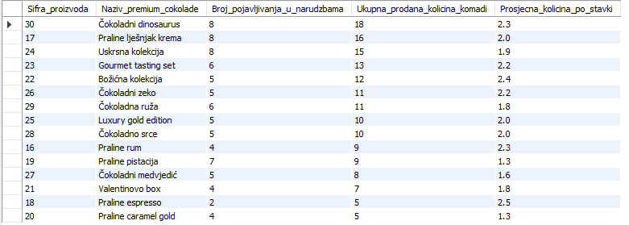


&nbsp;


### 6.10 Upit: Analiza minimuma i maksimuma cijena po košaricama (Danijel Margic)

```sql
SELECT 
    n.narudzba_id AS Sifra_narudzbe,
    n.datum_narudzbe AS Datum_transakcije,
    SUM(sn.kolicina) AS Ukupno_komada_u_kosarici,
    MIN(sn.cijena_po_komadu) AS Najjeftinija_stavka_narudzbe,
    MAX(sn.cijena_po_komadu) AS Najskuplja_stavka_narudzbe
FROM narudzba AS n
INNER JOIN stavka_narudzbe AS sn ON n.narudzba_id = sn.narudzba_id
GROUP BY n.narudzba_id, n.datum_narudzbe
HAVING SUM(sn.kolicina) > 5
ORDER BY n.datum_narudzbe DESC;
```

### POSLOVNI PROBLEM

Financijski kontrolor treba uvid u strukturu pojedinačnih košarica kako bi razumio ponašanje potrošača unutar samih transakcija. Budući da baza sadrži velik broj sitnih transakcija, fokus analize je stavljen isključivo na velike i volumno značajne košarice. Želi znati kolika je bila cijena najjeftinijeg, a kolika najskupljeg artikla unutar narudžbi koje sadrže natprosječan broj komada robe.

Napisati upit koji spaja zaglavlje narudžbi sa stavkama i pronalazi cjenovne ekstreme. Izvješće mora prikazati šifru narudžbe, datum njezina kreiranja, ukupan broj komada čokolade u toj narudžbi, minimalnu (najnižu) cijenu stavke te maksimalnu (najvišu) cijenu stavke. Pomoću `HAVING` klauzule potrebno je suziti ispis samo na narudžbe koje u sebi imaju strogo više od 5 komada artikala, sortirano od datumski najnovijih transakcija.

### Opis upita:

- `INNER JOIN stavka_narudzbe AS sn ON n.narudzba_id = sn.narudzba_id` — povezuje podatke o datumu narudžbe s pojedinačnim redovima kupljenih artikala i njihovim cijenama.

- `SUM(sn.kolicina)` — agregatna funkcija koja zbraja sve komade čokolade unutar iste narudžbe, dajući uvid u fizičku veličinu košarice.

- `MIN(sn.cijena_po_komadu) / MAX(sn.cijena_po_komadu)` — funkcije ekstrema koje pretražuju stavke unutar narudžbe i izdvajaju najnižu te najvišu plaćenu cijenu čokolade na tom računu.

- `GROUP BY n.narudzba_id, n.datum_narudzbe` — grupira podatke na razini pojedinačne transakcije, osiguravajući da se raspon cijena i količina izračunaju unutar svake košarice zasebno.

- `HAVING SUM(sn.kolicina) > 5` — ključna restrikcijska klauzula koja značajno smanjuje količinu ispisanih rezultata tako što u potpunosti eliminira male narudžbe i propušta samo one s više od 5 komada artikala.


### Rezultat:
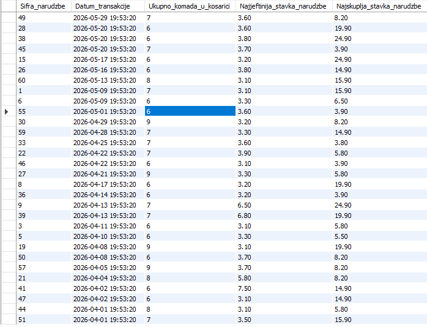


&nbsp;


## 7. Pogledi

Pogledi *(eng. views)* u SQL-u predstavljaju virtualne tablice koje su stvorene na temelju rezultata nekog `SELECT` upita. Pogled ne pohranjuje podatke zasebno, već prikazuje podatke koji se dohvaćaju iz jedne ili više tablica baze podataka. Stvaraju se pomoću naredbe `CREATE VIEW`, pri čemu se definira upit koji će pogled predstavljati. Pogledi se često koriste za pojednostavljenje složenih upita koji uključuju JOIN operacije, agregacije i filtriranje podataka. Pogledi se mogu promatrati kao spremljeni SELECT upiti koji omogućavaju ponovno korištenje često korištenih i složenih upita bez potrebe njihovog ponovnog pisanja. Također omogućavaju ograničavanje pristupa podacima jer se korisnicima mogu prikazati samo određeni stupci tablice, bez prikazivanja osjetljivih podataka (npr. lozinke, OIB, email adrese, broj računa i osobni podaci korisnika). Nakon stvaranja, pogled se može koristiti u `SELECT` naredbama kao obična tablica.

Općenita sintaksa za kreiranje SQL pogleda je:

```sql
CREATE VIEW view_name AS
SELECT A1, A2, ...
FROM r1, r2, ...
WHERE P;
```

pri čemu `view_name` predstavlja naziv pogleda, `A1, A2` atribute koji će biti prikazani, `r1, r2` relacije (tablice), a `P` predikat selekcije.


&nbsp;


### 7.1 Pogled: Proizvodi po ukupnom prihodu (Luka Wrana)

```sql
CREATE OR REPLACE VIEW v_prihod_po_proizvodu AS
SELECT 
    p.proizvod_id,
    p.naziv,
    COUNT(DISTINCT sn.narudzba_id) AS broj_narudzbi,
    SUM(sn.kolicina) AS ukupno_prodano,
    SUM(sn.kolicina * sn.cijena_po_komadu) AS ukupni_prihod
FROM proizvod p
JOIN stavka_narudzbe sn 
    ON p.proizvod_id = sn.proizvod_id
JOIN narudzba n 
    ON n.narudzba_id = sn.narudzba_id
WHERE n.datum_narudzbe >= DATE_SUB(NOW(), INTERVAL 1 MONTH)
GROUP BY p.proizvod_id, p.naziv;
```

### POSLOVNI PROBLEM

Voditelj trgovine želi imati uvid u statistike narudžbi i prodaje kako bi mogao odrediti koji su proizvodi najisplativiji, a koji ostvaruju slabije rezultate. Na temelju tih informacija može donositi odluke o tome koje proizvode treba poskupiti, koje sniziti te koje eventualno ukloniti iz ponude. Ručno izračunavanje i analiza ovih podataka zahtijevali bi mnogo vremena, a pritom postoji i mogućnost ljudskih pogrešaka. Zbog toga je potreban pogled koji automatski izračunava i prikazuje podatke o proizvodima prema ostvarenom prihodu.

Ovaj pogled prikazuje prodajne rezultate proizvoda u posljednjih mjesec dana. Za svaki proizvod prikazani su broj narudžbi, ukupna prodana količina i ostvareni prihod, što omogućuje jednostavnu usporedbu uspješnosti proizvoda i brže donošenje poslovnih odluka.

### Opis pogleda:

- `CREATE OR REPLACE VIEW v_prihod_po_proizvodu` — kreira novi ili zamjenjuje postojeći pogled pod navedenim nazivom u bazi podataka.

- `COUNT(DISTINCT sn.narudzba_id)` — funkcija agregacije koja prebrojava isključivo različite šifre narudžbi, čime se sprječava dupliranje ako narudžba ima više stavki.

- `SUM(sn.kolicina)` — agregatna funkcija koja zbraja sve prodane količine proizvoda koje ispunjavaju zadani vremenski uvjet.

- `SUM(sn.kolicina * sn.cijena_po_komadu)` — računa ukupni prihod zbrajanjem umnožaka količine i jedinične cijene artikla iz svih pripadajućih transakcijskih stavki.

- `FROM proizvod p JOIN ... JOIN ...` — operacije unutarnjeg spajanja koje povezuju katalog proizvoda sa stavkama i glavnom tablicom narudžbi preko ključeva.

- `DATE_SUB(NOW(), INTERVAL 1 MONTH)` — funkcija koja od trenutnog vremena sustava oduzima točno mjesec dana i postavlja vremensku granicu za pretragu.

- `WHERE n.datum_narudzbe >= ...` — predikat selekcije koji filtrira n-torke na razini redaka i propušta samo narudžbe unutar zadnjih mjesec dana.

- `GROUP BY p.proizvod_id, p.naziv` — grupiranje rezultata po šifri i nazivu proizvoda kako bi se sve funkcije agregacije izvršile zasebno za svaki artikl.

### Rezultati:
U nastavku su prikazani načini na koje se stvoreni pogled poziva i koristi u praksi. 
Budući da se pogled ponaša kao virtualna tablica, nad njim se mogu primjenjivati 
dodatni uvjeti filtriranja (restrikcije) i sortiranja.

```sql
-- Standardni poziv za prikaz svih zapisa unutar ovog pogleda poredani po ukupnom prihodu od najvećeg do najmanjeg.
SELECT * FROM v_prihod_po_proizvodu
ORDER BY ukupni_prihod DESC;
```
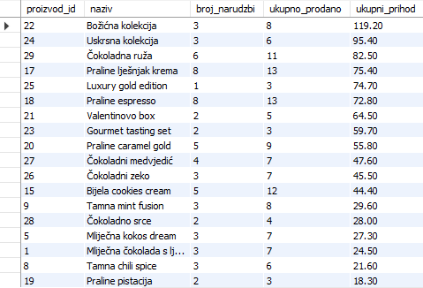


&nbsp;


### 7.2 Pogled: Popularnost proizvoda po ukupnoj količini narudžba (Luka Wrana)

```sql
CREATE OR REPLACE VIEW v_proizvodi_po_kolicini AS
SELECT 
    p.proizvod_id,
    p.naziv,
    COUNT(DISTINCT sn.narudzba_id) AS broj_narudzbi,
    SUM(sn.kolicina) AS ukupna_kolicina
FROM proizvod p
JOIN stavka_narudzbe sn 
    ON p.proizvod_id = sn.proizvod_id
JOIN narudzba n 
    ON n.narudzba_id = sn.narudzba_id
WHERE n.datum_narudzbe >= DATE_SUB(NOW(), INTERVAL 1 MONTH)
GROUP BY p.proizvod_id, p.naziv;
```

### POSLOVNI PROBLEM

Voditelj trgovine želi imati uvid u popularnost proizvoda kako bi mogao prepoznati koje proizvode kupci najčešće naručuju. Na temelju tih informacija može planirati zalihe, organizirati nabavu te osigurati da najtraženiji proizvodi budu uvijek dostupni kupcima. Ručno praćenje količina prodanih proizvoda kroz velik broj narudžbi bilo bi vremenski zahtjevno i podložno pogreškama. Zbog toga je potreban pogled koji automatski izračunava i prikazuje podatke o proizvodima prema ukupno prodanoj količini.

Ovaj pogled prikazuje popularnost proizvoda u posljednjih mjesec dana. Za svaki proizvod prikazani su broj narudžbi u kojima se proizvod pojavio te ukupna prodana količina. Takav prikaz omogućuje jednostavno prepoznavanje najtraženijih proizvoda, učinkovitije upravljanje zalihama i donošenje kvalitetnijih poslovnih odluka.

### Opis pogleda:

- `CREATE OR REPLACE VIEW v_proizvodi_po_kolicini` — kreira novi ili zamjenjuje 
  postojeći pogled pod navedenim nazivom u bazi podataka.

- `COUNT(DISTINCT sn.narudzba_id)` — funkcija agregacije koja prebrojava isključivo 
  različite šifre narudžbi, čime se sprječava dupliranje ako narudžba ima više stavki.

- `SUM(sn.kolicina)` - agregatna funkcija koja zbraja sve prodane količine proizvoda 
  koje ispunjavaju zadani vremenski uvjet.

- `FROM proizvod p JOIN ... JOIN ...` — operacije unutarnjeg spajanja koje povezuju 
  katalog proizvoda sa stavkama i glavnom tablicom narudžbi preko ključeva.

- `DATE_SUB(NOW(), INTERVAL 1 MONTH)` — funkcija koja od trenutnog vremena sustava 
  oduzima točno mjesec dana i postavlja vremensku granicu za pretragu.

-` WHERE n.datum_narudzbe >= ...` — predikat selekcije koji filtrira n-torke na razini 
  redaka i propušta samo narudžbe unutar zadnjih mjesec dana.

- `GROUP BY p.proizvod_id, p.naziv` — grupiranje rezultata po šifri i nazivu proizvoda 
  kako bi se sve funkcije agregacije izvršile zasebno za svaki artikl.

### Rezultati:
U nastavku su prikazani načini na koje se stvoreni pogled poziva i koristi u praksi. 
Budući da se pogled ponaša kao virtualna tablica, nad njim se mogu primjenjivati 
dodatni uvjeti filtriranja (restrikcije) i sortiranja.

```sql
-- Standardni poziv za prikaz svih zapisa unutar ovog pogleda poredani po ukupnoj količini prodanih proizvoda od najvećeg do najmanjeg.
SELECT * FROM v_proizvodi_po_kolicini
ORDER BY ukupna_kolicina DESC;
```
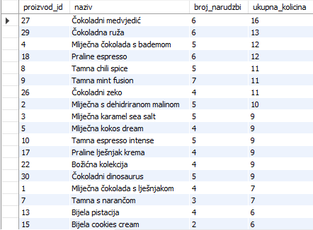


&nbsp;


### 7.3 Pogled: Koeficijen bulk-narudžba (Luka Wrana)

```sql
CREATE OR REPLACE VIEW v_koeficijent_kolicine_po_proizvodu AS
SELECT 
    p.proizvod_id,
    p.naziv,
    SUM(sn.kolicina) AS ukupna_kolicina,
    COUNT(DISTINCT n.narudzba_id) AS broj_narudzbi,
    CASE 
        WHEN COUNT(DISTINCT n.narudzba_id) = 0 THEN 0
        ELSE SUM(sn.kolicina) / COUNT(DISTINCT n.narudzba_id)
    END AS prosjecna_kolicina_po_narudzbi
FROM proizvod p
JOIN stavka_narudzbe sn 
    ON p.proizvod_id = sn.proizvod_id
JOIN narudzba n 
    ON n.narudzba_id = sn.narudzba_id
WHERE n.datum_narudzbe >= DATE_SUB(NOW(), INTERVAL 1 MONTH)
GROUP BY p.proizvod_id, p.naziv;
```

### POSLOVNI PROBLEM

Voditelj trgovine želi prepoznati proizvode koje kupci najčešće naručuju u većim količinama unutar jedne narudžbe. Takve informacije mogu pomoći pri planiranju promotivnih paketa, određivanju količinskih popusta te optimizaciji zaliha za proizvode koji imaju potencijal za bulk-prodaju.

Ovaj pogled prikazuje podatke o proizvodima u posljednjih mjesec dana. Za svaki proizvod prikazani su ukupna prodana količina, broj narudžbi u kojima se proizvod pojavio te prosječna količina proizvoda po narudžbi. Takav prikaz omogućuje jednostavno prepoznavanje proizvoda koji se najčešće kupuju u većim količinama, što olakšava planiranje prodajnih strategija, upravljanje zalihama i donošenje poslovnih odluka vezanih uz bulk-prodaju.

### Opis pogleda:

- `CREATE OR REPLACE VIEW v_koeficijent_kolicine_po_proizvodu` — kreira novi ili 
  zamjenjuje postojeći pogled pod navedenim nazivom u bazi podataka.

- `SUM(sn.kolicina)` — agregatna funkcija koja zbraja sve prodane količine proizvoda 
  unutar zadanog mjesečnog razdoblja.

- `COUNT(DISTINCT n.narudzba_id)` — funkcija agregacije koja prebrojava isključivo 
  različite šifre narudžbi, čime se eliminira ponavljanje iste košarice.

- `CASE WHEN ... THEN ... ELSE END` — uvjetni izraz s vježbi koji provjerava broj 
  narudžbi te u slučaju vrijednosti 0 vraća koeficijent 0, čime sprječava 
  kritičnu aritmetičku pogrešku dijeljenja s nulom.

- `SUM(sn.kolicina) / COUNT(DISTINCT n.narudzba_id)` — matematički izraz opće 
  projekcije koji izračunava prosječan broj komada čokolade po jednoj košarici.

- `FROM proizvod p JOIN ... JOIN ...` — operacije unutarnjeg spajanja koje povezuju 
  katalog proizvoda sa stavkama i transakcijskom tablicom narudžbi.

- `WHERE n.datum_narudzbe >= DATE_SUB(NOW(), INTERVAL 1 MONTH)` — predikat selekcije 
  koji ograničava analizu podataka na narudžbe unutar proteklih mjesec dana.

- `GROUP BY p.proizvod_id, p.naziv` — grupiranje rezultata po ključnim atributima 
  proizvoda radi omogućavanja zasebnih izračuna po svakom artiklu.

### Rezultati:
U nastavku su prikazani načini na koje se stvoreni pogled poziva i koristi u praksi. 
Budući da se pogled ponaša kao virtualna tablica, nad njim se mogu primjenjivati 
dodatni uvjeti filtriranja (restrikcije) i sortiranja.

```sql
-- Standardni poziv za prikaz svih zapisa unutar ovog pogleda poredani po ukupno koeficijentu bulk narudžbe.
SELECT * FROM v_koeficijent_kolicine_po_proizvodu
ORDER BY prosjecna_kolicina_po_narudzbi DESC;
```
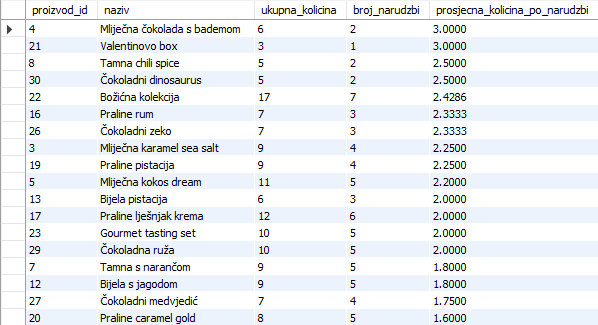


&nbsp;


### 7.4 Pogled: Analiza uspješnosti kategorija (Danijel Margić)

```sql
CREATE OR REPLACE VIEW v_analiza_uspjesnosti_kategorija AS
SELECT 
    k.kategorija_id AS Sifra_kategorije,
    k.naziv AS Naziv_kategorije,
    COUNT(DISTINCT sn.narudzba_id) AS Ukupno_narudzbi,
    SUM(sn.kolicina) AS Ukupno_prodanih_komada,
    ROUND(SUM(sn.kolicina * sn.cijena_po_komadu), 2) AS Ukupna_zarada_EUR
FROM kategorija AS k
INNER JOIN proizvod AS p ON k.kategorija_id = p.kategorija_id
INNER JOIN stavka_narudzbe AS sn ON p.proizvod_id = sn.proizvod_id
GROUP BY k.kategorija_id, k.naziv
ORDER BY Ukupna_zarada_EUR DESC;
```

Voditelj prodaje treba redoviti i automatizirani uvid u uspješnost poslovanja po 
pojedinim kategorijama proizvoda kako bi mogao donositi strateške odluke o nabavi i 
promocijama. Budući da se podaci o prodanim količinama i cijenama nalaze raspoređeni 
unutar stavki narudžbi, a kategorije su odvojena cjelina, ručna analiza zahtijeva 
previše vremena. 

Cilj je stvoriti trajni pogled koji će za svaku pojedinu kategoriju čokolade 
automatski izračunati ukupan broj zaprimljenih narudžbi, ukupnu količinu prodanih komada 
te ukupnu ostvarenu zaradu zaokruženu na dvije decimale. Izvješće kroz ovaj pogled mora 
prikazati šifru kategorije, njezin naziv te navedene izračunate vrijednosti, sortirane 
od financijski najuspješnije kategorije prema manje uspješnima.

### Opis pogleda:

- `CREATE OR REPLACE VIEW v_analiza_uspjesnosti_kategorija` — kreira novi ili zamjenjuje 
  postojeći pogled pod navedenim nazivom u bazi podataka.

- `COUNT(DISTINCT sn.narudzba_id)` — funkcija agregacije koja prebrojava isključivo različite 
  šifre narudžbi, čime se eliminiraju duplikati ako je u istoj narudžbi kupljeno više artikala.

- `SUM(sn.kolicina)` — agregatna funkcija koja zbraja sve prodane količine proizvoda unutar 
  pojedine kategorije.

- `ROUND(SUM(sn.kolicina * sn.cijena_po_komadu), 2)` — izračunava ukupnu zaradu zbrajanjem 
  umnožaka količine i cijene stavki te rezultat zaokružuje na dvije decimale.

- `INNER JOIN proizvod AS p ... INNER JOIN stavka_narudzbe AS sn` — povezuje relaciju kategorija 
  s proizvodima i stavkama narudžbi preko njihovih primarnih i stranih ključeva.

- `GROUP BY k.kategorija_id, k.naziv` — grupiranje n-torki prema šifri i nazivu kategorije kako 
  bi se sve funkcije agregacije izvršile zasebno za svaku skupinu.

- `ORDER BY Ukupna_zarada_EUR DESC` — sortira konačni rezultirajući multiskup silazno prema 
  vrijednosti izvedenog atributa ukupne zarade.

### Rezultati:
U nastavku su prikazani načini na koje se stvoreni pogled poziva i koristi u praksi. 
Budući da se pogled ponaša kao virtualna tablica, nad njim se mogu primjenjivati 
dodatni uvjeti filtriranja (restrikcije) i sortiranja.

```sql
-- Standardni poziv za prikaz svih zapisa unutar ovog pogleda
SELECT * FROM v_analiza_uspjesnosti_kategorija;
```
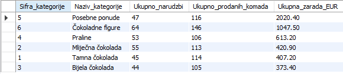

&nbsp;

```sql
-- Izdvajanje samo onih kategorija koje su ostvarile zaradu veću od 500 EUR
SELECT * 
FROM v_analiza_uspjesnosti_kategorija
WHERE Ukupna_zarada_EUR > 500.00;
```
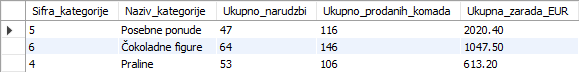

&nbsp;

```sql
-- Pronalaženje točno određene kategorije prema njezinom nazivu
SELECT * 
FROM v_analiza_uspjesnosti_kategorija
WHERE Naziv_kategorije = 'Tamna čokolada';
```
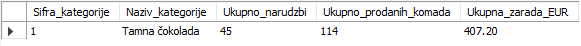


&nbsp;


### 7.5 Pogled: Prikaz premium proizvoda (Andrej Pucović)

```sql
CREATE OR REPLACE VIEW v_premium_proizvodi_i_potraznja AS
SELECT 
    p.proizvod_id AS Sifra_proizvoda,
    p.naziv AS Naziv_premium_cokolade,
    p.cijena AS Cijena_u_eurima,
    SUM(sn.kolicina) AS Ukupno_prodano_komada
FROM proizvod AS p
LEFT JOIN stavka_narudzbe AS sn ON p.proizvod_id = sn.proizvod_id
WHERE p.cijena > (
    SELECT AVG(p2.cijena) 
    FROM proizvod AS p2
)
GROUP BY p.proizvod_id, p.naziv, p.cijena
ORDER BY p.cijena DESC;
```

Voditelj prodaje treba redoviti i automatizirani uvid u ponudu naših premium čokolada, 
ali uz informaciju o tome koliko su te čokolade tražene na webshopu. Ručna pretraga 
artikala i zbrajanje prodanih količina svaki put oduzima previše vremena. 

Cilj je stvoriti trajni pogled koji će u svakom trenutku prikazati isključivo one 
proizvode čija je prodajna cijena strogo veća od prosječne cijene svih artikala u trgovini. 
Zahvaljujući lijevom spajanju, pogled mora sačuvati premium artikle čak i ako još nikada 
nisu naručeni (za njih će broj prodanih komada biti `NULL`). Izvješće mora obuhvatiti 
šifru proizvoda, naziv čokolade, cijenu te ukupan broj prodanih komada, sortirano od 
najskupljeg proizvoda prema jeftinijima.

### Opis pogleda:

- `CREATE OR REPLACE VIEW v_premium_proizvodi_i_potraznja` — kreira novi ili zamjenjuje 
  postojeći pogled pod navedenim nazivom u bazi podataka.

- `FROM proizvod AS p` — određuje bazičnu relaciju proizvoda kao polazno mjesto za 
  izgradnju virtualnog izvješća.

- `LEFT JOIN stavka_narudzbe AS sn ON p.proizvod_id = sn.proizvod_id` — lijevo vanjsko 
  spajanje koje čuva premium proizvode čak i ako ne postoji zapis o njihovoj prodaji.

- `SUM(sn.kolicina)` — funkcija agregacije koja zbraja sve prodane količine po proizvodu.

- `WHERE p.cijena > (...)` — filtrira i propušta samo one proizvode iz glavne tablice čija 
  je cijena veća od prosječne vrijednosti dobivene iz podupita.

- `SELECT AVG(p2.cijena) FROM proizvod AS p2` — ugniježđeni skalarni podupit koji 
  izračunava i vraća jednu brojčanu vrijednost koja predstavlja prosjek cijena svih čokolada.

- `GROUP BY p.proizvod_id, p.naziv, p.cijena` — grupiranje rezultata po atributima proizvoda 
  kako bi se funkcija SUM izvršila zasebno za svaki artikl.

- `ORDER BY p.cijena DESC` — sortira n-torke unutar stvorenog pogleda silazno prema 
  vrijednosti prodajne cijene artikla.

### Rezultati:
U nastavku su prikazani načini na koje se stvoreni pogled poziva i koristi u praksi. 
Budući da se pogled ponaša kao virtualna tablica, nad njim se mogu primjenjivati 
dodatni uvjeti filtriranja (restrikcije) i sortiranja.

```sql
-- Standardni poziv za prikaz svih premium čokolada i njihove potražnje
SELECT * FROM v_premium_proizvodi_i_potraznja;
```
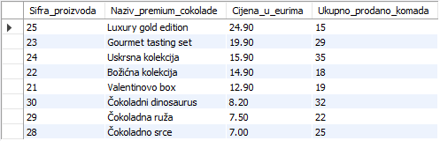


&nbsp;

```sql
-- Izdvajanje samo onih premium čokolada koje su se stvarno prodale (količina nije NULL)
SELECT * 
FROM v_premium_proizvodi_i_potraznja
WHERE Ukupno_prodano_komada IS NOT NULL;
```
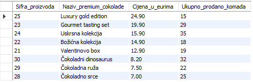


&nbsp;

```sql
-- Prikaz premium čokolada koje koštaju više od 10.00 EUR
SELECT * 
FROM v_premium_proizvodi_i_potraznja
WHERE Cijena_u_eurima > 10.00;
```
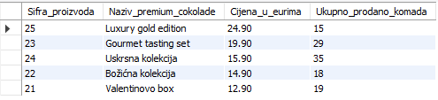


&nbsp;


### 7.6 Pogled: Prikaz zarade proizvoda i kategorije (Andrej Pucović)

```sql
CREATE OR REPLACE VIEW v_usporedba_proizvoda_i_kategorija AS
SELECT 
    p.proizvod_id AS Sifra_proizvoda,
    p.naziv AS Naziv_proizvoda,
    k.naziv AS Naziv_kategorije,
    ROUND(SUM(sn.kolicina * sn.cijena_po_komadu), 2) AS Zarada_proizvoda_EUR,
    ROUND((
        SELECT SUM(sn2.kolicina * sn2.cijena_po_komadu)
        FROM proizvod AS p2
        INNER JOIN stavka_narudzbe AS sn2 ON p2.proizvod_id = sn2.proizvod_id
        WHERE p2.kategorija_id = p.kategorija_id
    ), 2) AS Ukupna_zarada_kategorije_EUR
FROM proizvod AS p
INNER JOIN kategorija AS k ON p.kategorija_id = k.kategorija_id
INNER JOIN stavka_narudzbe AS sn ON p.proizvod_id = sn.proizvod_id
GROUP BY p.proizvod_id, p.naziv, k.naziv, p.kategorija_id;
```

Voditelj prodaje treba redoviti i automatizirani uvid u uspješnost prodaje artikala 
unutar njihovih pripadajućih kategorija kako bi lakše prepoznao lidere na tržištu. 
Budući da se cijene i količine nalaze u stavkama, a proizvodi pripadaju različitim 
kategorijama, ručna usporedba je spora. 

Cilj je stvoriti trajni pogled koji će za svaki proizvod izračunati njegovu ukupnu 
zaradu te ga izravno usporediti s ukupnom zaradom njegove matične kategorije. 
Izvješće kroz ovaj pogled mora prikazati šifru proizvoda, naziv proizvoda, naziv 
kategorije kojoj pripada, ukupnu zaradu tog proizvoda te ukupnu zaradu cijele te 
kategorije zaokruženu na dvije decimale.

### Opis pogleda:

- `CREATE OR REPLACE VIEW` — kreira novi ili zamjenjuje postojeći pogled pod navedenim 
  nazivom u bazi podataka.

- `ROUND(SUM(sn.kolicina * sn.cijena_po_komadu), 2)` — izračunava ukupnu zaradu pojedinog 
  proizvoda i zaokružuje iznos na dvije decimale.

- `SELECT SUM(...) FROM ... WHERE p2.kategorija_id = p.kategorija_id` — ugniježđeni korelirani 
  podupit u `SELECT` dijelu koji za svaku n-torku računa ukupnu sumu zarade cijele kategorije.

- `GROUP BY p.proizvod_id, p.naziv, k.naziv, p.kategorija_id` — grupiranje rezultata po ključnim 
  atributima proizvoda i kategorije za ispravno izvršavanje funkcija agregacije.

### Rezultati:
U nastavku su prikazani načini na koje se stvoreni pogled poziva i koristi u praksi. 
Budući da se pogled ponaša kao virtualna tablica, nad njim se mogu primjenjivati 
dodatni uvjeti filtriranja (restrikcije) i sortiranja.

```sql
-- Standardni poziv za prikaz svih zapisa unutar ovog pogleda
SELECT * FROM v_usporedba_proizvoda_i_kategorija;
```
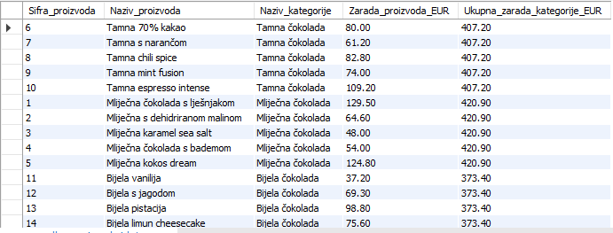


&nbsp;

```sql
-- Filtriranje proizvoda koji su sami donijeli više od 50 EUR u svojoj kategoriji
SELECT * 
FROM v_usporedba_proizvoda_i_kategorija
WHERE Zarada_proizvoda_EUR > 50.00;
```
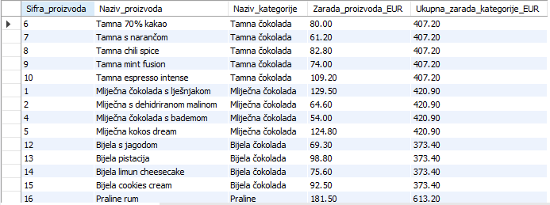


&nbsp;

```sql
-- Prikaz proizvoda koji pripadaju isključivo kategoriji 'Mliječna čokolada'
SELECT * 
FROM v_usporedba_proizvoda_i_kategorija
WHERE Naziv_kategorije = 'Mliječna čokolada';
```
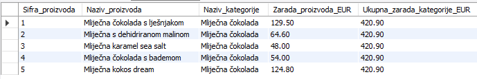


&nbsp;


### 7.7 Pogled: Ukupne vrijednosti narudžbi (Teo Kupčinovac)

```sql
CREATE OR REPLACE VIEW v_pregled_vrijednosti_narudzbi AS
SELECT 
    n.narudzba_id AS Sifra_narudzbe,
    n.datum_narudzbe AS Datum_kreiranja,
    CONCAT(k.ime, ' ', k.prezime) AS Kupac,
    ROUND(SUM(sn.kolicina * sn.cijena_po_komadu), 2) AS Ukupna_vrijednost_EUR
FROM narudzba AS n
INNER JOIN kupac AS k ON n.kupac_id = k.kupac_id
INNER JOIN stavka_narudzbe AS sn ON n.narudzba_id = sn.narudzba_id
GROUP BY n.narudzba_id, n.datum_narudzbe, k.ime, k.prezime;
```

Voditelj financija treba redovito pratiti i analizirati vrijednosti narudžbi koje 
pristižu na naš webshop. Budući da tablica narudžbi ne sadrži unaprijed izračunat 
ukupan iznos, financijska služba mora za svaku narudžbu ručno zbrajati vrijednosti 
njezinih pojedinačnih stavki. 

Cilj je dobiti jasan i čitljiv pregled koji će za svaku zaprimljenu narudžbu automatski izračunati njezinu ukupnu vrijednost 
zbrajanjem vrijednosti svih pripadajućih stavki, prikazujući pritom šifru narudžbe, 
datum njezinog stvaranja, ime i prezime kupca spojeno u jedno polje te izračunatu 
ukupnu vrijednost zaokruženu na dvije decimale.

### Opis pogleda:

- `CREATE OR REPLACE VIEW v_pregled_vrijednosti_narudzbi` — kreira novi ili 
  zamjenjuje postojeći pogled pod navedenim nazivom u bazi podataka.

- `CONCAT(k.ime, ' ', k.prezime)` — funkcija opće projekcije koja spaja ime i 
  prezime kupca u jedno tekstualno polje radi lakšeg čitanja.

- `SUM(sn.kolicina * sn.cijena_po_komadu)` — računa ukupnu financijsku vrijednost 
  narudžbe zbrajanjem umnožaka količine i jedinične cijene svih stavki.

- `ROUND(..., 2)` — zaokružuje izračunatu konačnu sumu svake narudžbe na dvije 
  decimale.

- `INNER JOIN kupac AS k ... INNER JOIN stavka_narudzbe AS sn` — spaja tablicu 
  narudžbi s tablicama kupaca i stavki narudžbi preko ključeva.

- `GROUP BY n.narudzba_id, n.datum_narudzbe, k.ime, k.prezime` — grupiranje 
  rezultata po ključnim atributima narudžbe i kupca za izračun `SUM` funkcije.

### Rezultati:
U nastavku su prikazani načini na koje se stvoreni pogled poziva i koristi u praksi. 
Budući da se pogled ponaša kao virtualna tablica, nad njim se mogu primjenjivati 
dodatni uvjeti filtriranja (restrikcije) i sortiranja.

```sql
-- Standardni poziv za prikaz svih zapisa unutar pogleda
SELECT * FROM v_pregled_vrijednosti_narudzbi;
```
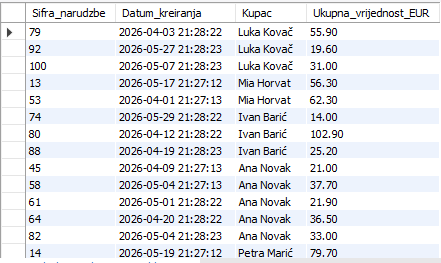


&nbsp;

```sql
-- Filtriranje podataka za izdvajanje samo onih narudžbi koje vrijede više od 100 EUR
SELECT * 
FROM v_pregled_vrijednosti_narudzbi
WHERE Ukupna_vrijednost_EUR > 100.00;
```
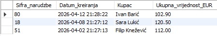


&nbsp;

```sql
-- Pretraživanje narudžbi za specifičnog kupca upotrebom tekstualnog uzorka
SELECT * 
FROM v_pregled_vrijednosti_narudzbi
WHERE Kupac LIKE '%Kovač%';
```
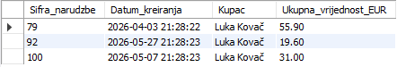


&nbsp;


### 7.8 Pogled: Segmentacija kupaca (Teo Kupčinovac)

```sql
CREATE OR REPLACE VIEW v_crm_segmentacija_kupaca AS
SELECT 
    k.kupac_id AS Sifra_kupca,
    CONCAT(k.ime, ' ', k.prezime) AS Kupac,
    COUNT(DISTINCT n.narudzba_id) AS Ukupno_narudzbi,
    ROUND(SUM(sn.kolicina * sn.cijena_po_komadu), 2) AS Ukupna_potrosnja_EUR,
    MAX(n.datum_narudzbe) AS Datum_zadnje_kupnje,
    CASE 
        WHEN SUM(sn.kolicina * sn.cijena_po_komadu) > 100.00 THEN 'VIP Kupac'
        WHEN SUM(sn.kolicina * sn.cijena_po_komadu) BETWEEN 40.00 AND 100.00 THEN 'Lojalan Kupac'
        ELSE 'Standardni Kupac'
    END AS Segment_kupca
FROM kupac AS k
INNER JOIN narudzba AS n ON k.kupac_id = n.kupac_id
INNER JOIN stavka_narudzbe AS sn ON n.narudzba_id = sn.narudzba_id
GROUP BY k.kupac_id, k.ime, k.prezime;
```

Voditelj prodaje želi automatizirati segmentaciju kupaca na temelju njihove povijesti 
kupnje kako bi marketinški tim mogao slati personalizirane ponude. Budući da su podaci 
o kupcima, datumima narudžbi i cijenama stavki razdvojeni, ručno praćenje lojalnosti 
je neizvedivo. 

Cilj je kreirati trajni pogled koji će za svakog kupca izračunati ukupan broj 
narudžbi, ukupan iznos potrošnje te datum njegove zadnje kupnje. Izvješće kroz ovaj 
pogled mora prikazati šifru kupca, njegovo ime i prezime spojeno u jedno polje, ukupan 
broj kupnji, ukupnu potrošnju zaokruženu na dvije decimale, datum zadnje kupnje te 
dodatni stupac 'Segment_kupca' izračunat preko CASE WHEN izraza: kupci s potrošnjom 
većom od 100 EUR označavaju se kao 'VIP Kupac', oni između 40 i 100 EUR kao 'Lojalan Kupac', 
a svi ostali kao 'Standardni Kupac'.

### Opis pogleda:

- `CREATE OR REPLACE VIEW` — kreira novi ili zamjenjuje postojeći pogled u bazi podataka.

- `COUNT(DISTINCT n.narudzba_id)` — funkcija agregacije koja prebrojava jedinstvene narudžbe 
  kako bi se spriječilo lažno uvećanje broja narudžbi zbog većeg broja stavki u košarici.

- `MAX(n.datum_narudzbe)` — funkcija agregacije koja pronalazi najnoviji (maksimalni) datum 
  narudžbe za svakog pojedinog kupca.

- `CASE WHEN ... THEN ... ELSE END` — uvjetni izraz s vježbi koji provodi kategorizaciju kupaca 
  u segmente na temelju izračunate ukupne vrijednosti njihove agregirane potrošnje.

- `GROUP BY k.kupac_id, k.ime, k.prezime` — grupiranje n-torki po ključnim atributima kupca 
  kako bi se sve funkcije agregacije izvršile zasebno za svakog korisnika.

### Rezultati:
U nastavku su prikazani načini na koje se stvoreni pogled poziva i koristi u praksi. 
Budući da se pogled ponaša kao virtualna tablica, nad njim se mogu primjenjivati 
dodatni uvjeti filtriranja (restrikcije) i sortiranja.

```sql
-- Standardni poziv za prikaz svih zapisa unutar ovog CRM pogleda
SELECT * FROM v_crm_segmentacija_kupaca;
```
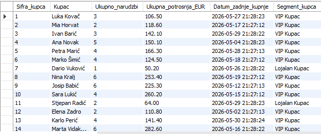


&nbsp;

```sql
-- Izdvajanje kupaca koji su ostvarili status 'VIP Kupac' za potrebe slanja kupona
SELECT * 
FROM v_crm_segmentacija_kupaca
WHERE Segment_kupca = 'VIP Kupac';
```
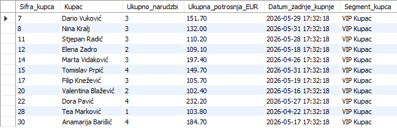


&nbsp;

```sql
-- Sortiranje kupaca tako da oni koji su najnedavnije kupovali budu na vrhu
SELECT * 
FROM v_crm_segmentacija_kupaca
ORDER BY Datum_zadnje_kupnje DESC;
```
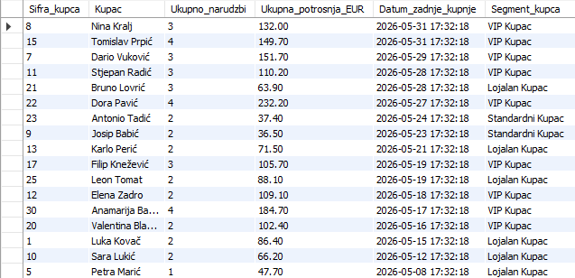


&nbsp;


### 7.9 Pogled: Pregled potrošnje kupaca (Luka Juroš)

```sql
CREATE OR REPLACE VIEW v_pregled_potrosnje_kupaca AS
SELECT 
    k.kupac_id AS Sifra_kupca,
    CONCAT(k.ime, ' ', k.prezime) AS Kupac,
    COUNT(DISTINCT n.narudzba_id) AS Ukupno_narudzbi,
    ROUND(SUM(sn.kolicina * sn.cijena_po_komadu), 2) AS Ukupna_potrosnja_EUR
FROM kupac AS k
INNER JOIN narudzba AS n ON k.kupac_id = n.kupac_id
INNER JOIN stavka_narudzbe AS sn ON n.narudzba_id = sn.narudzba_id
GROUP BY k.kupac_id, k.ime, k.prezime
ORDER BY Ukupna_potrosnja_EUR DESC;
```

Voditelj prodaje želi pratiti vjernost i financijski doprinos kupaca kroz duže 
razdoblje, no suočava se s problemom što se podaci o kupcima i stavke narudžbi 
nalaze u odvojenim tablicama. Kako bi se olakšao rad marketinškom odjelu, 
potrebno je kreirati trajni pogled koji će za svakog kupca automatski 
izračunati ukupan broj predanih narudžbi te ukupnu ostvarenu potrošnju. 

Izvješće kroz ovaj pogled mora prikazati šifru kupca, njegovo ime i prezime 
spojeno u jedno polje, ukupan broj narudžbi, te ukupnu potrošnju zaokruženu na 
dvije decimale. Rezultate unutar pogleda potrebno je sortirati od kupca s 
najvećom ukupnom potrošnjom prema onima s manjom potrošnjom.

### Opis pogleda:

- `CREATE OR REPLACE VIEW v_pregled_potrosnje_kupaca` — kreira novi ili 
  zamjenjuje postojeći pogled pod navedenim nazivom u bazi podataka.

- `CONCAT(k.ime, ' ', k.prezime)` — funkcija opće projekcije koja spaja ime i 
  prezime kupca u jedno tekstualno polje radi lakšeg čitanja.

- `COUNT(DISTINCT n.narudzba_id)` — funkcija agregacije koja prebrojava jedinstvene 
  narudžbe i sprječava lažno uvećanje broja narudžbi zbog više stavki u košarici.

- `ROUND(SUM(sn.kolicina * sn.cijena_po_komadu), 2)` — izračunava ukupnu potrošnju 
  kupca zbrajanjem vrijednosti svih stavki i zaokružuje iznos na dvije decimale.

- `INNER JOIN kupac AS k ... INNER JOIN stavka_narudzbe AS sn` — spaja tablicu 
  kupaca s narudžbama i stavkama narudžbi preko pripadajućih ključeva.

- `GROUP BY k.kupac_id, k.ime, k.prezime` — grupiranje rezultata po ključnim 
  atributima kupca kako bi se funkcije agregacije izvršile zasebno za svakoga.

- `ORDER BY Ukupna_potrosnja_EUR DESC` — sortira konačni rezultirajući multiskup 
  silazno prema vrijednosti ukupno potrošenog iznosa.

### Rezultati:
U nastavku su prikazani načini na koje se stvoreni pogled poziva i koristi u praksi. 
Budući da se pogled ponaša kao virtualna tablica, nad njim se mogu primjenjivati 
dodatni uvjeti filtriranja (restrikcije) i sortiranja.

```sql
-- Standardni poziv za prikaz cijelog izvješća unutar ovog pogleda
SELECT * FROM v_pregled_potrosnje_kupaca;
```
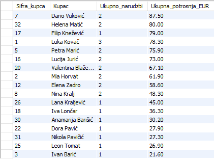


&nbsp;

```sql
-- Filtriranje kupaca koji su ostvarili ukupnu potrošnju veću od 150 EUR
SELECT * 
FROM v_pregled_potrosnje_kupaca
WHERE Ukupna_potrosnja_EUR > 150.00;
```
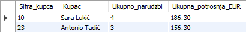


&nbsp;

```sql
-- Pronalaženje točno određenog kupca prema njegovom imenu ili prezimenu
SELECT * 
FROM v_pregled_potrosnje_kupaca
WHERE Kupac LIKE '%Kovač%';
```
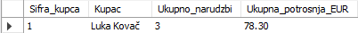


&nbsp;


### 7.10 Pogled: Indeks tereta dostave (Danijel Margic)

```sql
CREATE OR REPLACE VIEW v_analiza_tereta_dostave AS
SELECT 
    n.narudzba_id AS Sifra_narudzbe,
    CONCAT(k.ime, ' ', k.prezime) AS Kupac,
    n.cijena_dostave AS Cijena_dostave_EUR,
    ROUND(SUM(sn.kolicina * sn.cijena_po_komadu), 2) AS Vrijednost_robe_EUR,
    CASE 
        WHEN n.cijena_dostave = 0 THEN 'Besplatna dostava'
        WHEN (n.cijena_dostave / SUM(sn.kolicina * sn.cijena_po_komadu)) * 100 > 15.0 THEN 'Kritican trosak (iznad 15%)'
        ELSE 'Optimalan trosak'
    END AS Indeks_tereta_dostave
FROM narudzba AS n
INNER JOIN kupac AS k ON n.kupac_id = k.kupac_id
INNER JOIN stavka_narudzbe AS sn ON n.narudzba_id = sn.narudzba_id
GROUP BY n.narudzba_id, k.ime, k.prezime, n.cijena_dostave
ORDER BY Vrijednost_robe_EUR DESC;
```

Voditelj logistike i financija želi optimizirati prag za besplatnu dostavu premium čokolada. Ručni pregled računa je nesvrsishodan. Menadžment treba automatizirani uvid u narudžbe kod kojih trošak dostave predstavlja prevelik postotni udio u odnosu na ukupnu vrijednost kupljene čokolade, što signalizira neprofitabilne transakcije s niskom vrijednošću košarice.

Cilj je stvoriti novi trajni pogled koji će za svaku pojedinu narudžbu izračunati ukupnu vrijednost kupljene robe te postotni udio cijene dostave u toj vrijednosti. Pomoću `CASE WHEN` izraza, pogled mora automatski kategorizirati narudžbe: ako dostava čini više od 15% vrijednosti robe, označava se kao 'Kritičan trošak', ako je dostava 0 eura označava se kao 'Besplatna dostava', a sve ostalo kao 'Optimalan trošak'. Rezultat mora prikazati šifru narudžbe, ime i prezime kupca, cijenu dostave, ukupnu vrijednost robe te izračunatu kategoriju tereta, sortiranu od financijski najvrjednijih narudžbi.

### Opis pogleda:

- `CREATE OR REPLACE VIEW v_analiza_tereta_dostave` — kreira novi analitički pogled u bazi podataka koji trajno pohranjuje logiku profitabilnosti logistike radi lakše optimizacije prodajnih pragova.

- `CONCAT(k.ime, ' ', k.prezime)` — tekstualna funkcija koja spaja ime i prezime kupca u jedno polje s razmakom radi čitljivijeg i profesionalnijeg izgleda izvještaja.

- `ROUND(SUM(sn.kolicina * sn.cijena_po_komadu), 2)` — izračunava ukupnu bruto financijsku vrijednost naručene čokolade zbrajanjem umnožaka količina i jediničnih cijena te iznos zaokružuje na dvije decimale.

- `CASE WHEN ... THEN ... END` — uvjetni logički izraz koji dinamički izračunava postotni udio dostave u cijeni robe te na temelju zadanih granica (0% i 15%) razvrstava narudžbe u tri kategorije tereta.

- `INNER JOIN kupac AS k / stavka_narudzbe AS sn` — realizira unutarnja relacijska spajanja kako bi se zaglavlje narudžbe povezalo s osobnim podacima kupca i pojedinačnim stavkama u košarici.

- `GROUP BY n.narudzba_id, k.ime, k.prezime, n.cijena_dostave` — grupira podatke na razini pojedinačne narudžbe i kupca kako bi se omogućilo ispravno izračunavanje ukupne vrijednosti robe po svakom računu.

- `ORDER BY Vrijednost_robe_EUR DESC` — sortira konačne izlazne rezultate silazno prema ukupnoj vrijednosti kupljene robe, postavljajući financijski najveće narudžbe na sam vrh tablice.

### Rezultati:
U nastavku su prikazani načini na koje se stvoreni pogled poziva i koristi u praksi. 
Budući da se pogled ponaša kao virtualna tablica, nad njim se mogu primjenjivati 
dodatni uvjeti filtriranja (restrikcije) i sortiranja.

```sql
-- Standardni poziv za prikaz cijelog izvješća unutar ovog pogleda
SELECT * FROM v_analiza_tereta_dostave;
```
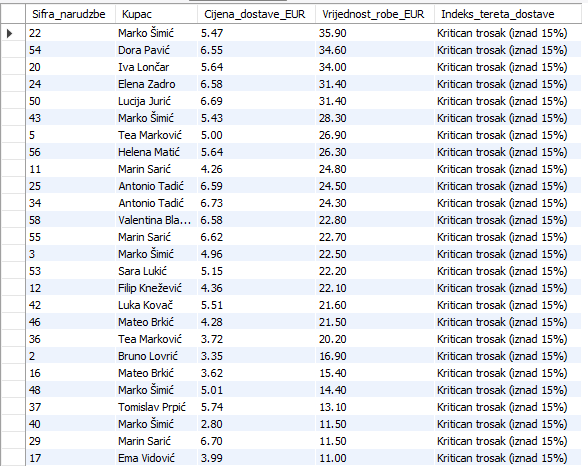


&nbsp;


